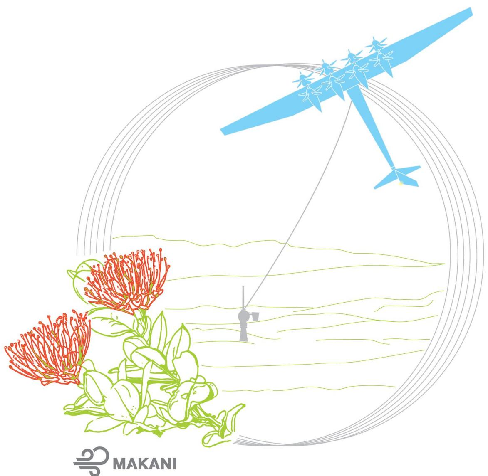

Airborne Wind Performance: Key Lessons From More Than a Decade of Flying Kites Corresponding author: Nicholas Tucker

The Energy Kite: Selected Results from the Design, Development, and Testing of Makani's Airborne Wind Turbines, Part I of III by Paula Echeverri, Tobin Fricke, Geo Homsy, Nicholas Tucker, on behalf of the Makani team.

Copyright © 2020 by Makani Technologies LLC

Distributed under the [Creative Commons CC BY 4.0 License .](https://creativecommons.org/licenses/by/4.0/) You are free to copy and redistribute this material in any medium or format for any purpose, even commercially.

Intended for electronic publication and distribution. Copies of this volume may be found at [https://archive.org](https://archive.org/) Additional information is at: <https://x.company/projects/makani>

Published September 2020

| 1 Introduction 1.1 Executive Summary 1.2 Example Systems | 93 93 95 |
| -------------------------------------------------------------- | -------------- |
| 1.3 Numerical Model                                            | 95             |
| 2 A Measure of Performance                                     | 97             |
| 3 Balance of System                                            | 99             |
| 4 Maintenance                                                  | 107            |
| 5 System Cost                                                  | 113            |
| 6 Kite Power                                                   | 114            |
| 6.1 Loyd Revisited                                             | 116            |
| 6.1.1 Tether Drag Losses                                       | 119            |
| 6.1.2 Path Offset Losses                                       | 121            |
| 6.1.3 Wind Shear Gains                                         | 123            |
| 6.1.4 Turning Losses                                           | 124            |
| 6.1.5 Efficiency Losses                                        | 130            |
| 6.1.6 Gravity Losses                                           | 131            |
| 6.1.7 Minimum Airspeed Losses                                  | 140            |
| 6.1.8 Tension Limiting Losses                                  | 140            |
| 6.1.9 Putting It Together                                      | 142            |
| 6.2 Lessons from Loyd Revisited                                | 149            |
| 6.2.1 Minimum Turning Radius Constraints                       | 149            |
| 6.2.2 The Push for Tighter Loops                               | 154            |
| 6.2.3 Higher Power from Stronger Winds at Altitude?            | 156            |
| 6.2.4 Comparing AWT with HAWT Power Production                 | 158            |
| 6.3 Conclusion 6.4 A Numerical Take on Path Shape           | 166 167     |
|                                                                |                |
| 7 Mass                                                         | 171            |
| 7.1 Hover                                                      | 171            |
| 7.2 No Wind Upstroke                                           | 174            |
| 7.3 Mass in Crosswind                                          | 174            |
| 8 Multi-kites                                                  | 177            |
| 9 M600 Power Performance                                       | 182            |
| 10 High Winds Are Hard                                         | 185            |
| 10.1 Overview                                                  | 185            |

| 10.2 The Challenge                  | 185 |     |     |
| ----------------------------------- | --- | --- | --- |
| 10.3 Strategies                     | 188 |     |     |
| 10.3.1 Reducing lift                | 188 |     |     |
| 10.3.2 Non-optimal speed            | 190 |     |     |
| 10.3.3 Path                         | 193 |     |     |
| 10.3.4 Excess Drag                  | 199 |     |     |
| 10.3.5 Piecing Together a Strategy  | 201 |     |     |
| 10.3.5.1 Path Strategy              | 202 |     |     |
| 10.3.5.2 Lift and Speed Strategy    | 203 |     |     |
| 10.3.5.3 Rotor Strategy             |     |     |     |
| 10.3.6 Poking holes in our strategy | 209 |     |     |
| 10.3.6.1 Turbulence                 | 211 |     |     |
| 10.3.6.2 Control Variability        | 212 |     |     |
| 10.3.6.3 Tether Dynamics            | 213 |     |     |
| 10.3.6.4 All the Rotors             | 214 |     |     |
| 10.3.6.5 Kite Acrobatics            | 215 |     |     |
| 10.4 Power Saturation Summary       | 216 |     |     |
| 11 References                       | 220 |     |     |
| 12 Appendix                         | 221 |     |     |
| 12.1 Numerical Model Description    | 221 |     |     |
| 12.1.1 Overview                     | 221 |     |     |
| 12.1.2 Sub-Models                   | 222 |     |     |
| 12.1.2.1 Rotor Model                | 223 |     |     |
| 12.1.2.2 Aero Model                 | 224 |     |     |
| 12.1.3 Known Shortcomings           | 224 |     |     |

# 1 Introduction

The goal of this document is to highlight several fundamental challenges for airborne wind energy that Makani has learned, in particular those that are perhaps under-represented in the field. The M600 (Makani's prototype that was tested from 2015-2019) was unable to meet its intended performance targets. While we will touch upon the specific issues of that design, the intent here is to discuss the challenges of energy kite performance more broadly, building up an understanding rather than a specific set of fixes. Where possible, we'll build an analytical foundation to frame the discussion, but building a complete mathematical toolset to design or evaluate an energy kite is not the explicit goal. As such, we presume the reader is somewhat familiar with the fundamentals of wind energy, and can pick up where the provided analytical tools stop short.

In the released design summary for the proposed next-generation system called MX2, Makani has sketched a system with some surprising characteristics: a short tether, a tall tower, and a comparatively low-performance-per-wing-area kite that's designed to fly tight paths as low as possible. Many, but not all, of the changes are driven by the general considerations we'll discuss here.

In addition, although Makani spent several of its early years designing, building, and testing several different types of energy kites, most of our collective experience is focused on onboard generation rigid wing kites. Many of the lessons here apply equally to soft fabric kites or systems with generation on the ground, but several do not. Rather than delve outside Makani's (and in particular this author's) area of expertise, we'll keep things centered on onboard generation designs.

Finally, this work is attempting to collect, condense, revise, and expand upon the efforts of dozens of individuals spanning many years. It's hoped that this author has represented their work appropriately.

## 1.1 Executive Summary

In order for any energy source to gain substantial market share, the cost of energy over the life of the system must be competitive. Renewables such as wind and solar have the added challenge that turning on your microwave doesn't tell the sun to shine brighter or the wind to blow harder, creating a mismatch between energy supply and demand. They then need to be even less costly in order to justify excess capacity that is only used when demand is highest, or potentially require additional infrastructure costs for energy storage. With the cost of energy as our guiding metric, we'll discuss the key challenges airborne wind energy faces.

These challenges can be summarized as follows:

-   1. Supporting infrastructure in a wind turbine plant is a large portion of the total cost of energy, especially offshore, and the primary way to reduce these costs is to increase the system size.
    -   a. Airborne wind energy has some inherent infrastructure cost advantages compared to traditional wind turbines, particularly in deep water offshore applications, but required components and their share of the total cost of energy do not substantially differ.
-   2. Despite several similarities between airborne wind turbines and aircraft, maintenance costs need to be approximately an order of magnitude less than similarly priced aircraft in order for airborne wind turbines to remain viable.
    -   a. It's not appropriate to directly apply the maintenance costs from traditional wind turbines to airborne wind turbines, as much of the improvement in the industry is the result of increased scale and reduced number of components for a given plant size, properties that airborne wind energy also needs to pursue.
    -   b. Small systems will struggle to have maintenance costs per unit power as low as larger systems, regardless of their perceived simplicity, due to the additional number of components.
-   3. Reducing turbine costs cannot be the primary avenue for long term success, given that turbine costs form less than half of the total cost of energy for a plant, and about a quarter of total costs offshore. Turbine costs can lose the battle for a competitive cost of energy, but it's exceedingly difficult to win the battle on turbine costs alone.
    -   a. It is more important for airborne wind energy to demonstrate a path to grow system scale than reduce turbine costs, as comparatively minor reductions in infrastructure and maintenance costs, as a result of larger scale, can easily outweigh aggressive turbine cost reductions.
-   4. Kites are largely free from the power limits imposed by the fixed swept area of the blades on a traditional wind turbine, but these gains are offset by the introduction of new loss mechanisms.
    -   a. Path offset losses, tether drag, and powertrain efficiency/cycle-time are among the largest, typically reducing power to a third of the theoretical maximum of the kite alone.
    -   b. A small minimum turning radius and reliable operation close to that limit is essential to reduce gravity pumping losses and path offset losses.
    -   c. The specifics of path shape are relatively unimportant even in theory, and even less relevant in practice. Paths must generally be as low and as tight as practical, but otherwise, simpler is better.
    -   d. Typical losses negate any gains from accessing stronger high altitude winds unless tether drag is exceptionally low and wind shear is very high.
    -   e. Kite specific losses are on a similar scale as the induced flow losses for a typical 3 bladed traditional wind turbine, effectively trading one set of losses for another.
-   5. Mass is a key design constraint, especially for hovering systems featuring onboard generation.

-   a. Power generation is strongly tied to wing area and weakly tied to mass, so the target for an optimal design is to get the largest wing possible into crosswind.
-   6. Multiple kites on a single ground station or a single shared tether have some clear benefits, but those benefits are only accessible after solving many novel control challenges, presenting a difficult development story.
    -   a. Multi-kites begin to see induced losses similar to traditional wind turbines, somewhat degrading their benefits.
    -   b. Simpler configurations of multi-kites may be worthwhile to pursue once a reliable single kite product is well developed and tested.
-   7. High winds pose a number of unsolved challenges, and these challenges only present themselves in the context of imperfect control and a turbulent wind field.
    -   a. The main mechanism to limit power for traditional turbines, reducing lift, is difficult to implement for kites as they also use lift to turn.
    -   b. Energy kites experience large swings in potential energy over their path, complicating other strategies as they must heavily reduce power for part of the path, and maximize it for the rest.
    -   c. In order to ensure the system can maintain adequate margins, necessary because of the limitations mentioned above, it's likely that the power components cannot be fully saturated at high wind speeds.
    -   d. The nature of the problem makes it difficult to evaluate outside the context of detailed flight simulation or physical flight tests.

Our hope is that by pointing out these potholes, others can then fill or avoid them. So, get ready for a bumpy ride, as we're aiming for a lot of potholes—there is much to discuss!

## 1.2 Example Systems

Throughout this text, we'll be pulling example values from several systems to demonstrate various effects. The key values for those systems are outlined in table 1 . 1

## 1.3 Numerical Model

Throughout this text we'll occasionally rely on results from a [numerical model whose source](#page-231-0) [code has been released \[1\]](#page-231-0) . This model is commonly referred to as the FBL at Makani. In most cases here, we lean on it to simply provide a numerical justification for a simplifying analytical assumption, but we'll also dive into a particular set of optimized results for a complete system in [s ection 10, High Winds Are Hard .](#page-195-0) It's not the goal of this paper to describe that model in detail, but there is a brief description in the appendix of this section.

1 All values are approximate. These systems all had various configurations that evolved over time.

| Parameter           | Units | Description                                    | M600 Intent                | M600 As-Built                                  | MX2                             |
| ------------------- | ----- | ---------------------------------------------- | -------------------------- | ---------------------------------------------- | ------------------------------- |
| -                   | -     | -                                              | Original design intent. | Prototype M600. Includes test equipment. | Oktoberkite next gen design. |
| l t              | m     | tether length                                  | 400 2                      | 440 2,3                                        | 300                             |
| S                   | m 2   | wing area                                      | 32.9                       | 32.9                                           | 54                              |
| b                   | m     | wing span                                      | 25.7                       | 25.7                                           | 26                              |
| @ L C ζL      | -     | lift coefficient @ best performance         | 2.8                        | 2.56                                           | 1.81                            |
| @ D C ζL k | -     | kite drag coefficient @ best power          | 0.207                      | 0.244 3                                        | 0.123                           |
| dt                  | m     | tether diameter                                | 0.025                      | 0.0295 3                                       | 0.0295                          |
| CD t             | -     | tether drag coefficient                        | 0.7                        | 0.7 3                                          | 0.7                             |
| @ D C ζL      | -     | kite + tether drag coefficient @ best power | 0.260                      | 0.312 3                                        | 0.152                           |
| ζ0                  | -     | performance metric, best, kite only         | 76                         | 42                                             | 58                              |
| ζL                  | -     | performance metric, best, kite + tether     | 48                         | 26                                             | 38                              |
| Arotor              | m 2   | rotor area                                     | 3.8                        | 4.15 3                                         | 4.38                            |
| Nrotors             | -     | number of rotors                               | 8                          | 8                                              | 8                               |
| rloop min        | m     | minimum viable path radius                  | 75                         | 145 3                                          | 90                              |
| hmin                | m     | minimum kite altitude                          | 85                         | 3 110                                       | 70                              |
| htower              | m     | tether attachment height                       | 15                         | 5 3                                            | 15                              |
| mkite               | kg    | kite mass                                      | 1310                       | 1690 3                                         | 1850                            |
| mtether             | kg    | tether mass                                    | 315                        | 390                                            | 275                             |
| ηt2g                | -     | efficiency, thrust to grid                     | 0.66                       | 0.66                                           | 0.66                            |
| vamin               | m/s   | minimum viable airspeed                        | 30                         | 35                                             | 27                              |
| FT max              | kN    | maximum operating tension                   | 280                        | 240 3                                          | 250                             |

#### **Table 1 : Various approximate values for Makani systems we'll be using in analytical examples.**

2 Includes bridle radial length.

3 Varied for different tests, but the value represents the bulk of the flight test data.

# 2 A Measure of Performance

How do we best describe the performance of a source of energy? What are the key metrics? Ultimately, the goal of any source of energy, wind turbines included, is to provide energy that is needed at a competitive cost, and the metric of greatest importance here is the Levelized Cost of Energy, or LCOE.

Given that energy systems generally have high upfront costs and long lifetimes, the "levelized" portion of LCOE refers to assessing the lifetime impact of all costs and distilling it down to an average cost in today's dollars. Included in this levelizing are items such as the cost of capital, the developer's desired return on investment, taxes, and inflation.

LCOE is not the _only_ metric that matters—a system that can better match demand by providing energy when needed, or one that can provide a consistent reliable base power, has more value than one that provides huge amounts of energy only when it's windy—but for simplicity's sake, let's leave it as the main metric when comparing the performance of different energy systems. With renewables only providing ~6% of the world's energy at the time of this writing, this is 4 especially true outside of a few markets where renewable penetration is large. In those increasingly saturated markets, the need for the energy system to match demand becomes of greater importance, and we see turbines value other metrics like capacity factor, which is a measure of the average power the turbine makes relative to its maximum rated power.

There are many ways to calculate lifetime costs, but as the focus here is on the energy system and not the underlying economics or financing, we utilize the simple method outlined by NREL in ["](#page-231-0) [Manual for the Economic Evaluation of Energy Efficiency and Renewable Energy](#page-231-0) [Technologies"](#page-231-0) [\[3\]](#page-231-0) , which boils these factors down into a single factor called the Fixed Charge Rate, or , which represents the yearly amortization rate of the total upfront costs. _kF CR_

From here, we can state that:

$$LCOE\ = \frac{C\_{\text{capex}}k\_{FCR} + C\_{\text{opex}\_l}}{AEP} \tag{1}$$

Where is the sum of the capital expenditures, is the fixed charge rate, is the _Ccapex kF CR Copexl levelized_ annual operating expenses (note that the subscript denotes this is a levelized value), _l_ and is the Annual Energy Production of the power system. _AEP_

The methodology in determining will not be laid out here (see the reference) to avoid _kF CR_ getting sidetracked by project economics that have little to do with turbine design, but we

4 As of 2020. Not counting hydroelectric. [IEA Global Energy Review 2020 \[2\]](#page-231-0) .

should note that for risk levels associated with mature onshore systems in well developed markets and expected project life around 20 years, typical values are around 0.1. Offshore _kF CR_ markets, novel designs, or new markets will see higher rates as the projects carry more perceived risk, while publicly supported projects can see favorable financing and tax treatment and have very low values. _kF CR_ 5

It is useful to break this apart further. Capital expenditures are commonly split between the cost of the turbine itself, which we'll call , and the cost of the roads, foundations, collection _Csys_ system, transformers and other systems that make up the rest of the plant. On a per system basis, these costs are called the Balance of System, or BoS, and on a plant basis they are called the Balance of Plant, or BoP. On the energy side of things, can be broken down into the _AEP_ system rated power, , which is the maximum continuous power of the turbine system, _Prated_ typically in MW, capacity factor, , which the average power normalized by the rated power, _kCF_ and , which is a year in the units of choice, typically hours, so that the final result is in costs _tyear_ per MW·hr. We now have:

$$LCOE = \frac{(C\_{sys} + C\_{Bo3})k\_{fcr} + C\_{open}}{k\_{CF}P\_{rated\text{year}}} \tag{2}$$

LCOE is now written in such a way that we have the big drivers separated out, and each of these terms forms a key metric we will use to compare systems below. To reiterate, there's the cost of the system, , the cost of everything else, , the cost to keep everything running, , _Csys CBoS Copexl_ how effectively we're utilizing our maximum system performance, , and the final metric we _kCF_ can control: how large our system is, . Despite our best efforts, we're unable to control the _Prated_ length of a year.

In any comparison utilizing only one of these component metrics, one needs to keep in mind that it is just that: only one piece of the total picture. A comparison between components is only valid in the context of LCOE if the other components are similar. We should be wary of gaming these component metrics. As an example, downrating a power system with no change in costs results in a higher capacity factor, but this is offset by the lower system rating and corresponding loss in energy production for a net increase in LCOE. With this in mind, we'll 6 compare some of these inputs for AWTs with HAWTs. Let's begin our conversation on wind turbine performance by not talking about the turbine at all, and instead discuss all the other components.

5 Financing and economics have a huge effect on LCOE. Favorable financing is often glossed over, or the benefits incorrectly attributed to energy system improvements. Much of the gains in wind turbine LCOE over the last few decades is from increased market confidence, which shows up as more favorable financing. The effect of financing also makes LCOE _market_ specific in addition to _site_ specific.

6 A high capacity factor has value independent of LCOE, but can't be the singular goal. If this were the case, we'd see the large rotors from, for example, 2 MW HAWTs paired with small 500 kW power systems. Capacity factor would be high, but LCOE and total energy production would be poor, as the expensive rotors are underutilized. Heavily saturated markets where capacity factor is highly valued are trending this way, but this doesn't well represent new markets.

# 3 Balance of System

Of the many improvements made to traditional horizontal axis wind turbines (HAWTs) over decades, perhaps the most obvious is the ever increasing system size and power rating (illustrated in figure 1 ), which is expected to continue, especially offshore.

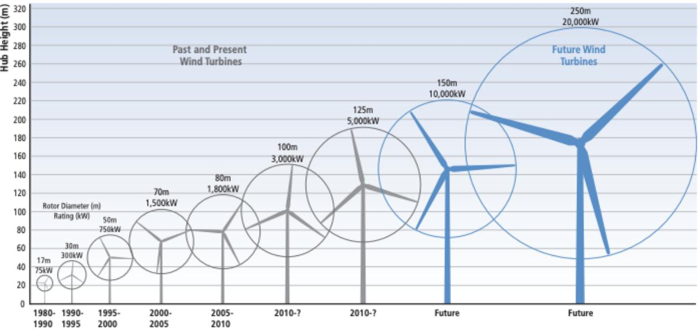

#### **Figure 1 : HAWTs have grown dramatically over time, as shown in this 2011 diagram from the [IPCC Special Report on Renewable Energy Sources and Climate Change Mitigation \[4\] .](#page-231-0) As of 2020, the largest HAWTs are ~15 MW, and are expected to continue to grow larger.**

With the additional constraint of needing the system to fly, airborne wind energy (AWE) systems face bigger difficulties increasing scale than HAWTs do. It's important to understand the pressures behind the growth of HAWTs and see how they may also apply to airborne wind turbines (AWTs). BoS is a surprisingly large portion of the total LCOE for wind energy systems and is indirectly responsible for much of this trend. What creates this trend? Why is one massive system better than several smaller systems if, when combined, they make the same total amount of power? To better understand, let's look at some examples of the importance of BoS costs, beginning with onshore HAWTs.

Numerous examples can be found in literature of breakdowns of these costs for HAWTs, such as the example in figure 2 from the [NREL 2018 Cost of Wind Energy Review \[5\] .](#page-231-0)

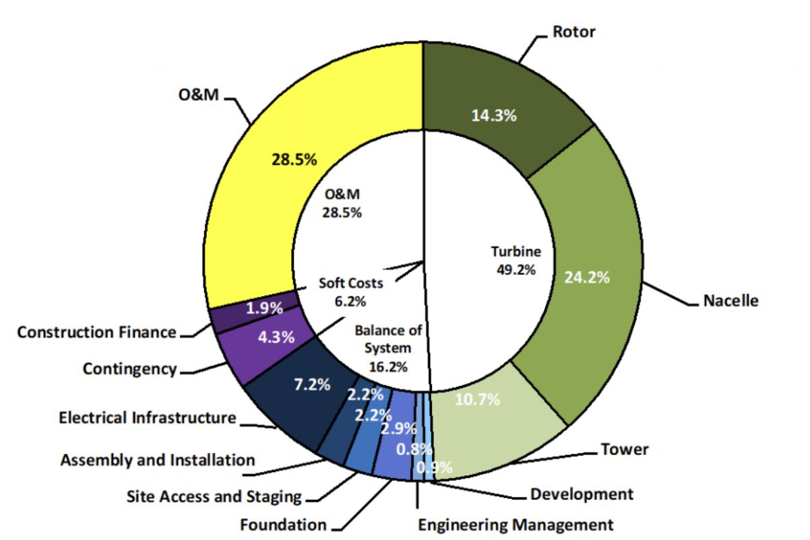

#### **Figure 2 : Component-level LCOE contribution for the 2018 land-based wind reference project. Note: O&M represents operation and maintenance. Image is from [NREL 2018 Cost of Wind](#page-231-0) [Energy Review, \[5, fig ES1\] .](#page-231-0)**

In this example, BoS and related soft costs (the purple and blue colors) are approximately 22% of the system LCOE for an onshore system.

Makani developed a bottom-up system cost, scaling, and performance model, and here we compare the total cost of energy breakdown in that model using a system similar to our MX2 next generation system under similar plant and site conditions as the NREL study.

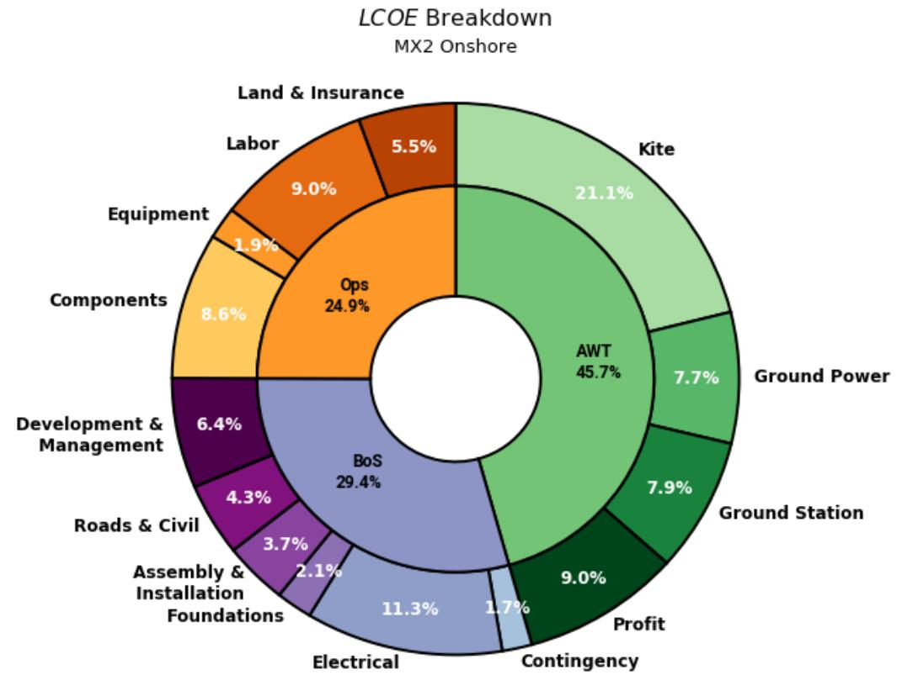

#### **Figure 3 : LCOE breakdown for onshore, using a system similar to our MX2 system under similar plant and site conditions as the NREL study.**

Approximating the categories (and roughly the colors) from the NREL data, we find that AWTs have similar cost drivers. They aren't meaningfully different in components—collection systems still need to be placed, substations and connections still need to be made, and access routes to install and maintain systems must be in place. The commonality means BoS costs play a similarly large role for AWTs as they do for HAWTs.

How do BoS costs relate to system scale? NREL provides scaling models for BoS costs that reside in their [System Advisor Model renewable energy cost tool \[6\]](#page-231-0) , and we can compare the specific BoS cost-per-rated-watt from the NREL model with our internally developed BoS model.

Direct comparisons should be qualified—the models were developed independently and don't necessarily share identical underlying assumptions. However, best attempts were made to make similar inputs, and differences in output appear justified. Using these models, we can hold the total rated power of the plant constant and vary the system rated power, resulting in fewer systems in the plant as each individual system increases in size.

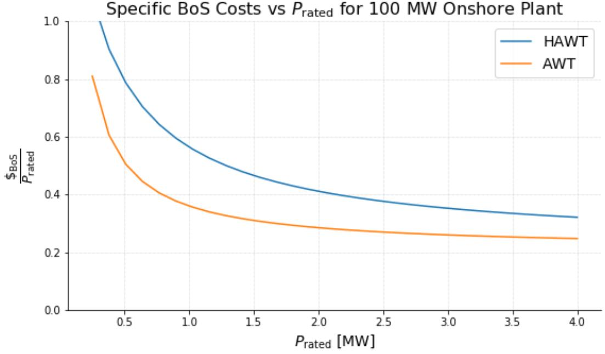

**Figure 4 : Specific BoS Costs versus P rated for 100 MW onshore plant.**

For a constant 100 MW onshore wind turbine project with typical siting, similar trends are present for both AWTs and HAWTs: BoS cost-per-rated-watt decreases with increasing system size. Larger systems are more cost effective than many small systems. Fewer systems mean fewer roads, fewer collection system trenches, fewer installations… In short, less of everything needed to install and support a wind turbine, which more than offsets the increased cost of the larger components and more involved installation process, driving the industry to larger and larger systems. We expect AWTs to have an advantage on specific BoS, requiring smaller access roads, foundations, towers, and crane pads on a per-rated-watt basis, and this appears to be the case.

Assuming that other system performance metrics are similar, AWTs appear to need to be at least > ~500 kW to get down the steepest part of the curve and be competitive with the 2-4 MW onshore HAWT systems of today.

For offshore installations, we never created scaling models to fill out an entire curve, but we expect the shapes to be similar, just shifted substantially up and to the right, for both AWTs and HAWTs. This is easily explained by again pulling from the NREL case study, this time for offshore floating platforms:

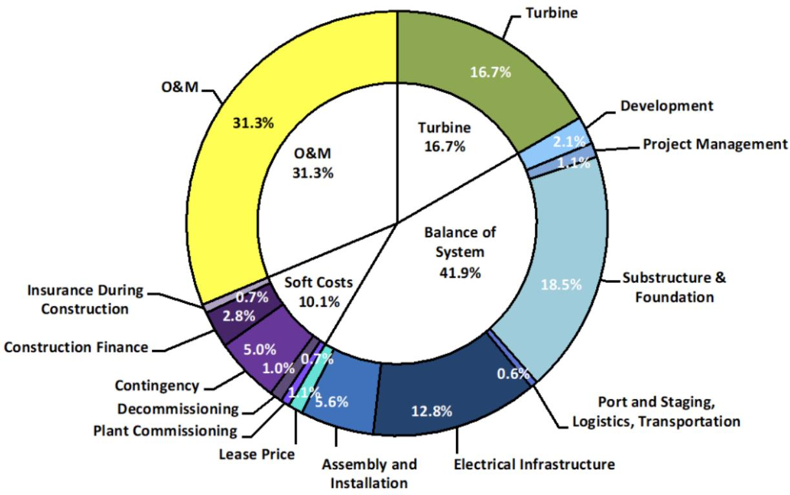

#### **Figure 5 : Component-level LCOE contribution for the 2018 floating offshore wind reference project. Image is from [NREL 2018 Cost of Wind Energy Review \[5, fig ES3\] .](#page-231-0)**

The BoS and associated soft costs dominate the total cost of energy for offshore systems, at ~52% of the total. The turbine is just a small fraction of the cost of energy! Making electrical connections, running mooring lines, and making large floating platforms is expensive, quickly taking over and defining the problem. It becomes justifiable to spend more on the turbine on a cost-per-rated-watt basis to grow the system and push down relative BoS costs.

Again, it's important to highlight that for most costs here, AWTs do not substantially differ! For all categories except: Assembly and Installation, Port and Staging, Logistics, Transportation, and Substructure and Foundation, AWE expects to have similar (or higher) costs per rated power. These categories where AWE differs and can hope to see a benefit combine to just 20% of the total LCOE. AWE needs to claim a clear advantage in these areas to make a meaningful reduction in overall cost of energy.

Several rough case studies for offshore systems at Makani confirm similar cost breakdowns. Figure 6 shows the results for one such case study, again matching conditions to the NREL example as much as possible, using a system similar to the MX2:

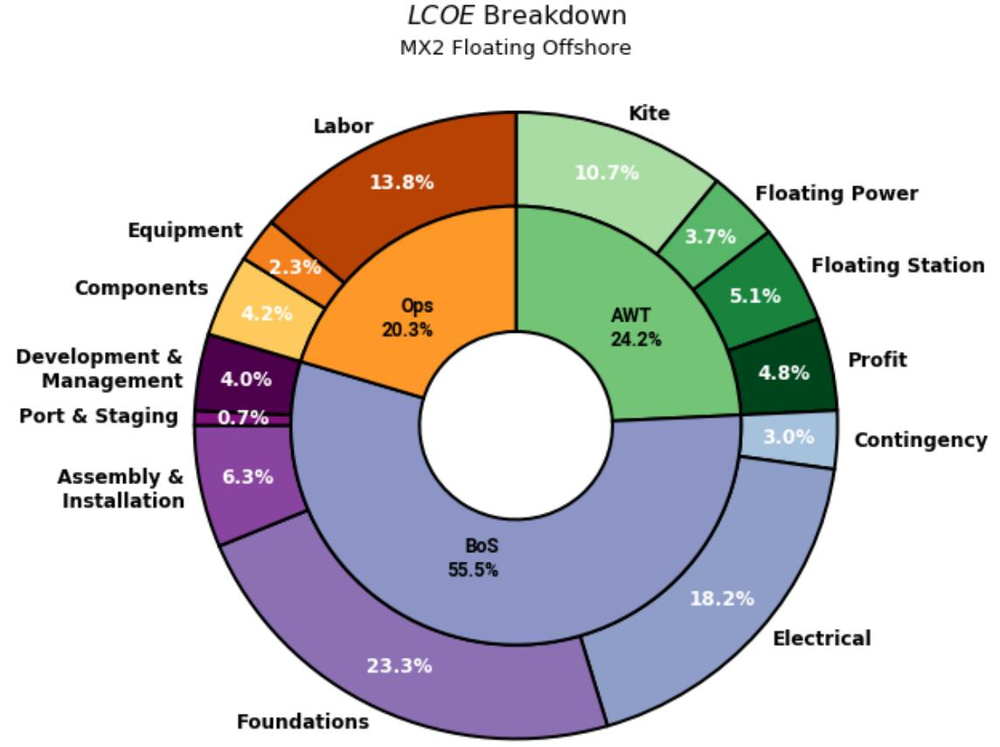

#### **Figure 6 : LCOE breakdown for floating offshore, using a system similar to our MX2 system under similar plant and site conditions as the NREL study. 7**

The turbine share of total costs for AWTs is smaller than for HAWTs—in this example, we're using the same system as onshore. Larger offshore HAWTs generally pay a higher cost per rated power to reduce more BoS costs for an overall win. BoS is less dominant for onshore systems, so this tradeoff is less pronounced onshore—this is the main reason why offshore systems are larger than onshore systems today. The optimum for offshore AWTs will follow the 8 same trend—larger systems reduce dominating BoS costs—but using the same system in this comparison means we're unable to capture this effect.

Maintenance for offshore AWTs was also modeled as a lower share of LCOE than HAWTs—there is certainly some benefit in being able to swap out a kite and perform turbine maintenance onshore—but confidence in matching the same conditions and assumptions, and in the predictive capabilities of the models, is lower. The key takeaway is simply that labor costs grow significantly offshore, taking up a larger portion of the operating costs. Maintenance costs

7 "Floating Station" here refers to the equipment (winches, sensors, perch) on top of the floating foundation, not the foundation itself.

8 Also, onshore systems typically have additional siting, transportation, and installation constraints, further pushing the trade-off to smaller systems than those offshore.

are rising (evident in the fact that operating costs offshore grow to be a similar component as the AWT, which is unchanged in cost), but the share of total LCOE is reduced as BoS becomes so dominant.

We expect AWTs to have an enduring advantage in platform cost-per-rated-watt over HAWTs in floating offshore applications, for three primary reasons:

-   1. AWTs have a lower overturning moment due to shorter towers.
-   2. AWTs have lower mass, centered at lower elevation above sea level.
-   3. AWTs can tolerate large platform motions.

The combined effect of these factors leads to smaller platforms that are less expensive to build and simpler to deploy.

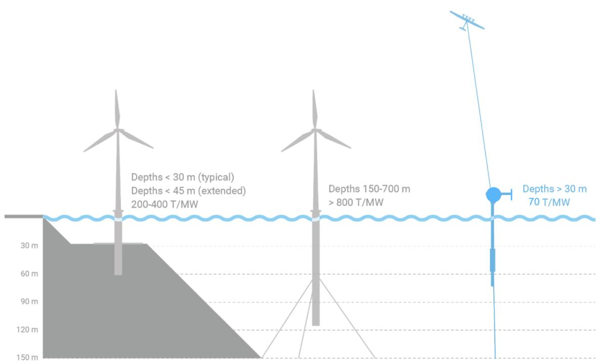

#### **Figure 7 : Notional offshore platforms for fixed bottom (left) HAWTs, floating (center) HAWTs, and AWTs (right), with rough platform tonnage per rated watt.**

As shown in figure 7 , Makani anticipated approximately an order of magnitude less foundation mass per unit power. This forms an enduring advantage for AWTs: even as system scale increases, the relative lack of an overturning moment will remain, keeping platforms small. Of course, this cost saving is primarily on the floating foundation itself. Installation costs per system go down as well, but, if systems are small, will need to be repeated for many systems. Electrical infrastructure follows this trend as well, but here AWTs have no initial advantage, requiring similar connections and installation processes.

Clearly, many touted AWE benefits are in danger of vanishing at smaller system sizes—AWT floating platforms and turbines may be able to reach a better cost-per-watt than HAWTs, but electrical infrastructure, installation, and maintenance costs grow with the increasing number of systems needed to meet a desired plant size, eating into those benefits.

In addition, many markets are increasingly space constrained—it doesn't appear in the LCOE metric, but when space to install turbines is limited, power per ground or sea area becomes important. As long as the LCOEs are competitive, a developer may choose a more power dense system to maximize total energy at the expense of a slighter higher cost of energy—the more power dense systems are typically also the higher rated systems.

AWTs can potentially meet renewable energy demand for small or semi-permanent installations in places where a large HAWT would be difficult to install, but in order to directly compete with HAWTs in the utility energy market and have a significant impact on overall renewable energy penetration, AWTs have significant incentive to be approximately 1 MW or larger.

# 4 Maintenance

Keeping the turbines operating via planned and unplanned maintenance is nearly the entirety of operating costs for turbines—land lease and insurance is typically a small component.

Cost of maintenance is difficult to model and predict—much of the existing literature on HAWTs relies on historical data and trends to predict performance of future systems. It's tempting to lean on this same HAWT historical data to form AWT predictions, but we need to at least understand the reasons for the trends for HAWTs and see how they can apply for AWE. We took two approaches—a broad, top-down comparison with the wind industry and aircraft, and a complex bottom-up approach, relying on extensive estimation of major component lifespans and repair or replacement costs. We'll describe some of the top-down comparisons here, and describe the key learnings from the bottom-up modeling we did.

We begin by setting an upper bound on maintenance costs with the naive assumption that maintenance is the only cost. If everything else was free, how much would maintenance need to cost to reach a desired LCOE target?

With as the cost in today's dollars in year , as the total system lifetime in years, and _COMn n lsys kW ACC_ as the real (inflation adjusted) weighted average cost of capital, the yearly levelized cost of operations and maintenance, is: _Copexl_

$$C\_{opex\_l} = \sum\_{n=0}^{l\_{sys}} \frac{C\_{OM\_n} \left(1 - k\_{WACC}\right)^n}{l\_{sys}} \tag{3}$$

If we assume operations and maintenance costs per year to be constant in today's dollars, we can represent this as:

$$\mathbf{C}\_{opex\_l} = \mathbf{C}\_{OM} k\_{level} \tag{4}$$

where is the average annual operations and maintenance costs in today's dollars, and _COM k_ is the levelizing factor, determined from the sum above to be: _level_

$$k\_{level} = \frac{k\_{WACC}(1 - k\_{WACC})^{l\_{\rm sys}} - (1 - k\_{WACC})^{l\_{\rm sys}} + 1}{l\_{\rm sys} k\_{WACC}} \tag{5}$$

We want to find some normalizing metric to compare with other vehicles, so let's define a new variable, the specific maintenance cost , which is the levelized cost to maintain a system _kOM_ per hour, scaled by system rating. If we define a specific system capital cost, , such that: _kcapex_

$$k\_{capex} = \frac{C\_{sys} + C\_{BoS}}{P\_{rated}} \tag{6}$$

we can then solve for the required system maintenance cost per hour in today's dollars, , in _kOM_ terms of LCOE and some system and economic characteristics:

$$k\_{OM} = \frac{C\_{OM}}{t\_{year}} = \frac{P\_{rated}}{k\_{level}} \left(LCOE\ \ k\_{CF} - \frac{k\_{copper}k\_{FCR}}{t\_{year}}\right) \tag{7}$$

Now, for some examples. With a of 6% and a 20 year project life, = 0.61. Solving for _kW ACC klevel k_ , a 1 MW rated system with a 50% capacity factor at a competitive onshore LCOE of _OM_ \$40/MWhr would require a maintenance cost of ~\$33/hr or less, even if the rest of the system were free!

Let's put these figures in context. In order to do so, we'll abandon any pretense of precision and pull out our biggest, broadest paintbrush.

We'll assume a of 0.1 for this exercise, typical for projects with a 20 year life in well _kF CR_ developed economies. AWTs, especially rigid wing onboard generation ones, share a lot in common with small aircraft, so to draw the comparison, we'll compare the cost of the system with the cost of maintenance for several types of flying vehicles. We'll draw lines to represent the required to meet a \$40/MWhr LCOE target. _kcapex_

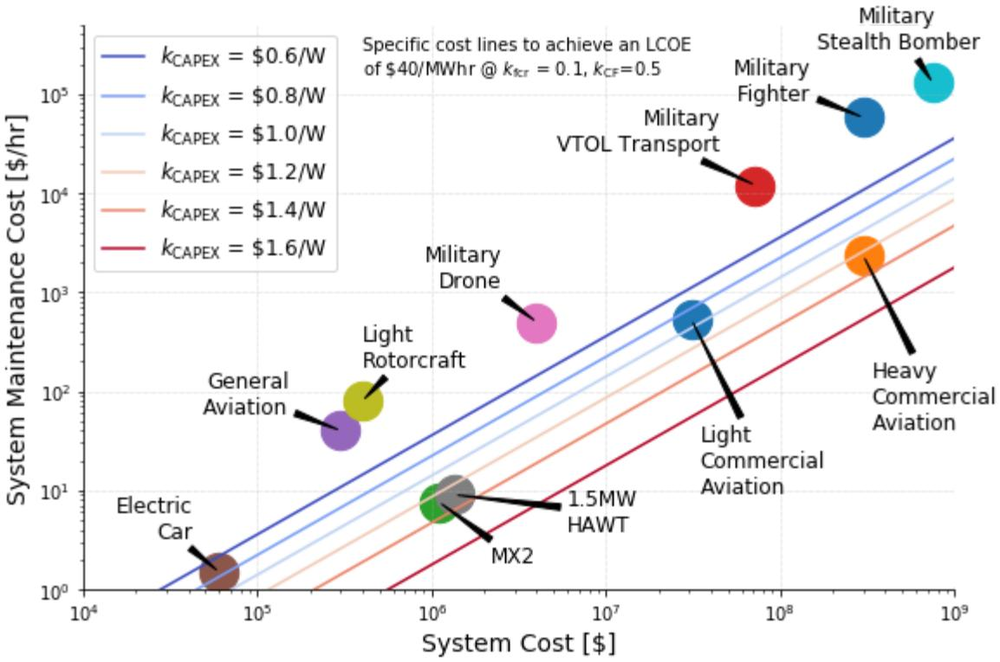

#### **Figure 8 : System cost versus maintenance cost for various types of (mostly) flying vehicles.**

The resulting plot in figure 8 lays out the challenge clearly—wind turbines need maintenance cost per hour relative to system cost comparable to the absolute best aviation can muster with heavy commercial aviation passenger planes. As we move up and left and maintenance costs become a larger share, we need a lower cost-per-rated-watt (a lower ) to offset the _kcapex_ increased maintenance costs.

Rather unsurprisingly, anything close to the relative maintenance costs of general aviation or military aircraft requires a specific system cost well below what the current wind industry is able to achieve, with current specific costs for the NREL onshore example system of ~1.4 \$/W (recall that we've lumped the cost of the turbine and the BoS in our definition—it's not uncommon for _turbine only_ specific costs to reach the required values).

Are maintenance costs an order of magnitude less than comparably priced aircraft a challenge? After all, the electric generators of AWTs are much simpler, and the reliability demands much lower, than the crewed gas turbine and piston powered aircraft we're comparing them to. A simple bottom-up comparison was completed, pulling several sources of data to create a hodgepodge machine comparable to an AWT—the airframe-only maintenance expenses for a common general aviation aircraft, combined with estimated maintenance costs for two electric car powertrains.

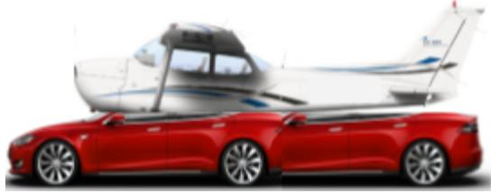

**Figure 9 : A conglomerate system resembling the complexity of an AWT—a simple airframe and several electric powertrain units.**

This rough estimate arrived at estimated hourly costs of ~\$14/hr, which, holding the rest of our assumptions from above, would require a of \$0.88/W to meet a competitive onshore _kcapex_ LCOE target of \$40/MWhr. These rough approximations simply show that we need to pay attention, as unexpectedly high maintenance costs can quickly blow up the problem. Systems need to be as hands-off as possible!

With these considerations in mind, Makani also built a comprehensive bottom-up model, whose top level results are shared in the LCOE breakdowns from above. We won't be sharing this model, as it's complex, vaguely sourced, and highly specific to our designs, but it's worth distilling the results, which are more general in nature.

The model consists of infant mortality and mean time between failure (MBTF) estimates for each class of components, combined with estimated time to service and/or replace those components, and their scheduled maintenance frequency. Failures are classified by urgency—some will require an unscheduled trip to the turbine, while others can be addressed in the next scheduled maintenance. Technician time to get out to the system and access it for repairs is one of the largest sensitivities, and unfortunately, also carries one of the largest uncertainties. An example of some of the largest inputs to this general labor portion (ie, not the labor to replace a specific component) of the model for onshore systems is in table 2 .

Despite relying on a large number of rough assumptions and estimates, the process of creating and using a maintenance model gave us several key lessons:

-   1. Larger systems reduce the total number of components in a given plant size, resulting in fewer trips, lower labor costs, and less kite downtime.
    -   a. This is especially important for offshore systems, where time to access systems is large.
-   2. Offshore AWT systems should support easy kite swaps to enable heavy maintenance operations to occur onshore.
-   3. Maintenance costs are dominated by the power plants.

    -   a. There are a large number of rotors, motors, motor controllers, and cooling systems to maintain.
    -   b. Expected MBTFs for most powertrain components seem to necessitate ~6 month scheduled maintenance intervals, about twice that of HAWTs.

-   4. Onboard generation wind turbines will likely be more expensive to maintain than modern HAWTs on a cost per rated power basis.
    -   a. Modeling uncertainty is large—it appears onboard generation wind turbines maintenance costs can be competitive, but a major cost reduction is unlikely.
    -   b. Ground based power systems will have somewhat easier access, but face the same maintenance pressures to reduce the number of components and thus have the same incentive for increased scale.
-   5. Rotor life expectancy for onboard generation systems is an area of concern.
    -   a. Inspection and replacement intervals will need to be several times longer than comparable rotors from general aviation, with costs a small fraction.
-   6. AWTs should be designed to facilitate quick powertrain swaps.
    -   a. Smaller powertrain units than comparable power HAWTs enable easier maintenance, but the system needs to be designed to maximize this advantage.

| Project Level General Maintenance Assumptions                 | Value | Unit |
| ------------------------------------------------------------- | ----- | ---- |
| Fault/troubleshooting time multiple of unscheduled time       | 100   | %    |
| Average kite wait time before a tech response                 | 8     | hr   |
| Average travel time for a tech to get a kite                  | 0.5   | hr   |
| Average time to get in a service position once at the kite    | 0.5   | hr   |
| General inspections each time accessing the kite              | 0.25  | hr   |
| % effectiveness increase decrease in tech time year over year | 1.0   | %    |
| Burden rate for handling spares                               | 5     | %    |
| % of scheduled maintenance done below cut-in                  | 20    | %    |
| # of carbon fiber repairs per kite per year                   | 2.0   |      |
| Cost per kite per year of carbon fiber repairs                | 1500  | \$   |
| Average # of hr down for a carbon fiber repair                | 24    | hr   |
| % of time that techs are working but not fixing kites         | 15    | %    |

#### **Table 2 : Some of the key inputs to Makani's labor model for onshore maintenance expenses.**

Anecdotal evidence supports the top takeaway, that larger systems reduce maintenance costs-per-rated-watt. Statements from several HAWT wind turbine farm operators agreed that the number of required technicians largely scales with the number of turbines (and therefore, number of total components), rather than the size of each turbine.

The model also decided several design trades for the next generation system—more rotors and variable pitch rotors were both rejected in large part due to the higher predicted maintenance

costs washing out the perceived benefits of those changes. A maintenance model is useful to gain some insight into difficult trades such as these, and reduce the temptation to add ever more complexity.

All of this is to say that maintenance costs are another compelling reason for energy systems to be as large as possible, and AWTs are not exempt, despite having comparatively easier to access and maintain power systems than HAWTs.

# 5 System Cost

Although the turbine itself draws all the attention, modern turbines are now so cost effective that wind energy costs have become primarily a siting, infrastructure, maintenance, and financing problem. As we saw above, the turbine itself is typically less than half the total cost of energy onshore, and a quarter or less offshore. Wind energy's ongoing challenge is to increase the denominator—lowering the cost of energy by increasing energy production—and to increase system rating to reduce balance of system and maintenance costs.

This isn't to say that system costs are irrelevant, or that the challenge of making a cost effective system is easy, but simply to point out that it's exceedingly difficult to substantially reduce the cost of energy through the cost of the turbine alone. In our offshore LCOE breakdowns from s [ection 3 ,](#page-110-0) we see that even if the cost of the turbine is free, we've only reduced the cost of 9 energy by ~15-25%, placing an impossible 100% turbine cost reduction at parity with a relatively more realistic 15-20% capacity factor improvement or an increase in scale to reduce BoS and maintenance costs by 20-30%. A competitive cost of energy cannot be achieved by reducing the cost-per-rated-watt of the turbine alone, but a high turbine cost can certainly push it out of reach.

We should use this to reframe the priorities for a first generation AWT. The design needs to ensure that cost-per-rated-watt can be roughly competitive with traditional wind energy, at which point it becomes relatively unimportant, at least for a new technology entering the market. It's much more important to demonstrate that a large system with an acceptable level of performance (ie, a competitive ) is technically possible, as these are the key long term _kCF_ avenues towards success. As a fledgling industry, AWE needs to shorten development time, 10 and (in the opinion of this author) time spent incrementally lowering costs should be largely relegated to future optimizations, assuming work has been done to ensure costs can be roughly competitive and maintenance considerations have been designed in.

Makani developed cost models, estimates, and vendor quotes that show a path to a competitive cost-per-rated-watt, leaving the key challenge as needing to demonstrate reliable performance at scale.

9 It's obviously _difficult_ to build a business case around a free product, but it's also difficult to build one around a product with a lengthy development where the benefits are only realized at a rock bottom price.

10 Despite several multi-year efforts from several companies, no AWT effort has publicly demonstrated hands-off operation of even a moderate sized (>500 kW) AWT for a reasonable length of time (>6 months of operation at a high level of availability) while achieving the necessary performance level. As Makani has clearly demonstrated, growing development costs and timelines can be hard to justify.

# 6 Kite Power

We finally arrive at the last piece of the LCOE puzzle, the energy production of the turbine. In this section, we'll introduce an analytical model to isolate the major sensitivities and losses for an AWT's power. To do so, we'll embody the mantra that "all models are wrong, but some are useful" by making extensive simplifying assumptions. Our goal is a relatively simple model that can be coded in an afternoon and teaches the big lessons on how to get power from a kite —the end result only needs to broadly capture the sensitivities to be useful.

Before we build a power model, we need a brief discussion of how we translate power into energy. Power is a function of wind speed, so turbine performance is typically presented as 11 power versus wind speed, called a power curve. A typical power curve will appear like the following, figure 10 :

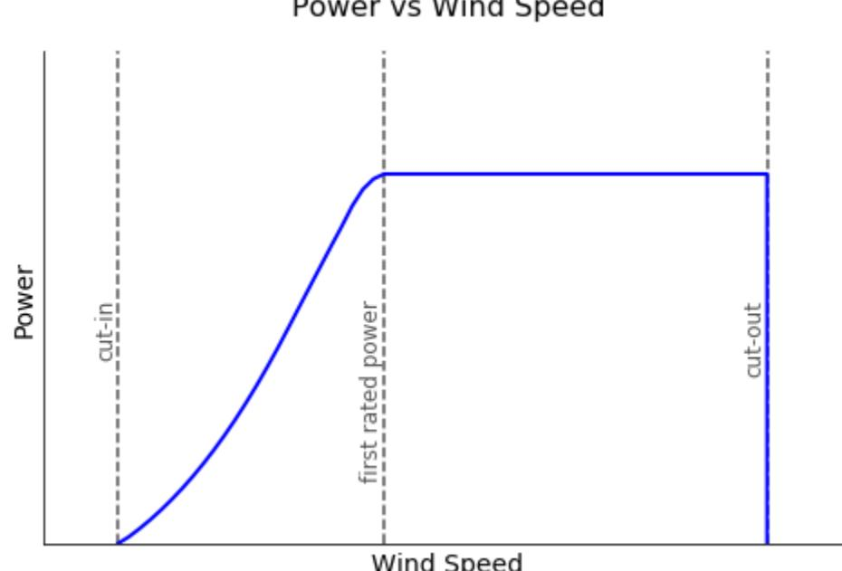

**Figure 10 : A notional power curve for a wind turbine with key wind speeds denoting different regimes specified.**

A power curve has 2 major regimes, denoted with 3 wind speeds. The cut-in wind speed marks the first wind speed where the turbine makes power. The turbine makes more power as the wind grows stronger until it reaches its first rated power point, where the power system becomes saturated at , and is unable to accept any more power. The rated power continues until _Prated_ cut-out, where the turbine must shut down, typically to avoid excessive loads that could damage the system.

11 And somewhat of turbulence, which we'll ignore here, as it's outside the scope of our simple model.

Power performance from cut-in to first rated power is dictated by the turbine's ability to extract power from the wind, while the rated power region is determined by the power system's maximum power. Here, we'll choose to focus on maximizing the ability of the turbine to make power from the wind, ie, the region from cut-in to first rated power. Power saturation, and the challenges associated with it, will be discussed in s [ection 10 .](#page-195-0)

A power curve does not directly give us the capacity factor, , needed to determine LCOE. _kCF_ Capacity factor is a function of both the power curve and the wind speed probability distribution. Wind speed probabilities are site specific, but are commonly described with "standard" distributions, taking the form of a Rayleigh curve. Sites can be classified by their average wind speed, with the International Electrotechnical Commission (IEC) specifying high (class I), to very low (class IV) categories. Rayleigh distributions for those average wind speeds is shown in figure 11 below:

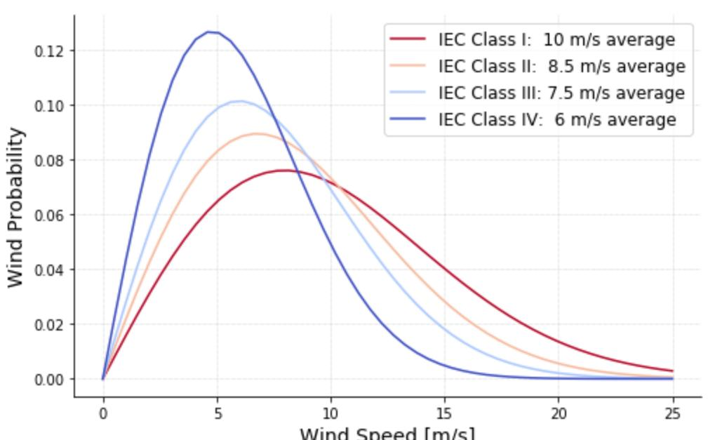

**Figure 11 : Wind probability distributions for IEC Wind Classes, assuming a typical Rayleigh distribution.**

A wind speed distribution convolved with a power curve then provides a power probability distribution. Integrating the power probability distribution results in the average power for a given wind distribution. The average power is then adjusted for turbine availability (turbines may be down for maintenance, or for bird migrations, or to better match energy demand, or several other reasons) and any other plant level losses, and ratio of the net average power to the maximum power, , gives us the capacity factor, . _Prated kCF_

We'll leave this exercise to the reader. The goal here is to describe what we can do to influence the capacity factor rather than to arrive at a particular LCOE estimate. It's sufficient to draw a quick, obvious conclusion: moving the power curve between cut-in to first rated power to the left, via increasing turbine performance, increases capacity factor and lowers LCOE.

## 6.1 Loyd Revisited

All wind turbines generate power by converting the kinetic energy of the wind into useful motion. Power available in the wind for a given area perpendicular to the wind direction is given by:

$$P\_{\rm wind} = \frac{1}{2} \text{ç}A\_{\rm swept} \text{v}\_{\rm w}^{\,^3} \tag{8}$$

Where is the air density, is the area of wind, and is the wind speed. For a HAWT, ρ _Aswept vw A_ is clearly defined, as the blades sweep out a fixed area, setting an absolute maximum _swept_ power that the turbine can reach for a given wind speed and air density. However, no turbine is able to extract all the power from the wind, due to both system inefficiencies and the physics of slowing down the wind to extract power. HAWTs are able to get close to the fundamental 12 limits, so it remains useful to reference their power to the power available in the wind, and to bundle these losses into a power coefficient, such that:

$$P\_{\rm HAWT} = \frac{1}{2} C\_{\rm HAWT} \otimes A\_{\rm wept} \nu\_w \, ^\otimes \tag{9}$$

Translating this to AWTs, we see an immediate disconnect: AWTs can sweep out a variable area with respect to the wind. Without a fixed , AWTs can be largely unburdened by the amount _Aswept_ of power available in a given area of wind, as they can easily sweep out a large area relative to the limits of the kite and its power system. It's instead useful to define a performance metric, , ζ in terms of the kite's wing area, , rather than the swept area, such that: _S_

$$P\_{AWT} = \,\_2\text{``}\mathfrak{J}\mathfrak{g}\mathrm{S}\nu\_{\text{w}}\,^3\text{\*\*}\,\tag{10}$$

Unlike the HAWT case, there is no clear limit on power. We need a different base to build our reference for AWT power. To find it, we look to the foundational paper from [Loyd \[7\] ,](#page-231-0) recontextualized for use here, with some strong influence from [Vander Lind](#page-231-0) [\[8\]](#page-231-0) .

We begin by assuming a kite is flying perpendicular to the wind at speed , with wing area , _vk S_ operating at lift and drag coefficients and , creating lift and drag forces and , _CL CD FL F D_ while located directly downwind from the tether attachment, at tension . For an onboard _FT_

12 Chiefly the Betz limit, as a result of induced flow losses, which we'll discuss later.

generation kite, we extract power from the force on the rotors, , at the airspeed of the kite _Fr_ (the apparent wind), , such that . We can then set up the following force balance. _va Fr_ = _P va_

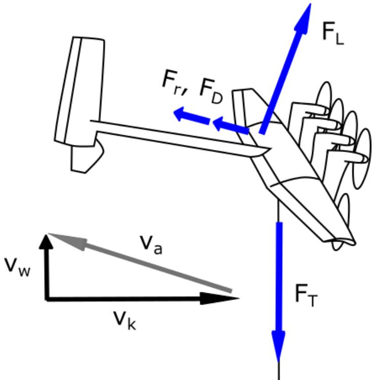

#### **Figure 12 : Force balance for an onboard generation kite. The wind and kite speeds (black), create a "kiting triangle" that tilts the lift and drag forces (all forces in blue) forwards such that there is a component of lift pushing the kite along.**

From figure 12 , we can utilize the similar triangles of the speeds and the forces to find the following relationship for the balance of forces along the axis: _va_

$$\frac{P}{\nu\_a} + \frac{1}{2} \mathfrak{g} \mathbf{C}\_D \mathbf{S} \nu\_a^2 = \frac{1}{2} \mathfrak{g} \mathbf{C}\_L \mathbf{S} \nu\_a^2 \left(\frac{\nu\_w}{\nu\_k}\right) \tag{11}$$

If we assume that , we can apply the small angle approximation that and solve _v k_ ≫ _vw va_ ≈ _vk_ for power, simplifying this to:

$$P\_- = \frac{1}{2} \varrho S \mathbf{v}\_k^{\ 3} \left( C\_L \frac{\mathbf{v}\_w}{\mathbf{v}\_k} - C\_D \right) \tag{12}$$

Tension is an important measure for AWT design, so let's also find a relationship for it.

Again applying the small angle approximation we did above, we can simply assume that tension is approximately equal to lift:

$$F\_T \approx F\_L = \frac{1}{2} \mathbb{Q} C\_L \text{Sv}\_k^2 \tag{13}$$

[Equation 12](#page-128-0) shows a sensitivity to kite speed, so to find the optimal speed we take the derivative of power with respect to , set the derivative to zero, and solve to find the optimal kite speed, _vk_ which we'll denote by adding the subscript to indicate this as the Loyd optimum operating _L_ point:

$$\mathbf{v}\_{k\_L} = \frac{2}{3} \frac{\mathbf{C}\_L}{\mathbf{C}\_D} \mathbf{v}\_{\mathbf{w}} \tag{14}$$

We'll see later that the wind speed used to determine the best kite speed needs to be adjusted to accommodate various effects, but we'll leave it as a generic for now. We can then _vw_ substitute this back into [equation 12](#page-128-0) to find:

$$P = \begin{array}{c} \frac{4}{27} \frac{C\_L}{C\_D} \frac{1}{2} \text{g} \text{S} \text{v}\_w \text{}^3 \\\\ \end{array} \tag{15}$$

Comparing [equations 10](#page-127-1) and [15](#page-129-0) , we see that we've found a theoretical limit for at a given ζ _CL_ and . We'll call this maximum the Loyd limit: _CD_ ζ*L*

$$
\mathfrak{T}\_L = \frac{4}{27} \frac{C\_L^{-3}}{C\_D^{-2}} \tag{16}
$$

This limit only assumes optimum kite speed, but a given kite design will also have an optimum _C_ , usually at or near the highest achievable lift coefficient. We'll need to specify operating _L_ point for the kite, accounting for any aerodynamic margins required to ensure the target is _CL_ feasible.

Let's also introduce a baseline for a wing operating optimally, , where the subscript ζ ζ0 0 indicates the for a kite without the tether, operating at the optimal speed and target , ζ _CL_ 13 where the drag coefficient is only for the kite, denoted with . We then use this to define a _CDk_ baseline power, , for an AWT operating optimally without any of the losses we'll soon be _P_0 adding in, at some reference wind speed, , measured at a specified height, , far _vwref href_ upstream of the turbine. We need to be careful with what we're solving for here—this _P_0

13 For very low drag, high lift designs, the optimum zeta may be at a lower lift coefficient for the kite alone than for the full system when including the tether drag, due to the greater influence of induced drag.

represents excess thrust power, not an electrical power. This thrust power can then go to the power system if we wish—for an onboard generation system, via rotor drag power that is then converted to electrical power—or into accelerating the kite.

$$
P\_0 = \frac{1}{2} \varrho S \mathfrak{T}\_0 \nu\_{\
u\_{ref}}{}^3 \tag{17}
$$

We'll be using this baseline power as the foundation to build our model on. Before moving on, let's look at how the tension of an optimally operated AWT compares with the theoretical minimum force for a given power at a given speed, in this case simply defined as . _FT min_ = _P vw_ Taking our optimal kite speed from [equation 14](#page-129-1) and plugging it into [equation 13](#page-129-2) to find the _vkL_ tension at the optimal kite speed, , we find that the tension ratio at the Loyd limit, , is: _FTL_ τ _L_

$$\mathfrak{T}\_L = \frac{F\_{T\_L}}{F\_{T\_{\min}}} = \frac{F\_{T\_L} v\_w}{P} = \mathfrak{Z} \tag{18}$$

The loading efficiency of an AWT at maximum performance is independent of the system itself! We'll compare this to the analogous tower loading efficiency of a HAWT in a later section.

#### 6.1.1 Tether Drag Losses

Defining a is only useful to provide a comparison point to come back to. For AWTs, the ζ0 _CD_ must include the drag of the tether, not just the wing. By again assuming and modeling _v k_ ≫ _vw_ the tether as a rigid bar with constant drag properties, we can find an effective tether drag _CDt_,_eff_ as a drag coefficient referenced to the kite wing area, , and kite airspeed to be: _S_

$$C\_{D\_{teff}} = \frac{1}{4} \frac{C\_{D\_t} l\_t d\_t}{S} \tag{19}$$

where is the drag coefficient of the tether, is the tether length, and is the tether _CDt l t dt_ diameter (or reference length for , if non-circular). _CDt_

Given that the tether is a significant component of the overall drag, we need to include the impact of the tether length on the system performance via reduced . There are other ζ detrimental effects of increasing tether length (such as increased mass, and, for an onboard generation system, reduced efficiency), but these will be ignored here.

We begin by breaking apart the total drag term into tether and non-tether components. It's useful to normalize this parameter to enable us to compare different kites and operating points.

By normalizing the tether drag per unit length relative to the airframe drag, we have a new metric, the tether drag ratio, : _kT DR_

$$k\_{TDR} = \frac{C\_{D\_1} d\_1}{C\_{D\_k} S} \tag{20}$$

We should highlight that this ratio is not purely a function of the system, but also a function of how we choose to operate it— is not fixed, as it is a function of , so must be _CDk CL kT DR_ specified at some target and its associated that represents how we will fly our kite. _CL CDk_ Some approximate example values are in table 3 below, including some fictional systems: _kT DR_

| Kite                            | CD k | S [m 2 ] | CD t | d [m] t | kT DR  |
| ------------------------------- | ------- | -------- | ------- | ------- | ------ |
| M600 As-Built: Fluted Tether | 0.244   | 32.9     | 0.7     | 0.0295  | 0.0026 |
| M600 As-Built: Smooth Tether | 0.244   | 32.9     | 1.0     | 0.027   | 0.0034 |
| M600-ish: Thick Tether       | 0.244   | 32.9     | 0.7     | 0.045   | 0.0039 |
| MX2: Fluted Tether           | 0.123   | 54.0     | 0.7     | 0.0295  | 0.0031 |
| MX2-ish: High Drag Kite      | 0.2     | 54.0     | 0.7     | 0.0295  | 0.0019 |
| Soft kite-ish                   | 0.16    | 30       | 1.0     | 0.010   | 0.0021 |
| MX2: Fully Faired Tether     | 0.123   | 54       | 0.1     | 0.035   | 0.0005 |

#### **Table 3 : Tether drag ratios, , for several example kites. Typical values appear to range** _kT DR_ **from 0.002 - 0.004. Faired tethers are a dramatic improvement.**

The total drag coefficient for the system can then be shown to be:

$$C\_D = C\_{D\_k} \left( 1 + \frac{1}{4} k\_{TDR} l\_t \right) \tag{21}$$

We can then define a power coefficient for tether drag, , as the ratio of . For a _CT D_ ζ ζ*L*/ 0 constant and , this becomes only a function of and : _CL CDk kT DR l t_

$$C\_{TD} = \frac{\xi\_L}{\xi\_0} = \frac{1}{\left(1 + \frac{1}{4}k\_{TDR}l\_l\right)^2} \tag{22}$$

#### 6.1.2 Path Offset Losses

It's important to consider the mechanism by which both HAWTs and AWTs generate their power from wind. All wind turbines work by redirecting and slowing down the incoming wind to generate a propulsive lift, in the process extracting the kinetic energy available in the wind. By definition, tethers of AWTs only support a tensile load, which means that for a kite in crosswind flight, the total aerodynamic forces on average must be in line with the tether, and the wing can only create forces to extract energy from the portion of wind aligned with the tether.

For AWTs with low tower heights, simply avoiding the ground requires an average elevation of the tether angle, , above horizontal, which attenuates the effective wind. Since power scales θ*e* with , we can then define a power coefficient to represent the elevation losses for a kite _vw_ 3 operating at : _vkL_

$$C\_{\theta\_e} = \cos^3 \theta\_e \tag{23}$$

This important relationship is worth confirming with the numerical model. A kite in pure crosswind flight (ie, ) under zero shear conditions, in the absence of gravity and with _v_ ⊥ _v k_ → _w_ → rotors of constant efficiency, is optimized for airspeed while all other flight conditions are held constant. It should be noted that is not a constant, as the wind speed used to determine _vkL vkL_ is also attenuated by . cos θ*e*

The power attenuation shown in figure 13 is independent of system performance. We've only shown the effect of path elevation here, but the same power attenuation occurs for any angular offset from the wind. We'll revisit this effect in the context of azimuth offsets later.

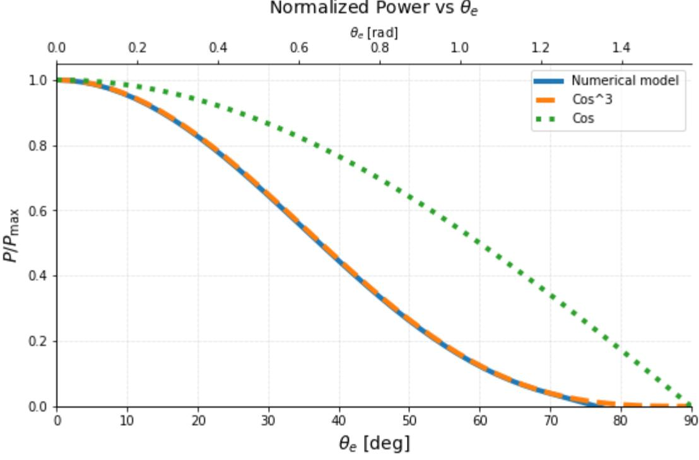

**Figure 13 : Numerical model verification of the critical cos 3angular offset losses.**

This wind speed attenuation is something we'll come back to again and again, so let's define our attenuated wind. The effective wind, , is the wind perpendicular to the approximate "flight _vweff_ plane," at the mean height of the path, which for AWTs we'll call the virtual hub height. Wind speed can vary with altitude, so we'll denote wind speed at this height as . For circular paths _vwvh_ and a rigid tether, the flight path is indeed planar, but for all other paths, the flight plane is roughly found as the plane normal to the vector drawn from the path centroid to the tether attachment. We lose some nuances around the path with this single simplification for effective wind, but it captures most of the effect. The angle of this plane forms the mean elevation offset, or , as discussed above. The effective wind can then be stated as: θ*e*

$$\nu\_{\nu\_{\rm eff}} = \nu\_{\nu\_{\rm vh}} \cos \Theta\_{\rm e} \tag{24}$$

For an AWT, minimum average tether elevation for a circular path is dictated by mean path radius , tower height , and desired ground clearance (ie, minimum altitude) : _rloop htower hmin_

$$\Theta\_{e\_{\min}} = \sin^{-1}\left(\frac{r\_{loop}}{l\_t}\right) + \sin^{-1}\left(\frac{h\_{\min} - h\_{\text{lower}}}{l\_t}\right) \tag{25}$$

Using approximate values from the Makani M600 with a wingspan of 25 m, a tether of 440 m, and a short tower of 5 m, then choosing a relatively tight turning radius of 5 wingspans (125 m

radius) with a ground clearance at the bottom of the loop of ~3.5 wingspans (90 m), we have a minimum elevation angle of 0.48 rad (~28 deg), and of this angle is 0.7. The minimum cos3 elevation loss in this example is nearly one third of the power!

#### 6.1.3 Wind Shear Gains

Wind in our altitudes of interest (~50 m to 300 m) typically follows a simple shear model, such that:

$$\nu\_{\nu\_{\rm vh}} = \nu\_{\nu\_{\rm ref}} \left( \frac{h\_{\rm vh}}{h\_{\rm ref}} \right)^{a\_{\rm w}} \tag{26}$$

Where is wind speed at the virtual hub height (the mean path height), , while is the _vwvh hvh vwref_ wind speed measured at some reference height, , and is the wind shear exponent. _href_ α*w*

Power in wind increases with , so even relatively small increases in wind speed with altitude _vw_ 3 can provide meaningful increases in system performance. We can find the average virtual hub height, , of the kite with the following: _hvh_

$$h\_{\rm vh} = l\_{\rm t} \sin \Theta\_e + h\_{\rm tow} \tag{27}$$

Using this virtual hub height in our [equation 26](#page-134-1) for wind speed allows us to define another power coefficient for the effect of wind shear, : _C_α_w_

$$\mathbf{C}\_{\mathbf{d}\_{\mathbf{w}}} = \left(\frac{l\_1 \sin \theta\_\varepsilon + h\_{\rm lower}}{h\_{\rm ref}}\right)^{3\mathbf{d}\_{\mathbf{w}}} \tag{28}$$

Before we move on, it's useful to compare the power benefits of higher shear with the elevation losses needed to access those benefits. If we assume that _h_ and drop it, then we _tower_ ≪ _l t_ sin θ*e* can combine our power coefficients and and drop geometric constants to show that: _C_θ_e C_α_w_

$$P \propto \cos^3 \theta\_e \sin^{3a\_\text{\textquotedblleft}3a\_\text{\textquotedblright}} \Theta\_e \tag{29}$$

The first part is the cost of higher elevations, while the second is the benefit of accessing higher winds.

Setting the derivative of this to zero and solving to find the for maximum performance gives θ*e* us:

$$\Theta\_{e\_{ideal}} = \tan^{-1} \sqrt{\mathbf{\alpha}\_w} \tag{30}$$

The ideal mean tether elevation accounting for the effects of elevation losses and wind shear benefits appears to be independent of tether length, system performance, or anything other than wind shear! For typical onshore shears of α 1 7 .143 , this evaluates to 0.36 rad (21 deg), _w_ = / ≈ 0 and for typical offshore wind shears of , ideal elevation is 0.31 rad (18 deg). Both are _w_ = 0.1 α lower than the minimum elevation we derived above! Best operation of an AWT is typically as low as feasible, even in normal wind shear conditions.

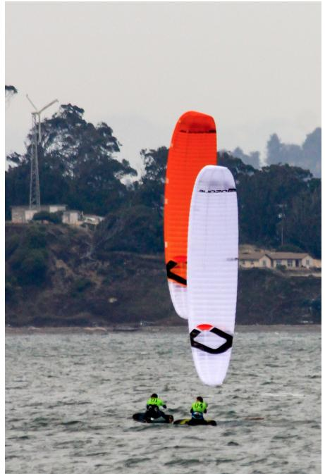

**Figure 14 : Makani employee and world champion kitesurf racer Johnny Heineken (white kite) keeping his kite low to reduce elevation losses.**

While AWTs are indeed accessing higher winds (typical tether lengths place the virtual hub height higher than most HAWT hub heights), it is generally advantageous to fly as low as possible, which means tighter turning radii and less ground clearance.

#### 6.1.4 Turning Losses

Not all lift produced by the kite can go towards power production. In practice, some portion of lift is used to make the turn and keep the kite and tether airborne. Here we'll look specifically at the turning losses.

A free body diagram in the frame of a kite turning a circular path directly downwind in the absence of gravity is shown in figure 15 , using the assumption to flatten the lift into the _v k_ ≫ _vw_

plane spanned by the centrifugal and tension forces, making all forces planar. This frame is non-inertial, so we add a centrifugal force, , that must also be balanced. _Fc_

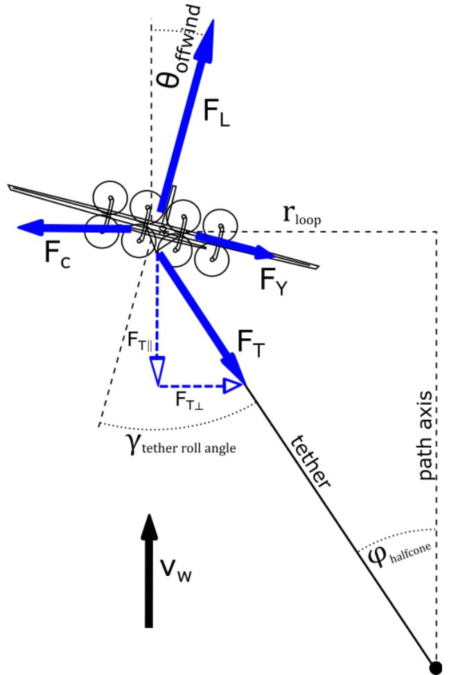

**Figure 15 : Forces on the kite in the approximate lift and tension plane. Here, the path center is directly downwind, and the kite is flying towards the viewer.**

We propose that only the lift in the plane contributes to power production. With our _Span_(_v_ , ) _k_ → _vw_ → small angle approximations we can restate the sensitivity as being in relation to the cos3 θ angle of the lift instead of simply the tether elevation angle, . In the absence of in _offwind_ θ*e Fc* straight and level flight, they are identical. This proposed behavior is worth confirming via the numerical model. In this case, we place the path loop axis directly downwind in the absence of gravity, and vary to achieve differing . Again, we optimize for airspeed under each _rloop_ θ*offwind* condition.

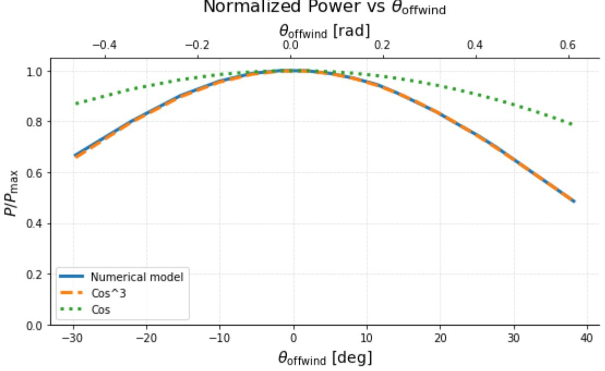

**Figure 16 : Numerical model confirmation of the proposed cos 3θ offwind losses**

Our example confirms the proposed sensitivity to the angle. Clearly, turning effort cos3 θ*offwind* can have a large impact on the net power production, but it's not all bad. Turning the _right_ amount can be used to help point the lift in the best power production direction (ie, as close as possible to downwind), despite the tether having some angle offset relative to the wind. Effectively, the power loss implied by the instantaneous azimuth present at the sides of a cos3 flight path can be negated by choosing a turning radius that realigns the lift back downwind.

This benefit doesn't come for free, as it results in higher system loads. Tensions are typically higher for the same power from the required centripetal forces. To quantify the increase in tension, we revisit the tension factor from [section 6.1 .](#page-127-0) Ideal operation of a crosswind kite τ _L_ 14 in straight and level flight occurs when = 3, but looking at tension factor versus normalized τ power for the numerical example plotted in figure 16 shows this non-generalized result in figure 17 .

14 Assuming operation at optimum speed for a system operating far from the Betz limit.

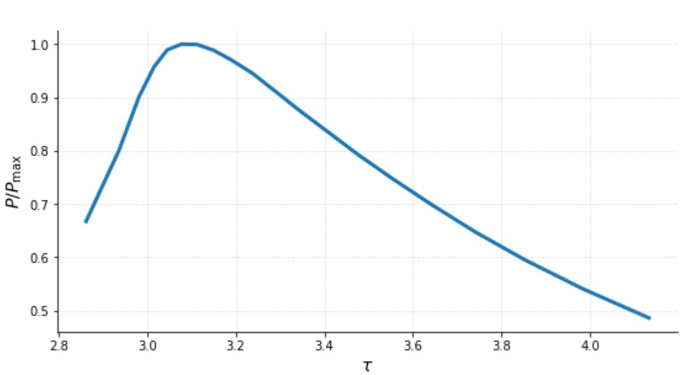

**Figure 17 : Tension factor, τ, changes as we vary r loop and the tether carries different amounts of the required centripetal force.**

The penalty for this design and operating condition is small, with the peak power only shifted to ≈ 3.1 τ , but it's something to be aware of.

Revisiting figure 15 , we can solve for the ideal loop size for a circular path accounting for turning losses alone.

The kite's aerodynamic forces are expressed below:

$$\begin{aligned} F\_L &= \frac{1}{2} \mathfrak{g} C\_L S \nu\_a{}^2 \\ F\_Y &= \frac{1}{2} \mathfrak{g} C\_Y S \nu\_a{}^2 \end{aligned} \tag{31}$$

Given that typically , then , and we make the assumption that _CL_ ≫ _CY FL_ ≫ _FY FY_ sin θ*offwind* will have a negligible effect on tension. With as the instantaneous radius of curvature (for a _rcurv_ circular flight path, ), we can the define the remaining forces: _rcurv_ ≡ _rloop_

ϕ_halfcone_ = sin1 ( _l t rloop_ ) [33]

$$F\_{\,\,T\_{\parallel}} = \frac{F\_L \cos \theta\_{offwind}}{\cos \varphi\_{halfcone}} \tag{34}$$

#### Makani Technologies LLC 127

$$\boldsymbol{F}\_{\boldsymbol{T}\_{\perp}} = \boldsymbol{F}\_{\boldsymbol{T}} \frac{\boldsymbol{r}\_{\text{loop}}}{\boldsymbol{l}\_{\text{t}}} \tag{35}$$

$$\boldsymbol{F}\_{\boldsymbol{c}} = \frac{\boldsymbol{m}\_{\text{eff},\boldsymbol{a}} \boldsymbol{\nu}\_{\text{k}}^{2}}{\boldsymbol{r}\_{\text{carv}}} \tag{36}$$

We introduce here the effective mass for acceleration, . Derived from a rigid tether _meff_,_a_ assumption, we can find that the effective inertia at the kite is the mass of the kite plus 1/3rd the mass of the tether. Assuming is small, then all the lift is from , and the optimum will _FY FL_ occur when is in the _F_ plane, and therefore when is equal to zero. _L Span_ (_v_ , _v_ ) _k_ → _w_ → θ*offwind*

By combining the equations above, adding the approximations that , that is small, _FT_ ≈ _FL FY_ that , and assuming a circular path so that , we can then set to its _va_ ≈ _vk rcurv_ = _rloop_ θ*offwind* optimum of zero and solve for to find the following relationship for the ideal circular path _rloop_ size to minimize turning losses, : _rloopideal_

$$r\_{loop\_{ideal}} = \sqrt{\frac{2l\_l m\_{eff}}{\varrho C\_L S}}\tag{37}$$

This is an interesting result. As both the tension and centrifugal force approximately scale together with , they drop out, and the ideal radius of curvature becomes only a function of a _vk_ 2 few kite parameters, largely independent of any kite speed strategy or wind.

The above gives the ideal path radius in isolation, ignoring effects other than how path curvature changes the power produced by lift. In order to combine this effect with others, it's desirable to instead put it in terms of a power coefficient.

It was stated above that _P_ ∝ cos θ , allowing us to define as a power 3 _offwind_ θcos 3 _offwind_ coefficient, . Again making the simplifying assumption that and also assuming _Cturn FT_ ≈ _FL_ that cos θ (ie, we are flying close to our ideal loop size as determined above), we can _offwind_ ≈ 1 solve for for a directly downwind circular path: θ*offwind*

$$\begin{split} \Theta\_{offwind} &= \sin^{-1} \left( \frac{F\_c - F\_{T\_\perp} - F\_{Y\_\perp}}{F\_L} \right) \\ &\approx \sin^{-1} \left( \frac{2m\_{eff,a}}{\varrho C\_L S r\_{loop}} - \frac{r\_{loop}}{l\_t} - \frac{C\_Y}{C\_L} \right) \end{split} \tag{38}$$

By utilizing the identity cos sin ( _x_ , we then find our power coefficient for turning 1 ) = √1 _x_ 2 losses for a circular path:

$$C\_{trm} = \left(1 - \left(\frac{2m\_{eff}}{\wp C\_L S r\_{loop}} - \frac{r\_{loop}}{l\_t} - \frac{C\_Y}{C\_L}\right)^2\right)^{\frac{2}{2}}\tag{39}$$

We can check the accuracy of all these approximations by again using the same example from the numerical model as we used to show the losses, and comparing results with the θ*offwind* analytical model for in figure 18 : _Cturn_

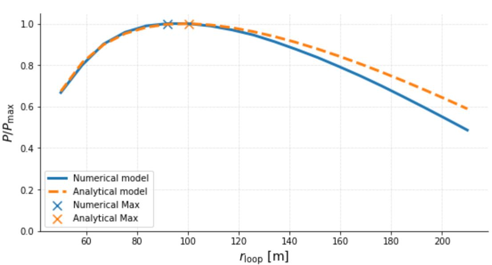

**Figure 18 : Numerical confirmation of our analytical turning losses for a directly downwind circular path. The analytical model, despite much simplification, is a good fit.**

The coefficient , despite extensive simplification in its derivation, performs well, only _Cturn_ showing meaningful differences at large loop sizes where the actual is far from the θ*offwind* assumed ideal, as one of the assumptions relies on being close to the ideal. Since we're targeting optimum operation, and path offset losses will also apply pressure for smaller path sizes, increasing errors at larger path sizes is acceptable.

For a path not directly downwind, from turning is combined with from path elevation, θ*offwind* θ*e* positively at the top of the path, negatively at the bottom. At the sides of the path, only θ*offwind*

comes from turning, but we now have the kite moving into and out of the wind. Despite these 15 nuances, numerical models have shown this factor derived from a path directly θcos 3 _offwind_ downwind to be a decent approximation for turning losses at typical path offsets.

#### 6.1.5 Efficiency Losses

Thus far we've been working with thrust power, a force on the rotors at an airspeed. The power system's job is to convert that thrust power from the wind into a useful electrical power.

In this simple analytical approach, we'll stick with idealized constant efficiencies. For an onboard generation power system the total efficiency from thrust to grid, consists of: *t*2*g* η

$$
\eta\_{t2g} = \eta\_{rotors} + \eta\_{motss} + \eta\_{ctrls} + \eta\_{tether} + \eta\_{padtrans} + \eta\_{collecion} \tag{40}
$$

Typical values are shown in table 4 below.

| Variable    | Value | Description                                            |
| ----------- | ----- | ------------------------------------------------------ |
| ηrotors     | 0.8   | Rotor efficiency from thrust power to shaft power.     |
| ηmotors     | 0.94  | Motor efficiency from shaft power to electrical power. |
| η ctrls  | 0.96  | Motor controller electrical efficiency.                |
| η tether | 0.97  | Tether electrical efficiency.                          |
| ηpadtrans   | 0.975 | Padmount transformer efficiency.                       |
| ηcollection | 0.97  | Electrical efficiency of the collection system.        |
| ηt2g        | ~0.66 | Net efficiency from thrust to grid.                    |

#### **Table 4 : Typical component efficiencies for an onboard generation AWT.**

For positive power generation, this simply forms our power coefficient: *t*2*g* η _C_η

$$C\_{\eta} = \eta\_{t2g} \tag{47}$$

15 For a path offset in elevation only. Azimuth offsets have a similar effect.

Pumping kites with ground based power generation will result in similar values, replacing the η with pumping cycle losses and removing the losses. _rotors tether_ η

#### 6.1.6 Gravity Losses

[Equation 17](#page-130-1) for assumes the kite is operating at its ideal kite speed, which is roughly _P_0 constant around the path (approximately: _v_ ) ). In order to do this, the kite _kL_ ∝ cos (θ*offwind* + θ*e* must hold a constant kite speed while experiencing large changes in potential energy due to the changes in path height. This strategy causes large swings in power as the potential energy is effectively pushed into the grid on the downstroke, and pulled back out on the upstroke. A constant kite speed strategy creates fluctuations in power with changes in altitude.

When the fluctuation in power is larger than the power from the wind, we're effectively using the grid as a battery for a portion of the potential energy exchange. Using the grid as a battery means paying the difference between the amount of energy we can store and how much we then need to put back into the kite. As the kite begins making power from the wind, it utilizes the grid battery less and less, until the power from the wind is larger than the fluctuations.

With the effective mass at the kite from gravity as , equal to the mass of the kite plus half _meff_,_g_ the mass of the tether, the potential energy exchange over a circular path is equal to:

$$
\Delta E\_p = 2r\_{loop} m\_{eff,g} \text{g } \cos \Theta\_e \tag{42}
$$

Defining as the losses of our "grid battery" relative to the potential energy exchange, , _pump_ η 0 _EP_ Δ under conditions of no wind, we find:

$$
\eta\_{pump\_0} = \frac{\eta\_{\Omega g} \Delta E\_P - \frac{\Delta E\_P}{\eta\_{\Omega g}}}{\Delta E\_p} = \eta\_{t2g} \ - \ \frac{1}{\eta\_{\Omega g}} \tag{43}
$$

Using the value of from above of 0.66 results in a of approximately -85%! The kite *t*2*g* η _pump_ η 0 only puts 2/3 of the potential energy into the grid, then needs to pull 3/2 the potential energy from the grid to put it back into the kite, resulting in a loss of most of the potential energy delta. Even ignoring grid implications of wild power swings, this is a bad deal.

Is this loss a significant amount of power? Let's take the MX2 kite as an example. With of _meff_,_g_ 1988 kg and a circular path radius of 90 m at an average elevation angle of 0.45 rad, the potential energy exchange from top to bottom is ~3.2 MJ. As we just saw above, most of this energy is lost with a constant speed strategy under no wind conditions. With a total system _C C_ of ~12, a minimum kite speed of 30 m/s gives a path time of ~7.8 s, turning this energy _L_/ _D_ loss into an average power loss of ~170 kW.

This is indeed significant for low wind speeds! Both the time and energy scale linearly with path radius, so this result is surprisingly independent of path vertical range (we'll derive this relationship in a moment). Paths stretched in the horizontal direction (such as ovals, racetracks, or horizontal figure eights) can spread this energy loss over greater time, but it's difficult to do enough to substantially change this problem, especially for larger and relatively heavier systems with a fairly short tether that operate close to their minimum radius, something we'll also investigate later. We need to adjust this equation to account for the reduced pumping losses as the kite begins to make power, but first let's describe an alternative solution.

The alternative to a constant kite speed strategy is to store the potential energy in kite speed. There are several consequences of a varying kite speed strategy, but here let's focus on one—the effect on power. Operation at requires the kite to fly at its optimal speed . As we ζ*L vKL* vary the speed, we'll move off this peak.

To determine these losses, we need to extract the optimal kite speed assumption from the Loyd limit for . Inspecting [equation 12](#page-128-0) , it can be shown that we can put in terms of kite speed ζ ζ and aerodynamic properties. We'll denote this kite speed dependent version of by : ζ ζ*v*

$$\mathfrak{T}\_{\nu} = \mathbf{C}\_{L} \left( \frac{\boldsymbol{v}\_{k}}{\boldsymbol{v}\_{\text{eff}}} \right)^{2} - \mathbf{C}\_{D} \left( \frac{\boldsymbol{v}\_{k}}{\boldsymbol{v}\_{\text{w}\_{\text{eff}}}} \right)^{3} \tag{44}$$

It's important to note that we've baked in the tether losses here by using rather than . _CD CDk_ We also must use rather than here. This is because the optimum speed is based on _vweff vwref_ the _effective_ wind and total system drag. We've effectively captured the inside this _CT D_ definition of , but as is referenced to in our definition, we have not captured the ζ*v* ζ0 _vwref P_0 _C_ or the —the wind speed attenuation is only used here to accurately represent the effect θ_e C_α_w_ of the speed strategy.

It's worth taking a look at this term to describe the losses we anticipate. Taking the MX2 kite at an elevation angle of 0.45 rad (26 deg), in figure 19 we plot this as we change kite inertial ζ*v* speed at different wind speeds.

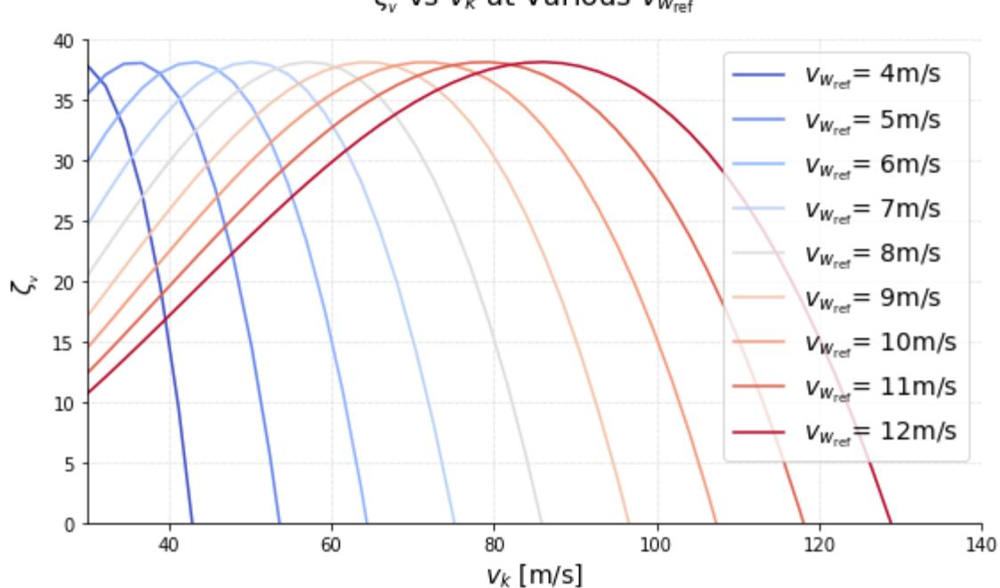

**Figure 19 : Kite performance metric v versus kite inertial speed at various wind speeds. For a fixed C L and C D , optimum speed increases linearly with wind speed.**

Each wind speed has an optimum at . As we fluctuate around the optimum speed, we expect _vkL_ to see the mean drop, with decreasing sensitivity as wind speed increases as the peak gets ζ*v* broader. This is applicable for a constant, non-optimal speed strategy, but we wish to know ζ*v* the net effect of a varying speed strategy.

Since the potential energy exchange is the main reason kite speed varies around the loop, we define the speed strategy in terms of a gravity factor, , defined such that a of zero is a _kgrav kgrav_ constant kite speed strategy, and a value of 1 means the sum of potential and kinetic energy is a constant around the path. In other words, it's a measure of how much of the potential energy 16 we're storing in kite inertial speed. Comparing the change in kinetic energy over the change in potential energy, this can be written as:

$$k\_{grav} = \frac{v\_{k\_{max}}^2 - v\_{k\_{min}}^2}{4 \, r\_{loop} g \cos \theta\_\epsilon} \tag{45}$$

If we chose a strategy such that the average kite speed, , is the optimum speed at the *v*ˉ*k* geometric middle of the path (not necessarily an optimum strategy, simply chosen for

16 It should be noted that values greater than 1 are possible strategies, but they break some of our other definitions and have limited applicability that we'll discuss later, so we'll keep values here < 1.

convenience), and update our optimum speed to include the effective wind speed, we have _vkL_ [equation 46 :](#page-145-0)

$$\mathbf{v}\_k = \mathbf{v}\_{k\_L} = \frac{2}{3} \frac{\mathbf{C}\_L}{\mathbf{C}\_D} \mathbf{v}\_{\mathbf{w}\_{\text{eff}}} \tag{46}$$

To capture the speed change around a circular path, we define a loop angle, , to start at zero ψ at the top of the path and increase moving in the direction of kite motion—this is clockwise for Makani systems when viewed looking downwind. Making the simplification that an average 18 kite speed, , is the average with respect to loop angle rather than to time, we can alternatively *v*ˉ*k* define as: *v*ˉ*k*

$$
\Delta \overline{\nu}\_k = \frac{1}{2} \left( \nu\_{k\_{\max}} + \nu\_{k\_{\min}} \right) \tag{47}
$$

And we can define:

$$
\Delta \nu\_k = \nu\_{k\_{\max}} - \nu\_{k\_{\min}} \tag{48}
$$

Combining these equations and solving for , we then have: _vk_ Δ

$$
\Delta \mathbf{v}\_k = \frac{2r\_{loop}gk\_{grav}\cos\theta\_\varepsilon}{\vec{v}\_k} \tag{49}
$$

The relationship between loop angle and kite speed for a constant fraction is nearly _kgrav_ sinusoidal in shape. We'll make the simplifying approximation that it is, giving us:

$$
\Delta \nu\_{k\_{\Psi}} \approx \overline{\nu}\_k - \frac{1}{2} \Delta \nu\_k \cos \psi \tag{50}
$$

We are now set up to find the average around the loop, by using . For simplicity, we'll _v_ ζ ζ_v_ˉ _vk_ψ also assume that all loop angles are evenly weighted, making our solution for for a strategy ζ*v* 19 that varies around the loop with : _kgrav_

$$\tilde{\mathfrak{S}}\_{\nu} \approx \frac{1}{2\pi} \int\_{0}^{2\pi} \tilde{\mathfrak{L}}\_{\nu} \partial \psi = C\_{L} \left( \frac{\bar{v}\_{k}}{v\_{\mathrm{eff}}} \right)^{2} \left( \frac{\Delta v\_{k}^{2}}{8\bar{v}\_{k}^{2}} + 1 \right) - C\_{D} \left( \frac{\bar{v}\_{k}}{v\_{\mathrm{eff}}} \right)^{3} \left( \frac{\pi \Delta v\_{k}^{2}}{8\bar{v}\_{k}^{2}} + 1 \right) \tag{51}$$

18 This loop angle definition differs from that in the crosswind controller.

17 Note that the first equal sign in here simply represents a possible _strategy_ , rather than a true equality. Later, we'll evaluate different average kite speed strategies under specific conditions, breaking this relationship.

19 Ignoring that more time is spent in the slower portions of the loop than the faster ones.

This is an approximation of the average for a given path size and elevation angle, ζ*v*ˉ _v_ ζ accounting only for the effects of a varying speed strategy and tether drag.

It's useful to put this in terms of a power coefficient to isolate the effect of the kite speed strategy, so we do so by defining a power coefficient, , as: _Cvk_

$$\mathcal{C}\_{v\_k} = \frac{\xi\_v}{\xi\_0 C\_{TD}} \tag{52}$$

This definition is somewhat duplicative, requiring us to pull out after baking it in, but _CT D_ accomplishes the goal of isolating our power coefficients. Before attempting to combine the effect of pumping losses and a varying speed strategy, let's investigate this new term. Unlike other power coefficients derived above, this one has a sensitivity to wind speed. In figure 20 , plotting for different wind speeds and fractions for a kite with a loop radius of 80 m _Cvk kgrav_ and elevation angle of 0.45 rad results in:

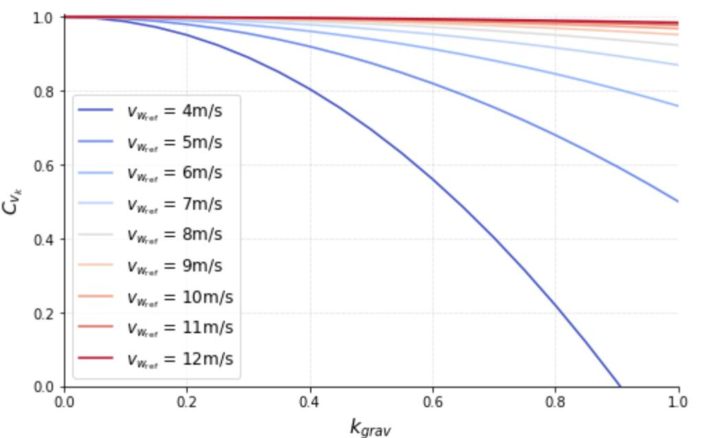

**Figure 20 : Change in power coefficient C vk as a function of speed strategy k grav . Low winds are highly sensitive to speed, and a varying strategy pays a large performance penalty.**

The effect of varying kite speed is particularly devastating at low wind speeds, even for these small loop sizes—the optimum kite speed forms a sharp peak, and the for a given _vk_ Δ _kgrav_ grows larger as gets slower at low wind speeds. In fact, higher fractions at low winds *v*ˉ*k kgrav*

are often impossible—inspecting the results will show that at some point large implies _kgrav_ negative kite speeds. At low wind speeds, these effects push us towards a constant kite speed strategy, but we must also consider the pumping losses, so now is the time to incorporate those losses.

The _rotor drag power_ (ie, thrust power before powertrain losses) fluctuation around the loop as a result of a given strategy can be approximated by taking the weight resisted by the rotor _kgrav_ drag, assuming the rotors extract power along the inertial speed axis rather than the airspeed axis, and for simplicity, at rather than as a function of loop angle. *v*ˉ*k vk*ψ 20

$$P\_{grav, \psi} = m\_{eff, g} g (1 - k\_{grav}) \,\bar{\upsilon}\_k \sin \psi \cos \Theta\_e \tag{53}$$

For the no wind case, this is the only power. Let's plot it below for the MX2 kite at a of 40 *v*ˉ*k* m/s, an elevation angle of 0.45 rad (26 deg), and a of 0.5. We'll also plot the electrical _kgrav_ power this results in. Since power changes sign, the definition of efficiency flips and we must multiply by for positive power (generating) and divide by for negative (consuming) *t*2*g* η *t*2*g* η power, resulting in:

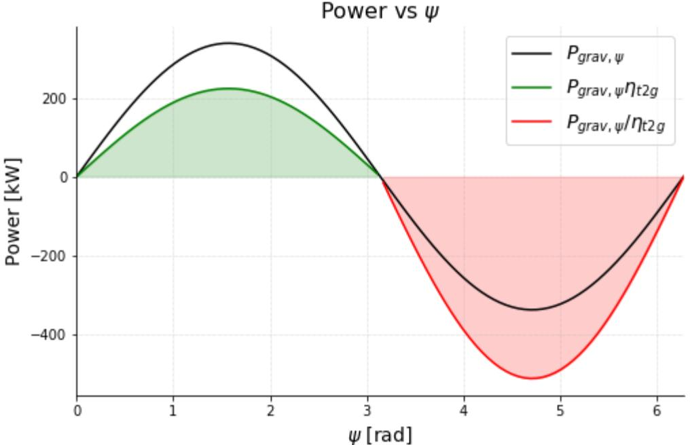

**Figure 21 : Power vs loop angle, demonstrating the large swings in power resulting from the potential energy exchange at a k grav of 0.5. Efficiency losses then mean the stored energy (green) is less than the consumed energy (red).**

20 These assumptions have an impact of <1% for most kites and strategies, as verified from a numerical model. They distort the shape more than they distort the final result.

In figure 21 , the shaded regions represent the energy stored (in green) and consumed (in red). Taking the difference between these two and normalizing by gives us as in [equation](#page-142-1) _Ep_ Δ _pump_ η 0 [43](#page-142-1) .

As the kite begins to make power from the wind, the power is offset, such that:

$$P\_{\ } = (P\_{\ \text{thrust}} + P\_{\ \text{grav},\psi}) \ \text{ } \eta \tag{54}$$

where represents inverted appropriately as the sum of the power flips sign (we don't η *t*2*g* η bother naming this more specifically as we'll soon throw it out), and is the power from the _Pthrust_ wind before any powertrain losses. We'll be defining this more explicitly in [section 6.2.4 ,](#page-169-0) _Pthrust_ in [equation 80](#page-170-0) .

We can then approximate the pumping efficiency, again assuming all loop angles are weighted evenly (ie, ignoring that we spend more time at the slower top of the loop than the bottom), with _Pgrav_ representing the maximum power variation, found as with a loop angle = : _max Pgrav_, ψ ψ 2 π

$$
\mathfrak{m}\_{pump} = \frac{\stackrel{2\pi}{\int P} - \stackrel{2\pi}{\int P\_{thrust}}}{\Delta E\_p}, \quad \begin{array}{c} \mathcal{P}\_{thrust} < \mathcal{P}\_{grav\_{max}} \end{array} \tag{55}
$$

When the condition is not met, where is larger than the power variation, there is no _Pthrust_ pumping loss, and . There's an exact analytical solution to be found here, but let's _pump_ = 0 η jump to a simpler approximate solution that can be shown to be close to numerical results. 21

$$\eta\_{pump} = \eta\_{pump\_0} \left(1 - \sin\left(\frac{P\_{thrust}}{2P\_{grav}}\right)\right), \ P\_{thrust} < P\_{grav\_{max}} \text{ [56]}$$

As _P P_ approaches 1, goes to zero. We're now ready to put our pumping losses _thrust_/ _gravmax pump_ η into a new term. We begin by finding the average pumping power, , as the total energy lost _Ppump_ ˉ around a path over the time around the path:

$$P\_{pump} = \frac{\Delta E\_p \eta\_{pump} \bar{v}\_k (1 - k\_{grav})}{2\pi r\_{loop}} = \frac{m\_{eff,g} g \bar{v}\_k (1 - k\_{grav}) \eta\_{pump} \cos \theta\_e}{\pi} \tag{57}$$

The relationship is simple, and somewhat surprisingly independent of path radius, as increased energy losses of larger paths are then spread over more time.

21 Absolute error of this simplification is typically << 0.05.

If it isn't yet readily apparent, our goal is put everything in terms of a geometric power coefficient to easily compare loss (and gain) factors, such that:

$$P = C\_1 C\_2 \cdots P\_0 \tag{58}$$

Where are the various power factors. We can directly do this with other power *C*1 2 _C_ · · · coefficients as they all either attenuate the effective wind or our ability to make power from that wind. Pumping power does not attenuate effective wind, and instead is an additive term. As a result, we're looking for something to fulfill:

$$P\_1 = C\_1 C\_2 \cdots \cdot C\_{pump} \\ P\_0 = C\_1 C\_2 \cdots \cdot P\_0 + P\_{pump} \tag{59}$$

Solving this for results in the following awkwardly roundabout definition, where is _Cpump Cother_ all other geometric power factors:

$$C\_{pump} = \left(1 + \frac{m\_{eff,g}g\eta\_{pump}\tilde{\upsilon}\_k(1 - k\_{grav})\cos\theta\_\varepsilon}{\pi C\_{other} P\_0}\right) \tag{60}$$

As other losses build and gets smaller, forms a larger part of the geometric power _Cother Ppump_ factors and gets smaller. _Cpump_

Let's investigate the product of these two power coefficients in isolation (ie, is just ) _Cother Cvk_ for various fractions and wind speeds. For the MX2 kite flying with an 80 m path radius at _kgrav_ an elevation angle of 0.45 rad with an of -0.85 under no wind shear, we have figure 22 . _pump_ η 0

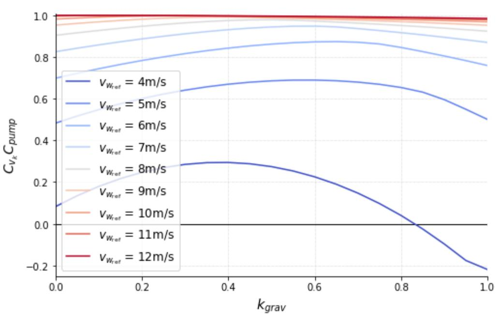

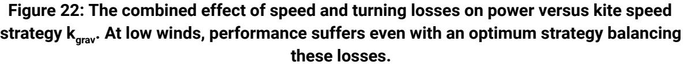

The end result is heavily detrimental to low wind speeds, and there is now no escaping it via low _kgrav_ fractions. Kinks visible in the solution are where saturates at 1 as _Cpump PP_ and pumping losses go to zero. Adding in additional losses ignored here _thrust_ > _pump_, _max_ increases the sensitivity to pumping losses, as becomes more dominant when total _Cpump_ power is lower. This can shift the optimum to higher fractions. _kgrav_

Wind speeds > ~8 m/s show a low sensitivity to kite speed strategy, and the ultimate _kgrav_ strategy at moderate to high winds in real usage ends up being driven by other effects we've ignored here, such as power, airspeed, and tension constraints, the fact that the ideal kite speed is not constant for all path positions (path azimuth and elevation offset combine with wind speed and turning effort to make different effective wind speeds around the path), and that the rotor efficiency is not constant for all conditions. This simple model suggests that at high winds, a constant kite speed strategy is (slightly) better, but in more detailed models, optimized _kgrav_ doesn't approach zero as winds increase, but instead climbs to 1 to address those constraints. We'll look into this strategy more in [section 10.3.5.2](#page-214-0) .

The simplifications here still allow us to highlight the important lessons: moderate to high wind speeds are largely insensitive to kite speed strategy (as long as it's roughly centered on the optimum), while low winds require a tight compromise between pumping losses and off optimal speed losses. All strategies expect to see major losses at low winds, and the primary way to

improve performance is to turn _very_ tight paths to reduce in order to reduce non-optimal _vk_ Δ speed losses with higher fractions that reduce pumping losses. _kgrav_

#### 6.1.7 Minimum Airspeed Losses

There is a minimum airspeed requirement for AWTs—the kite must at least be able to lift the mass of the kite and tether. This is often overshadowed by a minimum _controllable_ airspeed, dependent on the desired control authority and size of the control surfaces.

As optimum mean kite speed increases linearly with wind speed, this minimum airspeed requirement hurts power production until the optimum airspeed is larger than the minimum. The mean effect of this airspeed constraint is easily investigated by revisiting our speed dependent ζ , replacing the kite inertial speed with our minimum kite airspeed, , approximating _v vamin_ airspeed as kite inertial speed.

However, we already have a speed-dependent term in our power coefficient in the term. It's _Cvk_ possible for any speed-dependent term to go negative (ie, the system is now consuming rather than generating power), making combining them inappropriate—we need to incorporate this as a limit into the existing speed-based power coefficient. We desire the kite speed to be above the minimum speed, again approximating the airspeed limit as a kite inertial speed limit, such that:

$$
\nu\_k - \frac{1}{2} \Delta \nu\_k > \nu\_{a\_{\min}} \tag{61}
$$

If and is such that this constraint is not met, we can solve for the that would meet *v*ˉ*k vk* Δ *v*ˉ*k* the prescribed and speed limit: _kgrav_

$$\mathbf{v}\_{k}^{\tau} = \frac{1}{2} \left( \sqrt{\mathbf{v}\_{a\_{\text{min}}}^{2} + 4 \, r\_{\text{loop}} g k\_{\text{grav}} \cos \Theta\_{e}} + \mathbf{v}\_{a\_{\text{min}}} \right), \quad \mathbf{v}\_{k}^{\tau} - \frac{1}{2} \Delta \mathbf{v}\_{k} < \mathbf{v}\_{a\_{\text{min}}} \tag{62}$$

This is then substituted in place of where the condition is met. *v*ˉ*k vkL*

#### 6.1.8 Tension Limiting Losses

Structural loads and therefore mass of both the kite and tether scale strongly with tension, so a small drop in may be justified if it carries a large drop in tension, enabling a larger kite such ζ that the product is larger. _S_ ζ

If we again make the approximations that , that , that the kite is operating at the _FT_ ≈ _FL va_ ≈ _vk_ optimum speed , and ignore the speed variations we just introduced around the path with our _vkL_

_kgrav_ fraction, then we can plug our expression for into the equation for in [equation 13](#page-129-2) _vkL FT_ 22 and solve for the wind speed to find the tension limiting effective wind speed at the kite, : _vweff_,_T max_

$$\mathcal{V}\_{W\_{eff,Tmax}} = \sqrt{\frac{2F\_{Tmax}}{3\varrho S\xi\_L}}\tag{63}$$

Once a kite reaches its tension limit, it can maintain this tension by either lowering its as kite _CL_ speed increases, or by limiting increases in kite speed. From the Loyd fundamentals, we can find that the thrust power at the tension limit is equal to:

$$P\_{T\text{max}} = F\_{T\text{max}} \nu\_{\text{w}\_{\text{eff}}} - \frac{1}{2} \text{QC}\_{D} \text{Sv}\_{k}^{\text{3}}, \ \nu\_{\text{w}\_{\text{eff},T\text{max}}} < \nu\_{\text{w}\_{\text{eff}}} \tag{64}$$

From this relationship, it becomes apparent that maintaining tension by reducing lift and capturing the resultant drop in drag would be the better option, but in practice doing this extensively is difficult. Normal optimal operation for most systems has the kite operating at or close to its maximum lift coefficient, making peak tension loads more a function of kite speed than of lift coefficient. Flying faster and limiting loads via control of becomes increasingly _CL_ risky—as loads increase with , the kite may need to maintain excess control margin in order _va_ 2 to prevent an overload, so the simpler solution is to limit speed. Since any tension limiting represents a loss of power, we likely want the tension limiting point to be shortly before the power limited point anyways, so the simpler solution won't be too penalizing since we won't progress far enough into tension limiting to make large drag reductions.

Assuming kite speed, , and are held constant past the first point of tension limiting (ie, _CL CD_ tension is controlled with kite speed), we can find the following simple relationship for power in the tension limited regime:

$$P\_{T\max} = F\_{T\max} \left( \nu\_{\nu\_{\rm eff}} - \frac{2}{3} \nu\_{\nu\_{\rm eff,T\max}} \right), \ \nu\_{\nu\_{\rm eff,T\max}} < \nu\_{\nu\_{\rm eff}} \tag{65}$$

From this equation, the effect of a tension limit is clear—once the limit is reached, power ceases to increase with and instead simply increases linearly. _vw_ 3

For a constant lift coefficient, the above is functionally a maximum kite speed constraint, and it's tempting to incorporate it similarly to how we did for the minimum airspeed constraint, rolling it into the kite speed strategy term, . However, this can become very constraining and difficult _Cvk_ to incorporate analytically—large fractions and path sizes can hit both the minimum and _kgrav_

22 The inclusion of varying speed around the loop makes an analytical approach to power difficult—constraints like this are more readily captured via numerical models.

maximum kite speeds and aren't viable strategies, creating analytical potholes that are annoying to fill. In recognition of the fact that a kite can tolerate some speeds higher than the first tension limited kite speed via reduced lift coefficient, we instead make a new term, and as an approximation attenuate power simply based on the mean kite speed. A new speed dependent term is acceptable as we shouldn't be concerned about sign flips this late into the power curve.

To do so we normalize by our baseline power, . Again, we need to back out any duplicated _P_0 terms accounted for in this definition—in this case, the elevation, wind shear, and tether drag power coefficients. Our new power coefficient becomes less than 1 once _vw_ , so _eff_,_T max_ < _vweff_ rather than needing to define the start of this regime in terms of a wind speed, we can define it as:

$$C\_{Tmax} = \min\left(\frac{F\_{Tmax}\left(v\_{w\_{eff}} - \frac{2}{3}v\_{w\_{eff,Tmax}}\right)}{P\_0 C\_{\theta\_\ell} C\_{a\_\mathbb{W}} C\_{TD}}, 1\right) \tag{66}$$

#### 6.1.9 Putting It Together

At last we can piece together our power coefficients to define a total mean power for an AWT with all losses, referenced to : _P_0

$$P\_{AWT} = C\_{TD} C\_{\theta\_e} C\_{a\_w} C\_{twn} C\_{\eta} C\_{v\_k} C\_{pump} C\_{Tmax} P\_0 \tag{67}$$

We'll also define a coefficient that captures all the factors together, for easy reference:

$$\mathbf{C}\_{all} = \mathbf{C}\_{TD}\mathbf{C}\_{\theta\_e}\mathbf{C}\_{a\_\pi}\mathbf{C}\_{turn}\mathbf{C}\_{\eta}\mathbf{C}\_{v\_k}\mathbf{C}\_{pump}\mathbf{C}\_{Tmax} \tag{68}$$

This power equation has several terms that are poorly defined when becomes negative (ie, _Call_ rather than generating power, the system is _consuming_ power), so we'll truncate all results to positive regions only. This is fine, as an energy system that consumes power is a novel, but generally uninteresting, idea.

We're left with a lot of variables to potentially optimize over, so let's limit ourselves mostly to variables that describe _how to fly_ a given kite. We'll lock in our kite as the simplified MX2 system described above, flying at its target lift coefficient with zero side lift, only varying the tether length.

This leaves us with a pleasantly short list: , , , and . This list can be made shorter θ*e kgrav rloop l t* by recognizing how strong of an effect has on and and how weak of an effect it θ*e C*θ_e C_α_w_

has on everything else. This allows us to use the derived above in [equation 30](#page-135-1) as long as it θ*eideal* is above the minimum height specified in [equation 25 .](#page-133-0) The kite should be operating at the ideal elevation angle for the current wind shear, as long as it's not constrained by the minimum altitude. This means that the best achievable elevation angle, , should be: θ*ebest*

$$\Theta\_{e\_{\text{best}}} = \max \left( \Theta\_{e\_{\text{min}}} \, \right. \left. \, \Theta\_{e\_{\text{ideal}}} \right) \tag{69}$$

As a brief aside, we need to address that the solution for assumes zero tower height. If we θ*eideal* revisit the derivation and include terms for tower height, an algebraically messy solution for best θ*e* can be found (not shown here, as things are already messy enough). The difference _ideal_ between the more accurate solution and the simplified form above is most pronounced at short tether lengths, high shear, and tall towers, so we compare the solutions at a short tether length of 300 m and relatively high shear of 0.2 to find:

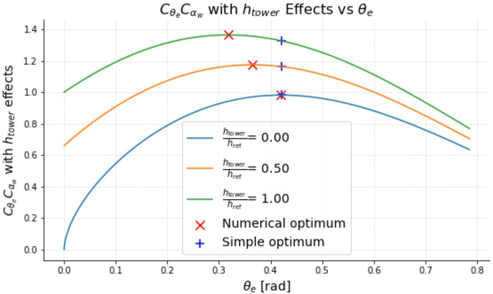

**Figure 23 : Comparing the simple analytical solution for θ e, best in the context of maximum elevation and shear power coefficients. The simpler solution, even perturbed far from the zero tower height case it was derived, performs well enough.**

Even under these pessimistic conditions, the difference between the simplistic solution and the full solution is an elevation angle difference of ~0.1 rad, and more importantly, a _C_θ _Ce_ α_W_ difference of just under 3% if we use the naive solution for with very high tower heights θ*eideal* equal to the reference height. Less shear, shorter towers, or longer tethers will increase accuracy. With this in mind, we'll continue with the simpler form moving forward.

We now optimize and for various tether lengths under zero wind shear conditions _kgrav rloop_ 23 and a standard sea level air density of 1.225 kg/m 3, and for reasons that will soon be clear, begin the discussion by showing for the resulting optimized solutions: _rloop_

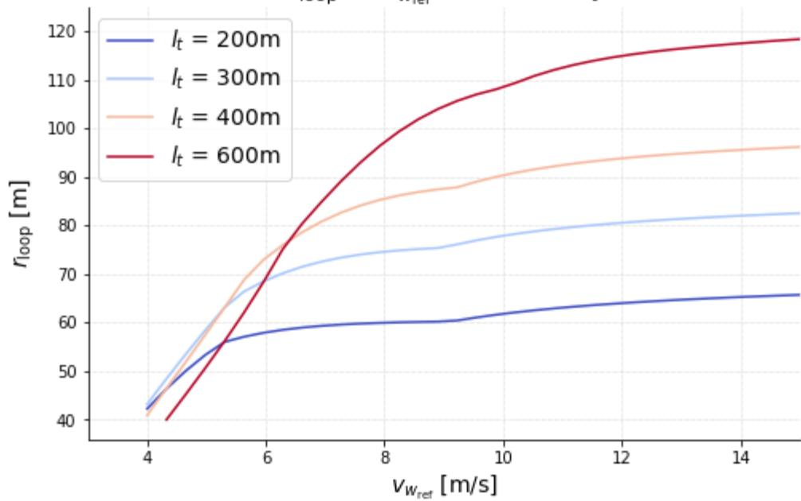

**Figure 24 : Numerical optimization results for r loop versus wind speed for the MX2 system using our analytical model.**

There are three regions of the optimum—a steep initial portion at low winds, and a flatter portion divided by a kink. In the steep initial portion, the kite seeks a very tight loop with large turning losses to support a high in order to eliminate even larger pumping losses. The small path _kgrav_ size is effective at reducing speed variations, as for all solutions at low wind speeds are _kgrav_ essentially equal to 1 in order to entirely eliminate pumping losses.

As the threat of pumping losses diminishes, decreases, and we enter the flat region, where _kgrav_ we simply find the best trade between speed losses, elevation losses, and turning losses. As the sensitivity to speed variations diminishes at higher winds, the optimum path radius slowly increases to reduce turning losses. The kink is caused by the onset of tension limiting losses, which then changes that trade-off. As other losses diminish, the lines slowly trend towards the _r_ derived above in [equation 37](#page-139-0) in the context of turning losses alone, but generally stay _loopideal_ well below that idealization in order to further reduce other losses.

23 In an attempt to be perhaps too kind to longer tethers and keep things simple, we only change the tether _length_ . Tether mass and η t2g remain constant at their values shown in table 1 in all examples to follow. It makes no meaningful difference in our conclusions, as we'll soon see that tether drag alone makes long tethers unappealing, even in favorable situations.

However, the important thing to note is how _staggeringly_ tight these paths are. With a minimum path radius of ~50 m, and given that this denotes the center of a kite with a ~25 m wingspan, the inner wingtip is a scant 1.5 wingspans from the path center!

A path radius this tight is simply not particularly feasible, at least not for heavier rigid wing onboard power generation systems. We'll investigate this further in [section 6.2.1, Minimum](#page-160-1) [Turning Radius Constraints .](#page-160-1) Even if a turning radius that tight is possible, the swept area will be so small that induced losses, which we'll soon discuss, will be meaningful. In addition, tight paths require high angular rate maneuvering that generates large aerodynamic moments, requiring large control surfaces and precise control that pose additional challenges.

For now, we'll simply constrain our path radius for the MX2 system to a more reasonable but 24 still tight minimum of 80 m and repeat the exercise (resulting in most cases riding this _rloop_ minimum turning limit), this time plotting in figure 25 what we're really interested in, the power curves:

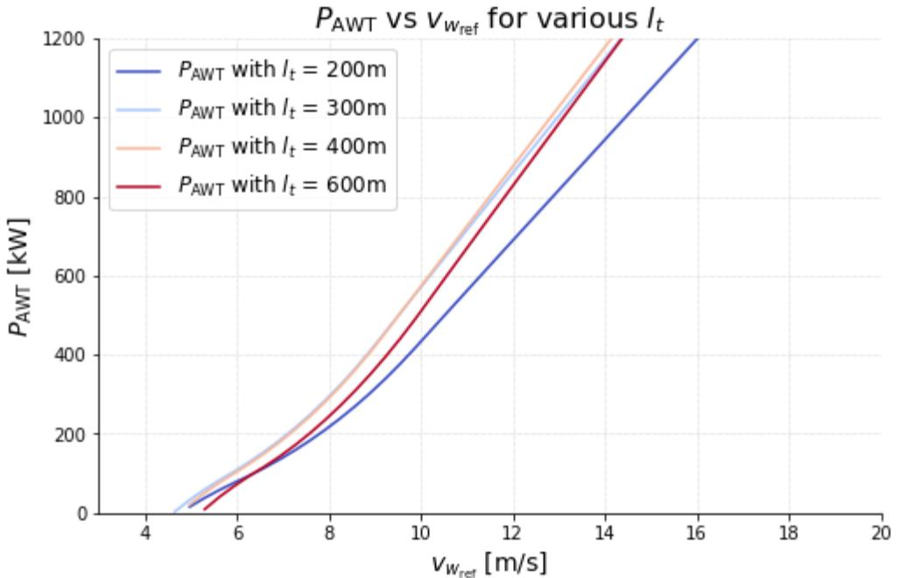

**Figure 25 : Power curves from the analytical model, numerically optimized over r loop (with a minimum of 80 m) and k grav for the MX2 system. Curves are not yet clipped at rated power.**

Keep in mind we haven't yet clipped the power at the power system's max capabilities to create a rated power region. For most systems and sites, this should be occurring at 9-12 m/s of wind. From figure 25 , an optimum tether length becomes apparent—too short, and the elevation

24 These are some reasons we have an r loop, min for our example systems in table 1 . The M600 has additional reasons for its minimum turning constraint, namely bridling and stability concerns, discussed in the M600 Energy Kite article [11].

losses from meeting the minimum altitude constraint dominate. Too long, and the tether drag reduces performance.

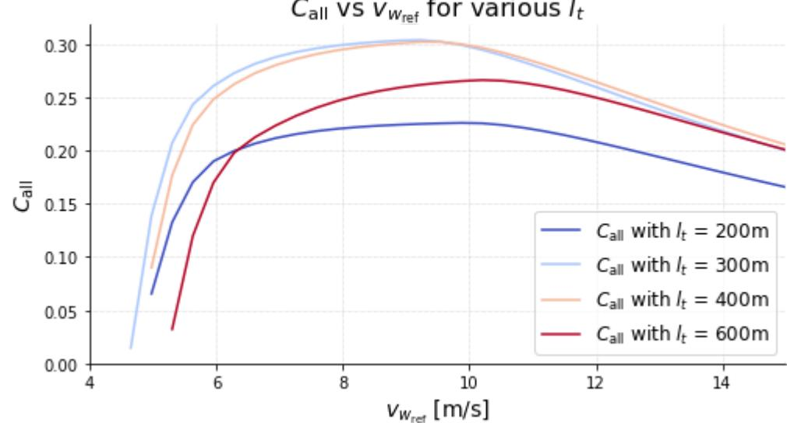

We can also see, in figure 26 , how the total power coefficient changes with wind speed:

**Figure 26 : Product of all power coefficients, referenced to P 0 , for our optimized analytical model for the MX2 under zero wind shear.**

At best, our AWT is able to capture ~30% of the idealized power. The (which includes _P_0 _Cvk_ the effect of our minimum airspeed constraint) and terms act to create a virtual wall at _Cpump_ low wind speeds. When there is little power available in the wind, the minimum airspeed requirement dominates the problem, and the airborne wind turbine simply becomes an airborne aircraft, consuming rather than generating power. It's difficult to imagine an AWT with an earlier cut-in than a HAWT in the absence of strong wind shear, due to the power offset imposed by a minimum kite speed.

Inspecting the breakdown of the various coefficients for our optimal 300 m tether case finds the following in figure 27 .

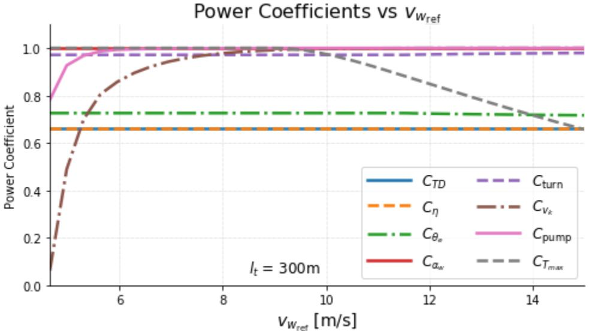

**Figure 27 : Individual power coefficients referenced to P 0 for our optimized analytical model for the MX2.**

The majority of the losses are captured with three constant and comparable losses: the tether drag, powertrain efficiency, and elevation angle losses, while the kite speed and tension losses round out the low and high wind speed losses, respectively (with a little bit of pumping losses at low winds as well). At this tether length and path radius constraint we see little in the way of turning losses, but longer tethers have optimal at much larger path radii, making the _Cturn_ compromise between turning losses and other losses more pronounced.

What about higher wind shears? Repeating the exercise again, but for a "standard" wind shear of 1 7 .143 and a reference wind height of 80 m results in figure 28 . / ≈ 0

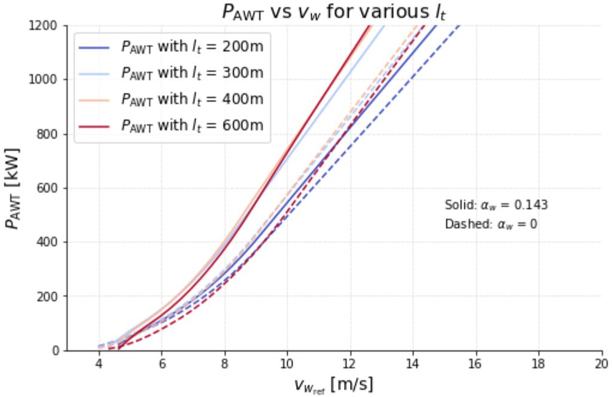

**Figure 28 : Optimized analytical model power estimates for the MX2, comparing "normal" wind shear of 1/7 (solid lines) vs no wind shear (dashed lines) at various tether lengths.**

As AWTs have higher virtual hub heights than typical HAWT hub heights, they see a large sensitivity to higher wind shears. Interestingly, longer tethers and the stronger, higher altitude winds they access don't seem to translate into additional power, even with our simplistic tether loss factor that only models the increased drag. Considering those additional losses, shorter tethers around 300 m seem likely to be the best for all conditions. We'll investigate the reasons behind this in a later section.

Finally, we'll compare these results with the results from the more detailed numerical model. A deeper dive into the numerical model results is shown in the [power saturation section](#page-195-0) and in the provided code tools, but here we'll just jump straight to the result. Updating the analytical model to a 90 m path radius to match the increased conservatism applied in the numerical model and using a of 0.7 to roughly match the speed strategy from the other model results in the _kgrav_ comparison in figure 29 under zero wind shear at sea level conditions.

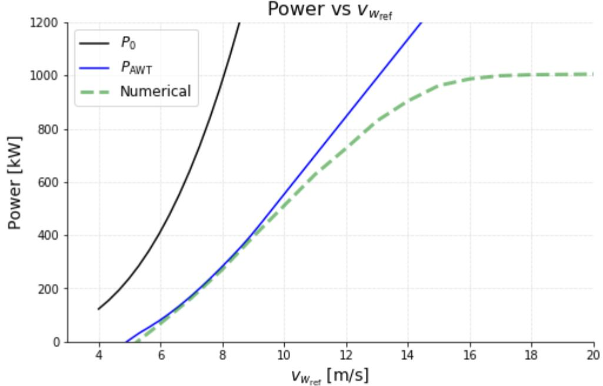

#### **Figure 29 : Comparison of optimized analytical model result for the MX2 versus optimized numerical model. The analytical model fares well until power and tension constraints become significant.**

The analytical model has done well at capturing the major loss factors and the trades between them. We see a slow roll-off in performance as the kite begins to blend in power saturation strategies in the numerical model, rather than a sharp cutoff—again, we'll investigate power saturation further in [section 10](#page-195-0) [a later section](#page-227-0) .

There's much to glean from the models we've just created. Let's see what we can learn, and how those lessons can apply to different kite designs.

## 6.2 Lessons from Loyd Revisited

### 6.2.1 Minimum Turning Radius Constraints

Our analytical model shows a strong preference for small path sizes, but there are both hard and practical constraints on minimum path size.

The hard constraint occurs when the kite simply cannot generate enough lift to make the desired turn, regardless of roll angle. This is the traditional minimum turning radius limit for un-tethered aircraft that are unconstrained in roll.

The practical constraint unique to AWEs is one of tether roll angle, , defined as the angle γ between the tether and the kite's pitch axis—at some limiting tether roll angle, the tether will hit parts of the kite for most designs.

Revisiting figure 15 , we can find an approximation for this tether roll angle. This differs from the actual kite to tether roll angle due to the small angle approximation inherent in flattening the problem to a plane, the effects of the aerodynamic alpha and beta angles of the kite, and the effect of tether catenary from tether acceleration, weight, and drag. Fortunately, all these angles are typically small, making these decent approximations.

When we solved for before, we were just looking for the mean effect. For roll limits it's θ*offwind* desirable to keep some complexity and add a few more terms to capture major effects that cause roll angle to vary around the loop, to determine if limits are hit anywhere. Those major effects are the difference between and , and the component of gravity that can either help _va vk_ or hurt the required turning effort at the top and bottom of the loop.

Solving for the force balance in the crosswind plane, perpendicular to the flight path axis, we have:

$$
\Sigma F\_{\perp} = F\_{L\_{\perp}} + F\_{T\_{\perp}} + F\_{c\_{\perp}} + F\_{w\_{\perp}} + F\_{Y\_{\perp}} = \mathbf{0} \tag{70}
$$

Where the side lift and weight perpendicular to the path axis are given by:

$$F\_{Y\_\perp} = F\_Y \cos(\mathfrak{q}\_{halfcone} - \gamma) \tag{71}$$

$$F\_{\,\,w\_{\perp}} = \,-m\_{eff,g} \, \mathbf{g} \, \cos \Theta\_e \, \cos \psi\,\,\tag{72}$$

Assuming the path is directly downwind in azimuth and only offset by some elevation angle, we can solve for as a function of wind speed at the kite virtual hub height, kite speed, and loop _va_ angle by solving the side-angle-side triangle that results:

$$\nu\_a = \sqrt{\nu\_k^2 + \nu\_{\nu\_{\rm v\bar{h}}}^2 - 2\nu\_{\nu\_{\rm v\bar{h}}}\nu\_k \cos\left(\frac{\pi}{2} - \sin(\psi \theta\_e)\right)}\tag{73}$$

This allows us to avoid using the assumption we've used extensively until now, and _va_ ≈ _vk va_ can be used for the aerodynamic forces and above rather than the approximation. _FL FY vk_

Expanding [equation 70](#page-161-0) above results in [equation 74](#page-162-0) .

$$\sum F\_{\perp} = 0 = \frac{m\_{\text{eff}} v\_k^2}{r\_{\text{core}}} - \frac{r\_{\text{loop}}}{l\_l} F\_L \frac{\cos(\varphi - \gamma)}{\cos \varphi} + F\_L \sin(\varphi - \gamma) \ + F\_Y \cos(\varphi - \gamma) - m\_{\text{eff}, \varphi} g \cos \theta\_\varepsilon \cos \psi \qquad \left[\BigDelta\_l \mathbf{4}\right] \ \left[\varphi - \varphi\_l \cos(\varphi - \gamma)\right] \ \left[\varphi - \varphi\_l \cos(\varphi - \gamma)\right] \ \left[\varphi\_l \cos(\varphi - \gamma)\right] \ \left[\varphi - \varphi\_l \cos(\varphi - \gamma)\right] \ \left[\varphi\_l \cos(\varphi - \gamma)\right] \ \left[\varphi\_l \cos(\varphi - \gamma)\right] \ \left[\varphi\_l \cos(\varphi - \gamma)\right] \ \left[\varphi\_l \cos(\varphi - \gamma)\right] \ \left[\varphi\_l \cos(\varphi - \gamma)\right] \ \left[\varphi\_l \cos(\varphi - \gamma)\right]$$

We can break out the reading glasses to see how this lengthy, shrunken equation can be numerically solved for tether roll angle if we wish, but it's desirable to have a simpler, shorter analytical solution, so some substitutions are in order. Assuming the kite is operating close to the ideal turning radius derived above, cos(ϕ γ) ≈ 1 ( and sin ϕ γ) ≈ (ϕ γ) . These changes allow us to directly solve for tether roll angle .γ 25

$$\gamma = \frac{m\_{\it eff} v\_k^2}{F\_L r\_{\it curv}} - \frac{r\_{\it loop}}{l\_t \cos \varphi} + \Psi + \frac{F\_Y}{F\_L} - \frac{m\_{\it eff,g} g \cos \theta\_\epsilon \cos \psi}{F\_L} \tag{75}$$

Now that we have a model, let's investigate. We begin with a constant kite speed strategy with _kgrav_ of zero to isolate the effects of gravity and the difference between kite inertial speed and airspeed. We take our MX2 system operating at its best achievable zeta lift ( = 1.81, = 0), _CL CY_ with a path radius of 80 m at an elevation angle of 0.45 rad at a reference wind speed of 8 m/s and no shear, and in order to isolate effects, model the tether roll angle both with and without gravity. Here, we assume the instantaneous radius of curvature, is equal to the mean path _rcurv_ radius, , and use a simple constant kite speed strategy with a of zero: _rloop kgrav_

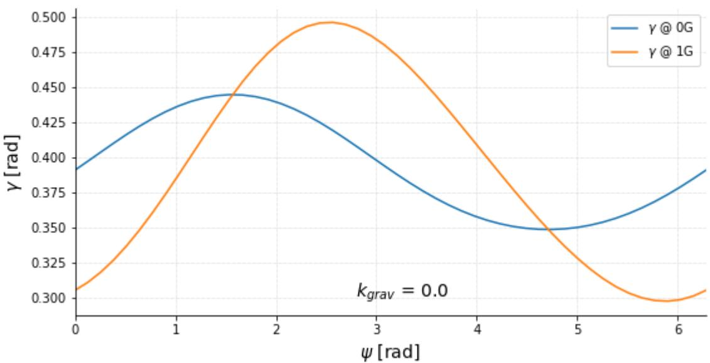

**Figure 30 : Tether roll angle versus loop angle at 8 m/s of wind at a path radius of 80 m and elevation angle of 0.45 rad, both with and without gravity to isolate its effect.**

25 This is functionally the same method used in the controller to convert a desired path curvature into a tether roll angle command. The only difference is that the controller has additional corrections to account for total path offset (elevation _and_ azimuth).

The curve without gravity is purely a result of the elevation angle that causes the up and down strokes of the path to move the kite into and out of the wind, respectively. Gravity assists the required turn at the top of the path, and adds to the required turning effort at the bottom, so gravity adds to the required tether roll range and shifts the peak roll effort towards the bottom of the path. The maximum turning effort is generally in this overlap region where the kite is moving downwind near the bottom of the loop, simultaneously reducing the airspeed needed to make lift while gravity increases the lift needed to make the turn. This is problematic. The maximum turning constraint occurs with the kite pointed at the ground!

Let's look, in figure 31 , at the limits of the tether roll angle versus wind speed for various _kgrav_ speed strategies, using the model from [equation 50](#page-145-1) for speed as a function of loop angle, , _vk_ψ assuming is the optimal speed and again using our example MX2 kite and path setup as *v*ˉ*k vkL* above:

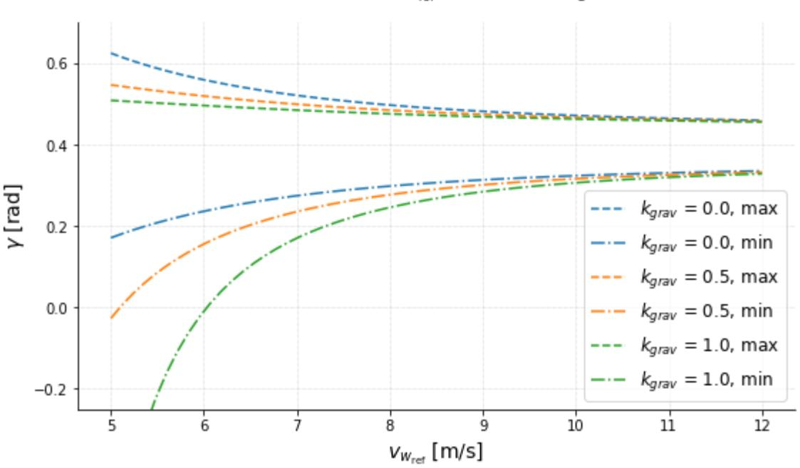

**Figure 31 : Tether roll angle versus wind speed for various k grav strategies. We've assumed the kite is operating centered around its optimal kite speed, effectively showing that as the kite speeds increase with wind speed, the required tether roll range decreases.**

As the wind speed increases and the optimum kite speed strategy linearly increases with it, the aerodynamic forces take over, scaling with while gravity remains constant, causing the _vw_ 2 curves to asymptotically approach the no-gravity case. Counterintuitively, going faster _reduces_ the maximum tether roll angle, and is comparatively easier.

We can now explore the limits of this kite. The MX2 hits physical limits at roll angles of approximately 55 deg. Leaving a 10 deg margin places our limit at 45 deg, or 0.785 rad. We want to find the worst case instantaneous turning radius, , around the path. In other words, for a _rcurv_ kite that is following the prescribed circular path , how much turning margin does it have to _rloop_ correct control errors? What is the tightest it could turn at the maximum roll angle?

To find this, we return to the sum of the forces perpendicular to the path axis and solve for instantaneous curvature, at the tether roll limit, again taking our path setup from above. We _rcurv_ find a weak sensitivity to the strategy, but a strong one to both wind speed (largely _kgrav_ because in our kite speed is a linear function of wind speed) and lift coefficient, so varying those while is fixed at 0.75 and finding the worst case turning radius around the loop at our _kgrav_ maximum roll results in figure 32 :

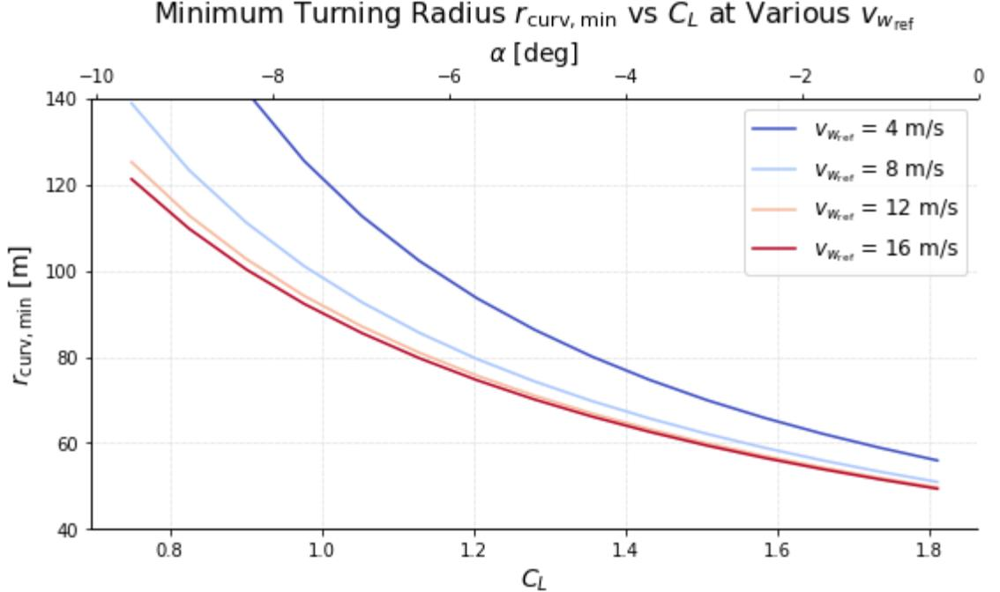

#### **Figure 32 : Minimum instantaneous turning radius versus coefficient of lift at a constant path radius of 80 m. The difference between the path radius and the minimum instantaneous radius is the turning margin.**

We find that the MX2 flying prescribed 80 m radius circular paths at the target of 1.81 is _CL_ surprisingly close to its minimum turning radius at the worst part of the path, pointed nearly directly at the ground. An alpha control error of just a few degrees can leave the kite with little excess turning capability for path correction.

In this context, being able to make this turn while operating optimally appears possible with sufficient margin, but highlights the need for precise control, particularly in the portion of the

path where the kite is moving both downwind and at the ground. The limits shown here will be revisited when we look at power saturation, as they pose a larger problem as the need to also limit power via reduced lift arises at high wind speeds.

Before moving on, there are several assumptions we've baked in that should be reviewed. We've thus far assumed circular or close to circular paths. Horizontally oriented figure eight paths with downstrokes on the cross can alleviate at least the combination of simultaneously moving downwind and pointed steeply at the ground. Moving the sides of the path further out by either ovalizing the path or flying horizontal figure eights can get additional turning assistance from the tension, but wider paths also increase the required tether roll angle, so the net effect is typically a small increase in turning margin for increased power losses. With shorter tether systems, these minimum turning radius constraints require figure eight paths to cover a wide span of azimuth, and these power losses can be substantial. A system designed to fly these paths needs to be designed around a longer tether.

### 6.2.2 The Push for Tighter Loops

Small path radii are clearly beneficial in reducing gravity losses, but for this section we'll remove those losses and just look at losses directly dependent on that are independent of wind _rloop_ speed.

Taking the values for our MX2 system as defined in table 4 , we use our model to create this non-generalized result for _C C C_ as a function of path radius and tether length, in figure θ_e turn_ α*w* 33 .

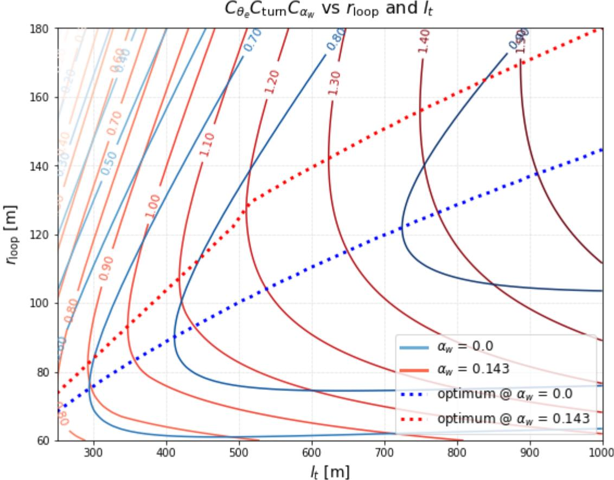

**Figure 33 : Contours of combined power coefficients representing the effects of elevation losses, turning losses, and wind shear gains for different path radii and tether lengths, under conditions of both no shear (blue lines) and shear of 1/7th (red lines). Optimal path radii curves are highlighted.**

There's a relatively sharp optimum in the path radius for a given system and tether length, especially at zero shear or shorter tether lengths. Following the line of best path radius, we see a kink in the positive wind shear case as the optimum switches from being constrained by minimum altitude to being allowed to track the best mean elevation for this shear, at which point the power becomes less sensitive to larger loop sizes. Under zero shear, this switch never occurs, so optimums shift to smaller path radii in an attempt to lower the mean elevation as much as possible.

Gravity losses ( and ) push the optimum tighter than that suggested here, but optimal _Cpump Cvk_ radii remain small even without those effects. A much lighter kite, enabled perhaps by using a ground-based power system rather than an onboard power system, would see optimums shift to even tighter path radii, as the turning loss is diminished—a lighter kite needs less roll angle to make the same turn and will occur at smaller path sizes. _rloopideal_

At a shear of 1/7, a combined coefficient > 1 is still possible, meaning that despite the elevation angle and turning losses, it's still possible for the system to achieve more power by accessing higher winds than the same system directly downwind with no turning losses at the reference wind height. The increased drag of the tether is responsible for flattening this effect, something we'll dig into more in the next section.

An alternative approach to ever tighter loops is to increase the tower height. This should be approached carefully, given that AWEs have half the tension efficiency per unit power as HAWTs, and the relative lack of overturning moments from short towers is the key offshore 26 advantage of AWTs—enabling smaller, simpler platforms. However, cost models indicate that tower costs for a permanent installation are a tiny fraction of total LCOE (~ 2-3%), so some additional expense here is warranted.

There's a similar sensitivity to changing tower height or minimum altitude. We find that the 27 change in power is approximately linear for changes of approximately +/- 30 m in the above example, so pulling out the mean sensitivity for different tether lengths for a system with a minimum altitude of 80 m, a higher than normal tower height of 30 m, and a path radius of 80 m under conditions of zero wind shear gives us figure 34 .

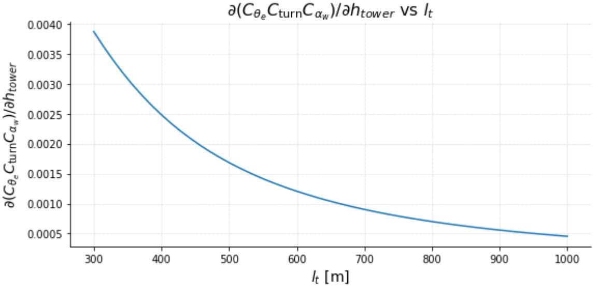

**Figure 34 : Sensitivity of a subset of power coefficients to changing tower height (or minimum altitude) versus tether length.**

This system sees ~ 0.28% change per meter of tower, making an 11 m increase in tower height or (reduction in minimum altitude) a relatively easy ~3% gain in power.

26 Discussed in [section 6.2.4 .](#page-169-0)

27 Identical for zero shear conditions.

### 6.2.3 Higher Power from Stronger Winds at Altitude?

The increased performance by accessing higher, stronger winds at higher altitudes makes a seemingly strong case for AWTs, and this is amplified when looking at a _C C C_ subset of θ_e turn_ α*w* power coefficients we plotted above in figure 33 —despite elevation and turning losses, long tethers in moderate shear can give power up to 1.5 times ! _P_0

This effect wasn't present in the initial summary, where longer tethers at high wind shear were a wash. We pointed to the tether drag as the culprit, so let's repeat the exercise from the [tighter](#page-165-0) [loops section](#page-165-0) , again looking only at subset of power coefficients that are independent of wind speed (just for simplicity), but this time adding in the . _CT D_

With this model, we revisit the sweep from before, but this time rather than showing all , _rloop_ we'll solve for the optimum for each tether length, resulting in the best total coefficient for a given tether length, in figure 35 .

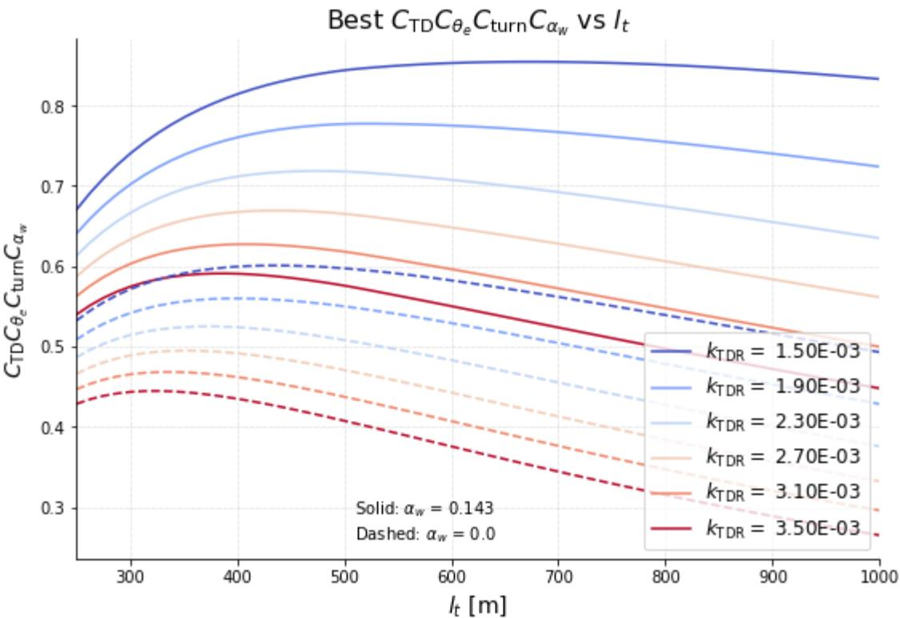

**Figure 35 : Best possible (via optimized r loop ) power coefficients representing tether drag, elevation, and turning losses with shear gains versus tether length. Various tether drag ratios, k TDR , are shown, under conditions of shear (solid lines) and no shear (dashed lines).**

There are some key takeaways from [this plot](#page-168-1) :

-   All values are less than one.
    -   The elevation, turning, and tether drag losses offset gains from accessing higher winds via longer tethers for all design points shown here.
-   Power factor and ideal tether length are heavily impacted by wind shear and tether drag.
    -   Low wind shears and low tether drag ratios prefer shorter tethers.
    -   High wind shear and high tether drag ratios prefer longer tethers.

Figure 35 also effectively states that _the tether is almost always unsuccessful as a tool for a wing to create more power from stronger, higher winds_ , especially given that this simple analysis has also ignored the other downsides of increasing tether length, such as increased resistive losses, increased mass to address those losses, and the opportunity cost of devoting mass to the tether rather than the wing. This isn't to say that kites aren't making additional power from stronger, high altitude winds—it's just that the losses required to access those winds more than offset the gains.

This conclusion is fairly robust, requiring either very low or very _k_ low minimum altitudes _T DR_ and high shear to see this combination of power coefficients become greater than 1 at reasonable tether lengths. Using a high wind shear with an of 0.2, cutting our to 40 m, α*w hmin* and keeping our of 15 m sees this combination of coefficients become greater than 1 for _htower_ tether lengths greater than 500 m. This is indeed aggressive—the minimum altitude places our kite < 2 wingspans from the ground at the lowest point! Alternatively, using the original values for shear and minimum height requires a of approximately 0.0075, half the minimum value _kT DR_ in the prior plot and less than half the low end values for unfaired tethers in table 3 , to achieve a similar effect. A so low likely requires either a faired tether, or a large draggy low _kT DR_ performance per wing area kite, which means our high power coefficient is based on a low base of power. Tether drag dictates optimal tether length, which itself dictates a lot of design parameters.

#### 6.2.4 Comparing AWT with HAWT Power Production

What if we compare the same wing, but affixed to a hub on a tower instead of freely flying around on a tether? We've effectively described a traditional wind turbine, as the blades of a HAWT create power from the wind in the same manner as the wing of our kite. This wing-mounted-to-a-tower will represent our comparison HAWT.

Thus far, we've been ignoring an effect that becomes important for this comparison. As a turbine extracts energy from the wind, it slows it down, resulting in a lower wind speed at the turbine. We'll call this effect "induced flow," as operating the turbine has changed the flow of wind through the wind area it sweeps out. AWTs typically sweep out a large wind area relative to their power, resulting in a net induced flow that is small, allowing us to safely ignore it. In ignoring it, we've been assuming that the wind at the kite is the same as the incoming far field wind speed at the kite's virtual hub height, . _vwvh_

For our example tetherless kite, ie, a HAWT with a single blade, the distance from the hub that we can mount our wing (the "path" radius for our wing) is heavily constrained by the tower height. As a result, swept area drops dramatically and induced flow becomes significant.

We apply actuator disc theory to the swept area to account for the induced flow losses. The actuator disc model finds that the wind speed at the disc (where we sweep out the wind area) is the average of the upstream, , and downstream, , velocities. We'll use to denote the _vwvh vwd vwvh_,_i_ wind speed at the kite after accounting for induced flow.

$$\boldsymbol{\nu}\_{\boldsymbol{w}\_{\boldsymbol{w}\_{\boldsymbol{h},\boldsymbol{l}}}} = \frac{1}{2} \left( \boldsymbol{\nu}\_{\boldsymbol{w}\_{\boldsymbol{v}\_{\boldsymbol{h}}}} + \boldsymbol{\nu}\_{\boldsymbol{w}\_{\boldsymbol{d}}} \right) \tag{76}$$

The continuity equation for the actuator disc gives us an alternative equation for power extracted from the wind:

$$P = \frac{1}{2} \mathbb{Q} A\_{sweight} \mathbb{v}\_{\mathbb{W}\_{\text{vh}j}} \left( \mathbb{v}\_{\mathbb{W}\_{\text{vh}}}{}^2 - \left. \mathbb{v}\_{\mathbb{W}\_d}{}^2 \right) \tag{77}$$

Combining [equation 76](#page-170-1) with [equation 77](#page-170-2) gives us an alternative form for power:

$$P = \mathcal{Q}A\_{\mathcal{w}ept} \nu\_{\mathcal{w}\_{\text{v}hj}} \, ^2 \left( \nu\_{\mathcal{w}\_{\text{v}h}} - \nu\_{\mathcal{w}\_{\text{v}h,j}} \right) \tag{78}$$

The swept area perpendicular to the wind, , of our kite is given by the area of the annulus _Aswept_ swept out by the wingspan, , and projected by the elevation angle: _b_

$$A\_{swept} = 2\pi \, b \, r\_{loop} \cos \Theta\_e \tag{79}$$

The alternate power equation above is solving for a thrust power extracted from the wind, before any powertrain losses. The power from this equation must be equal to the thrust power using the methods above as well. We'll lump together terms that define a thrust power, such that:

$$P\_{\text{thrust}} = \frac{1}{2} \text{g}S\sharp\_0 C\_{\text{thrust}} \nu\_{w\_{\text{ref}}}{}^3 \tag{80}$$

Here, we've lumped all the coefficients that attenuate thrust power together into , leaving _Cthrust_ out ones that are a function of the power system losses, defining it as:

$$\mathbf{C}\_{\text{thrust}} = \mathbf{C}\_{TD}\mathbf{C}\_{\theta\_e}\mathbf{C}\_{a\_\#}\mathbf{C}\_{\text{turn}}\mathbf{C}\_{v\_k}\mathbf{C}\_{T\max} \tag{81}$$

To include the effect of the induced flow, we need to substitute for in [equation 80](#page-170-0) for _vwref_,_i vwref P_ , noting that the induced flow may not actually be changing the wind speed at the _thrust_ reference height—we're simply accounting for the fact that the reference point differs from virtual hub height. This additional complexity is simply to maintain our reference to . _P_0

To put the first power equation in terms of rather than , we combine it with the _vwref vwvh_ following, substituting the induced flow versions where appropriate:

$$\left(\nu\_{w\_{\rm ref}}\right)^3 = \frac{\nu\_{w\_{\rm wh}}}{C\_{a\_{\rm w}}} \tag{82}$$

We can then equate these power [equations 78](#page-170-3) and [80](#page-170-0) and solve for , and then use this _vwref_,_i_ value to define a new power coefficient for induced losses, by referencing it to the uncorrected wind speed. This results in:

$$\mathbf{C}\_{j} = \left(\frac{\nu\_{w\_{ref}}}{\nu\_{w\_{ref}}}\right)^{3} = \left(\frac{4\mathcal{A}\_{\text{swept}}C\_{a\_{\text{w}}}}{4\mathcal{A}\_{\text{swept}}C\_{a\_{\text{w}}} + \mathcal{S}\xi\_{0}C\_{\text{thrust}}}\right)^{3} \tag{83}$$

Inspecting [equation 83 ,](#page-171-0) we see that the higher performance we make our wing, the greater the 28 induced losses. A higher performance wing is accomplished by either increasing wing performance per wing area, , growing the wing area, , or reducing losses to increase . ζ0 _S Cthrust_

We begin using this equation by checking the validity of neglecting the induced flow for most kites. The actuator disc model is most poorly suited to large and variable swept areas with very low solidity, but can still be used to place an upper bound on induced losses as the swept area gets very small. These induced losses will be at their maximum with a high performance kite 29 turning tight loops—ie, extracting a lot of wind power from a small swept area. As our MX2

28 The reduced wind speed at the kite has the effect of lowering optimum kite speed and changing coefficients that are dependent on kite speed. We ignore this secondary effect, as including it would greatly complicate the solution. Since kite speed only linearly changes with effective wind speed, this secondary effect is small.

29 Why is this a poor model? The shear implied by the streamtubes in the actuator disc model are in reality supported by vortices shed by the wing. While the net effect is indeed to slow down the wind in the swept area, areas just outside the swept region see increased wind speed—a benefit analogous to birds in formation making use of wingtip upwash. Actuator disc theory assumes an even and instantaneous pressure drop, but the discreteness of a kite (due to the low ratio of the wing area to the swept area, called solidity) means the specifics of where the vortices are and how they are convected away become important—the pressure drop is not even, and path errors, wind direction shifts, or intentional path movement can all move a kite out of the "streamtube" of actuator disc model validity.

system meets those criteria, we again use our simplified representation of it as our example kite. With a wind speed of 9 m/s and a constant fraction of 1 (at this high of a wind speed _kgrav_ and small path radius, makes little difference), we find the following: _kgrav_

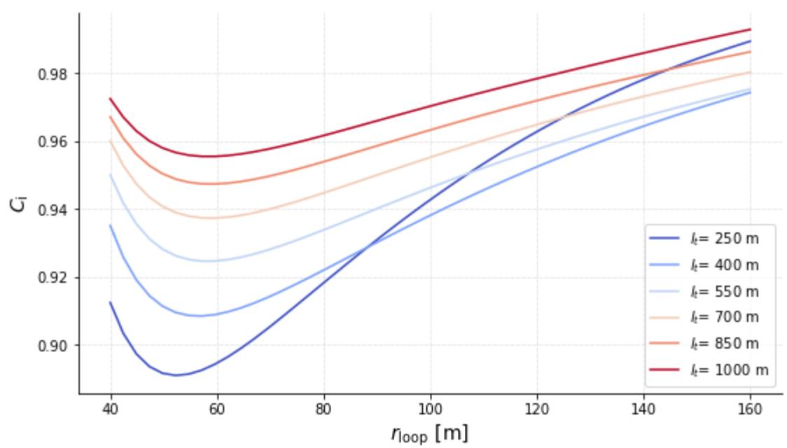

#### **Figure 36 : Power coefficient representing the effect of induced losses on our MX2 versus path radius for various tether lengths. These losses are generally small for AWTs, even with the pessimistic (for AWTs) actuator disc model.**

For the selected system and tether lengths, induced flow losses max out at ~11% and are ~8% for a 300 m tether with 80 m radius paths. Overly tight loop sizes result in the kite's lift being used to make the turn rather than extract energy from the incoming wind, and induced losses top out and then diminish. There is now some motivation to turn larger loops than suggested above in [section 6.1.9](#page-153-0) , before induced flow losses are added, but at such a low solidity, this should just be considered an upper bound on induced losses. Even if directly applicable, this is assuming circular paths. AWTs can increase with minimal offwind or turning costs by _Aswept_ stretching the path horizontally into an oval, and/or by varying the path slightly from one loop to the next. For a kite, given that these losses are low even in the absence of these strategies, and given that the actuator disc model likely overpredicts AWT losses, we can state that induced flow losses for AWTs, even large high power kites turning small circles, is mostly irrelevant.

We're now prepared to compare our wing affixed to a tower—our kite turned into a HAWT—to an AWT. Doing so requires some additional assumptions, namely that our wing performance and

ideal speed isn't grossly affected by the higher rotational rate and growing airspeed delta from tip to tip. 30

This comparison is easily accomplished by inspecting our various power coefficients. A HAWT has no elevation, turning, pumping, off ideal speed, or minimum airspeed losses. With much 31 less sensitivity to mass, there's less motivation to reduce loads before rated power, so we're unlikely to choose to carry anything resembling tension losses either. This leaves us with:

$$P\_{HAWT} = C\_i C\_{a\_\bullet} C\_\eta P\_0 = C\_i C\_{a\_\bullet} C\_\eta \frac{1}{2} \otimes S\xi\_0 \nu\_{w\_{ref}}{}^3 \tag{84}$$

For simplicity in this example, we choose to place our HAWTs hub height at the reference height of 80 m, which sets to 1. Revisiting , the only terms a HAWT is able to drop are the _C_α_w C_η η and , leaving us with a of 0.85. We know induced losses will be at their lowest _rotors tether_ η _C_η at the largest loop size possible (and our above assumption most valid), so we'll choose _rloop_ accordingly. Minimum height is less of a concern for a mounted wing, so for this example we only allow a half span of clearance from tip to ground, setting to 54 m. We'll assume the _rloop_ structure supporting our wing from the inner tip to the hub has negligible drag or lift, and we'll leave this area out of our swept area as well, only looking at the swept annulus.

Let's begin by looking at just the induced losses. Most HAWTs have more than one blade, and blades don't typically have the same performance as wings, so to make the comparison complete, we'll vary the product of , which can represent different numbers and sizes of _S_ ζ blades of various performance, and reference it to our nominal values, . We assume the _S_ ζ0 0 _L D_ remains constant so kite speed strategies as we change remain constant as well. For / _S_ ζ HAWTs, if we hold constant, the ratio can be thought of as a multiplier on blade ζ _S_/(ζ _S_ ) ζ 0 0 area _or_ the number of blades—without turning losses, the discretization of the total blade area is unimportant.

Induced losses impose a limit on the maximum power a system can extract from a given wind flow, and this limit is called the Betz limit. With increasing , induced losses cause the system _S_ ζ to approach and hit this limit, so we also compare the power with the Betz limit power, which can be derived (not shown here) from actuator disc theory to be:

$$P\_{Betz} = C\_{Betz} \frac{1}{2} \text{ç} A\_{Swept} C\_{a\_{\text{w}}} \nu\_{w\_{ref}}{}^{\;3} \tag{85}$$

Where:

30 This is a surprisingly decent assumption at the chosen loop size. Correcting for this does not _significantly_ change the blade performance or the overall conclusion. We should note that the aero database used is generated at a path radius of 100 m, and so is already accounting for much of the rate effects in the nominal case.

31 For a balanced rotor, there is no potential energy exchange and no motivation to vary the speed from the optimum.

$$C\_{Betz} = \frac{16}{27} \tag{86}$$

We can then define how close we are to the Betz limit with the ratio:

$$\frac{P}{P\_{\text{Betz}}} = \frac{C \cdots \natural S}{A\_{\text{swept}} C\_{\text{Betz}} C\_{\text{aw}}} \tag{87}$$

Where represents whatever power coefficients you wish to represent. In figure 37 , we'll _C_ · · · just use . The wind shear terms cancel, leaving only the effect of induced flow. The Betz _CiC_α_w_ 32 limit is a direct result of induced flow—since that's all we're considering, should be able _P_/_PBetz_ to reach the limit, taking on a value of 1, as shown in figure 37 .

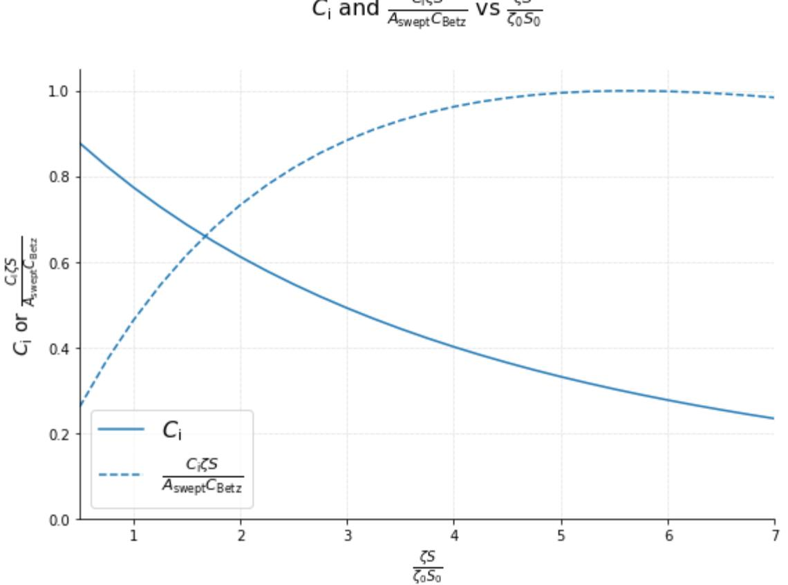

**Figure 37 : Power coefficient representing induced flow losses and total power relative to the Betz limit versus normalized performance metric ζS/ζ 0 S 0 . Maximum power, as dictated by the Betz limit, is quickly reached with growing performance.**

From this plot we see:

32 This example is also at the reference height, causing shear to have no effect anyways.

-   Induced flow losses for a HAWT are significant.
-   The Betz limit is rapidly approached with increasing , with induced losses taking over _S_ ζ such that further increasing over a value of 4 results in essentially no _S_/(ζ _S_ ) ζ 0 0 additional power.

Let's take a moment to discuss what else this means for HAWTs. Unlike AWTs, HAWTs are heavily influenced by induced losses. We showed, in [equation 18 ,](#page-130-2) that the tension ratio, , for τ _L_ an AWT operating optimally is equal to 3. If we assume that optimal operation for a HAWT means operating at the Betz limit, what is the for a HAWT, where we replace tension with drag τ on the tower, ? To find the drag on the tower we first back our way through the Betz _Ftower_ derivation a bit, equating from [equation 85](#page-173-0) with [equation 78](#page-170-3) to find the wind speed at the _PBetz_ disc, , as . We can then find for a wind turbine operating at the Betz limit as _vwvh_,_i_ 2 3) / _vw_ ( _vh_ τ shown in [equation 88](#page-175-0) .

$$\pi\_{Betz} = \frac{F\_{\text{tower}}}{F\_{T\_{\text{min}}}} = \frac{(\dot{m}\_{\text{v}\_{\text{v}hj}})\_{\text{v}\_{\text{v}\_{\text{v}hj}}}}{P\_{Betz}} = \frac{\varrho A\_{\text{sept}} \nu\_{\text{v}\_{\text{v}\_{\text{v}hj}}}^{\prime}}{P\_{Betz}} = 1.5 \tag{88}$$

The tension ratio for a wind turbine operating near the Betz limit, as HAWTs typically do, is half that of an AWT operating optimally at a of 3. In other words, for the same power, the loads τ _L_ on the tower from an AWT are approximately twice that of a HAWT, which cuts in half the perceived benefit of reduced bending moments from a lower tower height typical of HAWTs.

Now, let's pull together a power comparison. For simplicity, we'll lock all the wind dependent terms for our MX2 AWT, fixing path radius at a somewhat conservative 80 m as we did above, with a of 1. We'll grab coefficients from the best portion of , at a wind speed of 9 _kgrav PAW T_ m/s, where tension limiting has not really begun, and where is close to 1. _Cvk_

We'll do the same combined performance metric sweep of for the AWT as well, with _S_/(ζ _S_ ) ζ 0 0 some adjustments. For an AWT, the discretization of the total wing area matters for turning losses, so unlike HAWTs, a constant with a growing only represents increasing wing area, ζ _S_ ζ not increasing the number of wings. HAWTs have no power sensitivity to blade mass, but 33 AWTs do. In order to simplify the comparison, we hold mass constant as we vary . As _S_ ζ _S_ ζ increases, we need to increase the tension limit to avoid reaching it too early. Assuming we have a similar , tension increases roughly linearly with . As the tension increases, we adjust _CL_/_CD S_ ζ the tether thickness, scaling it simply as _d_ . The net effect is _t_ ∝ √ _F F T_,_max_/ _T_,_max_0 ∝ √ζ*S*/(ζ _S_ ) 0 0 that depending on how we increase , we have different effects on . Growing wing area _S_ ζ _kT DR_ reduces proportional to changes in , while growing at a constant raises _kT DR_ √*S*/_S_ ζ _CL_/_CD k_ proportional to changes in . We'll favorably assume is reducing by modeling _T DR_ √ζ _kT DR_

33 As in multiple kites on a single tether, discussed in [section 8.](#page-187-0)

increasing via increased wing area alone in our models. We'll ignore the effect of increased _S_ ζ tether mass.

We see from our plots above that as decreases, the optimal tether length also increases, _kT DR_ especially at higher shear. So, we evaluate both a no wind shear case with a 300 m tether, and a normal wind shear case with a 450 m tether. We can now compare total performance—for the 34 AWT, we'll compare both cases with and without induced losses as an upper and lower bound, and always include induced losses for the HAWT. Keep in mind that we expect reality for an optimized solution to be closer to the more favorable non-induced losses case.

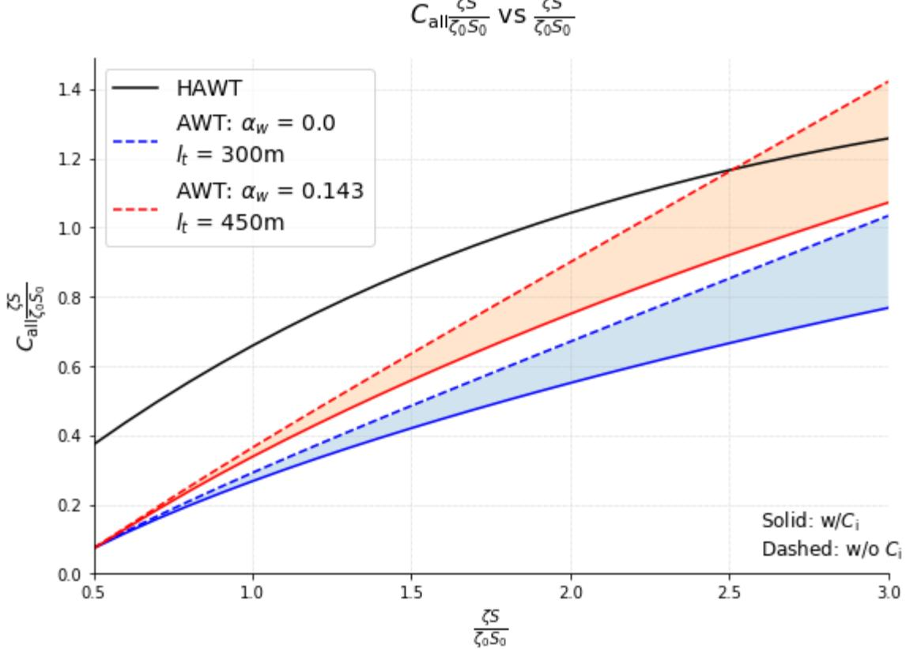

#### **Figure 38 : HAWT vs AWT total power normalized by P 0 versus normalized system performance metric, ζS/ζ 0 S. AWTs are shown both with and without induced losses.**

There are some big takeaways from figure 38 :

-   The baseline single wing HAWT ( = 1) at the reference height outperforms the _S_/(ζ _S_ ) ζ 0 0 baseline AWT by a factor of 2-3x.
-   HAWTs are quickly up against the Betz limit and see less overall power gain per increased blade performance, while AWTs can realize most of the benefit of increased wing performance.

34 Hand-tuned to be approximately optimal.

● Three tower affixed wings ( = 3), also known as a traditional HAWT, are _S_/(ζ _S_ ) ζ 0 0 competitive in power with an AWT of 3x the performance at normal wind shears

HAWTs have a strong motivation to have at least 3 blades for balancing reasons, and here we see why they don't have more: they can already approach the Betz limit with 3 normal sized wings. Of course, this wing isn't optimized for use on a tower—the value of higher is also ζ*L* diminished as the Betz limit is approached, and this is why we don't see HAWTs also chase high with high lift airfoils like AWTs do—a single element airfoil has significant simplicity and cost ζ benefits that outweigh the heavily reduced gains of the multi-element airfoil due to the increased induced flow that a high performance multi-element airfoil creates. This means that in the 3 wing comparison case above, a HAWT would likely simplify its "wings" to a single element with lower for little performance loss, perhaps making up for some of it with ζ increased blade area—adding blade area is often cheaper than adding an equivalent amount of through multi-element blades. ζ

## 6.3 Conclusion

In this light, let's take a step back and critically examine the perceived power benefits of AWTs. A number of unique losses, in particular tether drag and elevation losses (from the combination of a minimum required altitude, turning losses, and a minimum turning radius) all act to reduce performance of an AWT relative to a HAWT with similar blades. Under these conditions, it's inaccurate to state that AWTs access higher power from higher winds, since the net effect is to create less power than the same wing mounted to a tower at the reference height!

This isn't to say that AWTs don't present any performance advantages compared to HAWTs:

-   AWTs sweep out much more wind area, dramatically lowering induced flow losses.
    -   AWTs can achieve higher performance per wing area than a 3 blade HAWT, especially in high wind shear or with very low ratios, possibly making them _kT DR_ more cost effective.
    -   HAWTs remove so much energy from the wind area they sweep out that in a plant consisting of many wind turbines, downwind turbines see reduced performance (referred to in the industry as wake losses, and can be on the order of 10-15%). AWTs sweep out much more wind area relative to their power, and wake losses will be negligible.
-   Lower bending moments from shorter towers support much smaller and cheaper foundations, which is a significant cost driver for offshore installations.

"These conditions" clearly include the system drag, path, and mass assumptions we've made. The biggest way to change this conclusion is with a very low in moderate to high wind _kT DR_ shears. When the cost of reaching higher winds is low, the tether can better pay for itself to access them. Ratios low enough to do so seem achievable only with significant tether fairing, something that Makani was not able to practically achieve.

It's also important to reiterate the detrimental effects of longer tethers we ignored in the above analysis—onboard generation AWTs must either pay additional resistive losses or increase mass. All AWTs must support the additional mass, and they should consider the opportunity cost of adding tether mass—increased tether mass generally directly takes away from mass that can be added to the wing (either to increase or reduce costs), especially for onboard _S_ ζ power generation systems. We'll explore this effect more in s [ection 7, Mass .](#page-181-0)

Path changes can also be important. We've so far assumed a circular path and a minimum altitude of ~3 wingspans at 80 m and of 15 m. A kite with a very tight minimum turning _htower_ radius could instead make much flatter shapes, lowering the mean elevation to significantly reduce at the cost of minor off-wind losses for the crosswind portion and accepting bigger θ*e* losses for the brief tight turns.

One version of this could be horizontally oriented figure eights, with the additional benefit of eliminating the need to de-twist the tether. For the systems presented here, this isn't an optimal solution—the minimum turning radius constraint combined with shorter tethers simply pushes the sides of the path to large azimuth offsets, which hurts performance. A system that can turn more tightly can alleviate those losses, but unless the kite is substantially lighter, it will see large losses in the turns. Longer tethers can also ease the azimuth offsets, allowing us to stretch the path horizontally and spend less time turning, but longer tethers are less optimal, and they increase the turning losses for the same path radius. A very light kite with a low could find _kT DR_ a suitable compromise here.

Mass has a surprisingly small impact on crosswind performance, predominantly only affecting the low wind performance. A lighter kite can pull tighter turns and experience less elevation losses at shorter tether lengths, but changes large enough to be significant will likely only be possible with a different architecture, namely a ground-based power system, as the examples used here already represent very light construction methods for onboard power generation rigid kites.

In summary, AWTs nearly completely eliminate the shackle of induced flow losses, only to trade it for the shackle of tether, elevation, turning, gravity, and speed losses. Stronger high altitude winds provide a benefit that can recoup some of the difference, but not enough for the systems explored here to see a net benefit.

## 6.4 A Numerical Take on Path Shape

Thus far, we've limited the data to circular paths only, leaving non-circular paths to discussion alone.

Codes that can optimize path shapes certainly give non-circular results, outputting more organic shapes, typically compressed in the vertical dimension. What's unclear is how critical this shape is to the final result. The numerical model provided as part of the Makani software distribution has the capability to evaluate non-circular paths. A brute force investigation was taken for the Makani M600 using an earlier version of this tool. Different variations of simple closed curve paths —shapes best described as eggs, beans, ovals, and racetracks—were evaluated at 35 different scales, orientations, and azimuth and elevation offsets, resulting in ~25k different path shapes, each evaluated at a range of wind speeds.

The top percentile of mean power for the given paths at a variety of wind speeds with zero shear is shown in figure 39 , looking downwind such that all paths are flown clockwise.

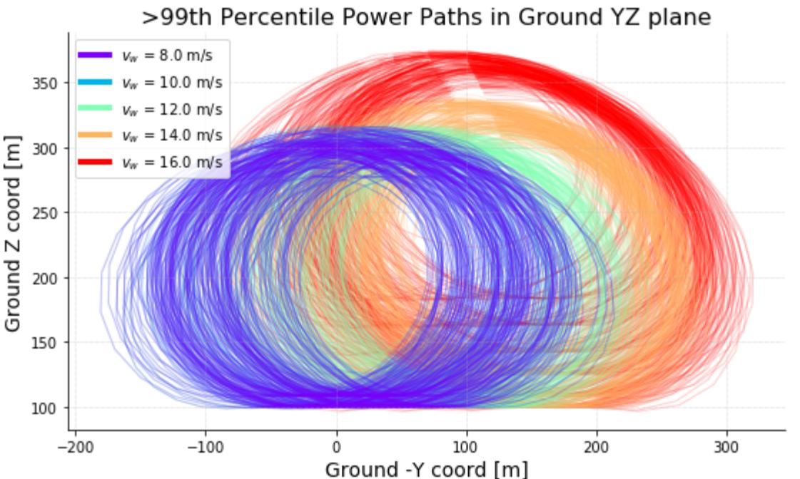

#### **Figure 39 : Paths with the top percentile of power for ~25k brute force path evaluation of various closed path shapes, orientations, and locations for various wind speeds. There are two regimes visible—moderate winds where the kite flies tight and low paths to make maximal 36 power, and large offset paths at high winds to manage excess power.**

We see very similar optimal paths for 8 and 10 m/s of wind, as the 10 m/s solutions are nearly entirely obscured by the lower wind speed solutions. As expected, all these paths are as low as possible, and stretched only in the horizontal dimension. The M600 has more constraints limiting its ability to turn small path radii as a result of its heavy bridling and lack of strong tail

35 Horizontally oriented figure eights weren't considered in this study, see comments in [section 6.3](#page-177-0) .

36 Well, tight for the M600, which struggled to turn paths of ~120 m radii in flight tests and was eventually limited to a minimum path radius of ~140 m. These are large relative to ideal operation of an AWT.

authority, so viable paths were limited in how vertically compressed they could be—easing this constraint was one of the strongest motivations for the MX2 design.

At high winds, the kite sees significant changes, increasing azimuth and elevation offset while increasing path sizes. We haven't discussed it yet, but this is occurring as part of the power saturation strategy, as the kite is reaching its power limit. Some paths enable the kite to saturate power more effectively, for a greater portion of the time.

Now, let's look, in figure 40 , at the effect on power these variations on path can have.

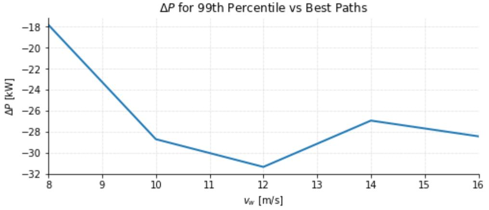

**Figure 40 : Difference in power from the 99th percentile power to the best power for the paths shown in** figure 39 **.**

The difference between the best and the worst of the paths shown in the plot above is surprisingly small. Meaningful, but small. For a kite with a tighter minimum turning radius such as the MX2, we expect these losses to become much smaller.

The overall conclusion is that we shouldn't over-index on the specifics of path shape. Chasing performance via path results in control and planning complexity, possibly resulting in increased control errors that can easily wash out the perceived gains. In the context of an unpredictable, turbulent wind field, a particular path may no longer result in the minor gains we fought so hard for.

This isn't to say that all paths should be neat, crisp circles or perfect horizontally oriented figure eights—there are still some important conclusions:

-   For wind speeds where the kite is not becoming power limited, we want to:

    -   Squash our paths vertically as much as possible, echoing the conclusion from above regarding gravity losses.

-   For high wind speeds:
    -   Path location and shape become a key part of the power saturation strategy, which we'll discuss more later.
-   For all wind speeds:

-   It's beneficial to ease the path curvature where most constrained at the 4-5 o'clock position, where gravity is adding to the turning effort while the kite has reduced airspeed since it's moving downwind. 37
    -   This is best accomplished by tightening the curvature at the start of the downstroke, which still keeps the path vertically compressed.

Path variations such as these should be incorporated into final products, and Makani had planned controller development toward that goal. However, during development, simple paths are easier to implement, and during system analysis, easier to compare. Optimizers have very soft gradients for the large number of variables that control path shape, so minor changes in system, seed, and optimizer performance can result in larger path variations. The resulting difficulty in isolating the effect of a change is why we'll limit ourselves to simple circles for comparison purposes. Path changes beyond simple shapes should be considered a secondary improvement, and kite and controller design should not over-index on the specifics of the path shape.

37 This conclusion is gleaned from the dataset, as it isn't apparent from [Figure 39](#page-179-0) above, especially with the visual distortion from flattening paths with significant azimuth and elevation offset into the YZ plane, which gives the appearance of sharper turns in the 4-5 o'clock region.

# 7 Mass

As a flying vehicle, we expect mass to play a large role in the performance of AWTs. Surprisingly, the relationship is found to be weaker than one might expect purely from a power generation perspective—once a system is in crosswind and generating power, changes in mass have a relatively small impact. Where mass matters a ton, at least for an onboard generation system that hovers to enter crosswind, is the weight limit it imposes on the total system for a given power system. The sensitivity to mass ends up being driven by the opportunity cost, as all optimal designs in Makani's models ended with the same conclusion: get the biggest, highest performing kite your power system can muster into crosswind.

Here, we'll investigate some of the relationships and limits imposed by system mass for a hovering onboard generation system.

## 7.1 Hover

It's useful to begin system design with a target power level in mind, and then determine the mass limit. We'll do an example exercise for the MX2, but the actual design process used a statistical approach with flight test data from the M600. That process is outlined in the MX2 design document [\[12\] .](#page-231-0)

Taking the hover thrust power equation and rearranging it to solve for system mass gives the following, where is the total airborne mass of the system, is the limiting hover _mtotal Phover_ power available to the system, is the efficiency of the powertrain from the power limited _hover_ η component to thrust power, is the desired minimum operating air density, is the rotor _min_ ρ _kRF_ fraction available, is the number of rotors, is the swept area of a rotor, is the _Nrotors Arotor kTW R_ desired thrust to weight ratio, and is the acceleration of gravity: _g_

$$m\_{total} = \frac{\sqrt[3]{2(P\_{hover} \eta\_{hover})^2 \varrho\_{min} k\_{RF} N\_{rotors} A\_{rotor}}}{k\_{TWR} g} \tag{89}$$

In order to choose a , we need to select the power parity point for generation and hover _Phover_ power in the system. To demonstrate what this means, imagine a system with an of 0.6, *t*2*g* η with the power parity point at the grid connection. In order to make 1 MW at the grid connection, the system must generate 1 MW/0.6 1.7 MW of power at the kite. However, this 1 MW at the ≈ grid only translates to 600 kW of hover power at the kite!

Given that the ground side power equipment is a small portion of total capital costs that form part of the numerator in our equation for LCOE, and the size and mass of power generating components like the wing and power system are responsible for the power production that

forms the entirety of the denominator, it makes sense to place the power parity point as far up the generation chain as possible. In other words, the additional cost of ground based power components to support a higher hover power is usually more than offset by the additional power production of a larger and heavier kite.

A full system model optimization effort found the same, with the optimizer settling on hover to generation motor shaft power ratios close to 1. This means that we pick motor shaft power as the parity point, choosing _P P k_ , and becomes only the efficiency of the _hover_ = _shaft_, _max RF hover_ η rotors. As a result of this choice, the downstream power train must support higher hover power levels than they receive in generation, due to reversals of the efficiency chain. For the MX2 system, 1.2 MW, and _P_ 0.71. This efficiency is at maximum thrust _shaft_, _max_ ≈ η_hover_ = η*rotors*,_hover_ ≈ with zero freestream velocity.

The rotor fraction allows us to set some safety margin for a powertrain failure. Makani systems utilize what we call a stacked powertrain architecture, which means that motors are chained in parallel connected pairs. This allows the system to support high tether voltages, resulting in a lighter, more efficient tether, while still having reasonable power system voltages, eliminating the need for onboard step down converters or exotic high voltage motor controllers. It does, however, also mean that loss of a single motor/rotor takes out its paired motor/rotor as well, and as such, the maximum for Makani systems is 6/8 = 0.75. We can then use this value to _kRF_ find _P k_ 900 kW. _hover_ = _Pshaft_, _max RF_ ≈

Selection of number and area of rotors deserves its own topic, but we'll be brief here. A target first rated power point combined with expected system L/D gives expected kite airspeed from the Loyd fundamentals. We can then use this to choose a desired bound on rotor efficiency from inflow on the rotors as a function of the total rotor area. Once this exercise is completed, it's a matter of dividing up that area among several rotors, balancing the trade-offs of tether voltages and stacking, additional maintenance needs for each added power system, motor out margins, and overall mass. Motor mass largely scales linearly with required torque (for a gearbox-less system, much desired for the reduced complexity), pushing for a greater number of smaller rotors, but more rotors require additional structure and other fixed mass costs, pushing the other direction. Having completed this complex series of design trade-offs, Makani settled on 8 rotors, with a total rotor area of ~33 m 2for both the M600 and MX2 systems. 38

Somewhat surprisingly, the desired thrust to weight ratio also deserves a longer section than we'll give it here. The obvious limit for a thrust to weight ratio is the acceleration phase during the transition into and out of crosswind flight, but transition into crosswind thrust requirements

38 If rotor area sizing is a function of power and airspeed, then why do these two different kites have similar rotor areas? The MX2 made a conscious decision to utilize the M600 power system, but the reason these match the MX2 well is that the M600 did not hit original performance targets—it performed worse than expected, in large part due to not being able to turn the desired tight paths due to substantially missing the mass target. To address the weight growth, shaft power and rotor area grew, and ultimately the M600 power system became poorly matched to the airframe performance. The MX2 is expected to perform close to the M600 intent.

didn't provide many surprises. Despite (or perhaps as a result of) much concern during development, transition to crosswind flight was easier than expected.

The surprising part is that the "simple" hover condition proved to be difficult to define precisely, and at high winds may be just as limiting as the acceleration to crosswind. A hovering tilt kite operates in a complex environment—the wing is partially blown by the rotors and the wind, rotor wakes interact with the wing and tail differently at different wind speeds, and rotor inflow and wakes can block downwind rotors from operating as efficiently. Balancing the resulting moments from drops in downwind rotor thrust, tether tension, and airframe aerodynamic moments lower the net available thrust, requiring a higher peak thrust to weight ratio in our simple equation. No simple model confidently explained the flight test data, and verification of more complex models via system identification flight tests wasn't completed, so knowledge here is somewhat incomplete. The topic is covered in more detail in section 4.6.2 of the " [Oktoberkite and MX2](#page-231-0) " article [\[ 12 \]](#page-231-0), but for brevity, here we'll simply state that should be _kTW R_ ~1.25 to meet hover and transition into and out of crosswind needs.

A reasonable value for is 0.95 kg/m 3 ρ , roughly equivalent to the standard atmosphere at _min_ 2500 m altitude.

At last, we can solve for mass. Using the values above, we arrive at a value of ~2180 kg. This total mass has to be shared between the kite and the tether. Low tower heights do not support a great deal of catenary hanging below the tower. For the M600, typical operation had the tether leaving the tower with a slight positive elevation, meaning the tension created a downward load at the kite slightly greater than the tether weight. Without significant catenary hanging below the attachment point at the tower, the kite must support at least the full weight of the tether. With a mass of ~275 kg for the 300 m MX2 tether, this leaves ~1905 kg for the kite. The same values with an offshore focused system with a of 1.1 kg/m 3 ρ gives approximately another 100 kg _min_ of mass.

It's difficult to add anything of note to the well-trodden ground that is the topic of hovering vehicles. Typical power density and rotor areas require that ~⅓ to ½ the total mass of the kite will be the power system. The section on system scaling argued that the rated power should be as high as possible, but it's the hover challenge that places a practical limit here. A system around 1 MW isn't the largest possible, but it strikes what we felt is a good balance between capturing system scaling benefits while easing development of a first generation AWT.

In addition, the hover requirement creates a strong tie between the system rated power and its _S_ performance. HAWTs are able to apply system rated power as a somewhat secondary ζ optimization. For HAWTs, low wind sites or markets with heavy renewable penetration that value higher capacity factors can favor the cost savings of a smaller power system paired with a larger and higher performance rotor to increase capacity factor. The same trade isn't available for hovering onboard generation AWTs, as we're unable to reduce the size of the power system

relative to the performance of the kite—shrinking the power system results in a kite that is unable to hover. As such, AWTs in renewable saturated markets may be reliant on intentional curtailment or downrating rather than resizing of their powertrain to seek higher capacity factors.

### 7.2 No Wind Upstroke

Our kite needs to be able to remain flying even when the wind cuts out. This can impose a hefty climb requirement. If we assume circular flight paths, a complete drop in wind, and climb at the lowest controllable airspeed, we can state this power requirement roughly as:

$$P\_{climb} = k\_{TWR} \left(\frac{m\_{total} \text{g} \gamma\_{a\_{\text{min}}} \cos \theta\_e}{\eta\_{bover}} + P\_{drag} \right) \tag{90}$$

If the limiting power in the system is shaft power as above, then is again just the rotor _hover_ η efficiency, which at the power limit and airspeed is higher at 0.85. A over 1 is still needed _kTW R_ to maintain a safety margin, but we can perhaps go lower—here let's choose 1.1. Operating at peak , the of the MX2 system (including effective tether drag) is 0.123, giving a of ζ*L CD Pdrag* ~ 110 kW.

Solving [equation 90](#page-185-2) above for a path elevation of 0.45 rad and a minimum controllable airspeed _va_ of 30 m/s results in a climb shaft power requirement of ~870 kW. If we desire the kite to _min_ maintain a minimum airspeed climb in a motor out scenario (in order to survive a loop until a safe return to hover can be completed), this is perhaps uncomfortably close to our motor out shaft power limit of 900 kW.

In practice, this constraint is less limiting than our simplistic model has indicated. We find that optimal strategies store a large amount of potential energy in kite speed, and as a result, minimum airspeeds are only seen near the top of the path. It does need to be accounted for though—low wind strategies need to be adjusted in the event of a sudden loss in wind to ensure there's enough airspeed to maintain control of the kite at top of the path. Some of this can be done in response to a loss of wind, such as lowering alphas and adding power earlier, but there may need to be adjustment of the overall strategy to become more tolerant of a loss in wind, such as storing more energy in kite speed at the bottom of the path than is optimal for power production.

## 7.3 Mass in Crosswind

Finally, let's discuss the effect of mass on crosswind power generation. We'll use the analytical model for described in [section 6 ,](#page-125-0) and perturb the mass to find sensitivities. Inspecting _PAW T_ [equation 75 ,](#page-162-1) we find that the tether roll angle is approximately linear with changes in mass. If we assume the limit on turning radius is driven by the tether roll angle, and that we want to maintain

a similar amount of roll margin as mass changes, then we scale the minimum turning radius constraint of 80 m we applied in [section 6.1.9](#page-153-0) proportionally with the change in mass, where the nominal mass is the MX2 kite target of 1850 kg, limiting the minimum size to 60 m to keep things reasonable. Doing so, and once again optimizing the strategy and loop radius, under _kgrav_ conditions of no wind shear, we find the following:

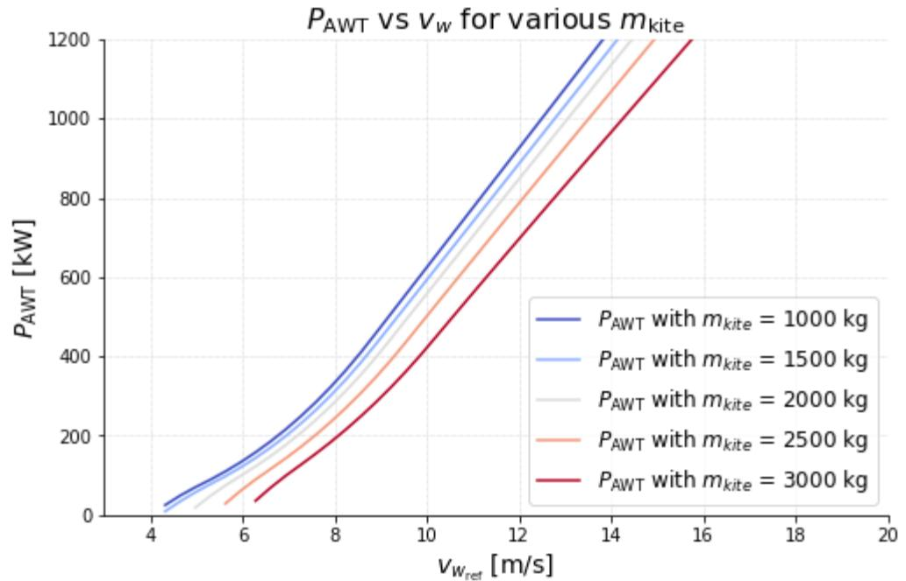

#### **Figure 41 : Numerically optimized power predictions from our analytical model with the MX2 system for various kite masses, scaling minimum path radius linearly with increases in mass. Dramatically lighter kites only bring comparatively minor improvements.**

It requires a large mass growth to have a pronounced effect on the power, driven predominantly by the growing minimum radius constraint and its effect on the losses as the minimum _C_θ_e_ altitude constraint pushes the paths to higher elevations, with growing sensitivity as we drive off the cliff. Going the other direction, heavy mass reductions have a small impact. θcos 3 _e_

Under positive wind shear, the effect in both directions shrinks, as the ideal path elevation gets closer to the minimum elevation limit and the losses are offset by the shear gains. If the cos3 minimum turning constraint is held constant (ie, the heavier kites can turn just as tightly as the lighter ones), the sensitivity to mass shrinks even further. The combined effect is shown in figure 42 .

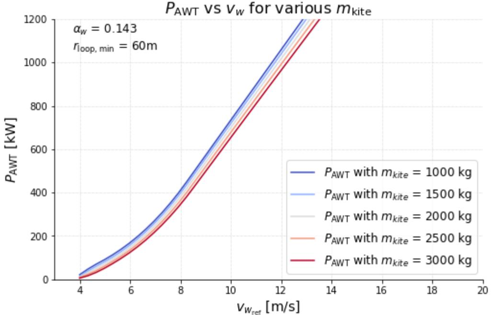

**Figure 42 : Numerically optimized power predictions from our analytical model with the MX2 system for various kite masses, this time with positive wind shear and assuming a fixed constraint on path radius. Isolated this way, mass has negligible effect.**

The conclusions from these simple analytical results are consistent with those from more detailed models and simulation. Once in crosswind, changes in mass for a given kite design are relatively small and unimportant, with the biggest impact being a gradual degradation of the kite's minimum turning radius. Oddly, this _amplifies_ the need for an accurate mass estimate during design. We have strong motivation in the design phase to maximize the of the kite to _S_ ζ maximize power production, which generally means lifting the biggest wing you can into crosswind, riding the limit of a given powertrain's capabilities in the hover and transition modes. If the mass grows even a little over the mass target, then the kite can't fly! Meanwhile, a kite that is lighter than expected has missed out on the opportunity to grow the kite's size, and sees little benefit of that reduced mass in crosswind.

# 8 Multi-kites

The significant effect of tether drag and the BoS cost benefits makes the idea of multiple kites (multi-kites) on a single tether appealing. One possible concept of multi-kites is a "Y" configuration, shown in figure 43 , where the kites lift a shared stationary tether that then splits into several short tethers, enabling the kite to access stronger winds at higher altitudes without paying the drag penalty of a fully moving tether.

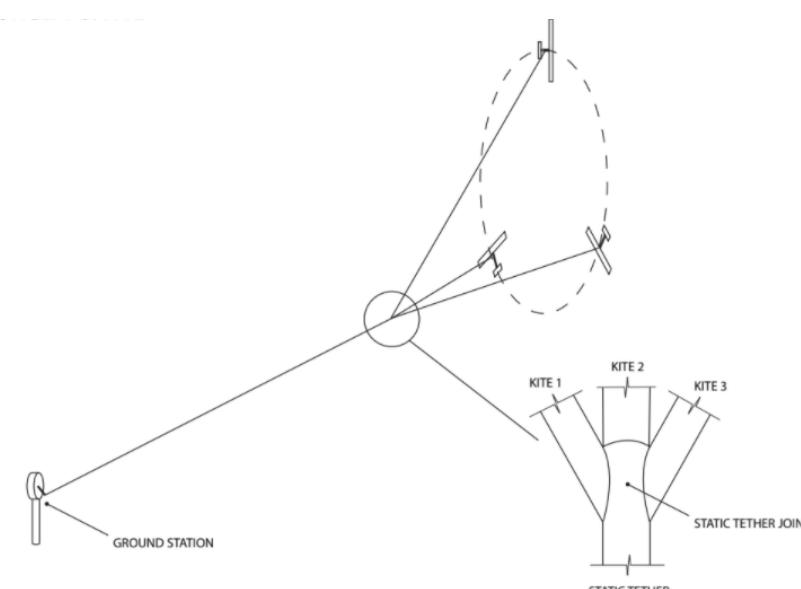

#### **Figure 43 : Conceptual sketch of a "Y" multi-kite configuration, with a static tether section.**

This is a topic worthy of more discussion than we'll give it, but let's briefly explore the idea using our existing model with a few minor changes and notes:

-   Tether drag is adjusted by the ratio of the moving tether length to the total tether length, effectively reducing the by this amount. _ktdr_
-   More kites in the same swept area means induced losses become important, so we must include it, diminishing one of the few clear advantages of AWTs.
    -   We multiply the in [equation 81](#page-171-1) for by the number of kites to *S*ζ0*Cthrust Ci* represent the increasing induced losses.
    -   With an increasing number of kites, the actuator disc model will be increasingly accurate. We'll again show results both with and without induced flow, but as we add kites we expect the induced flow result to be increasingly close to the truth.
-   We optimistically neglect the mass of our static tether and the reduced efficiency from a longer total tether length.

    -   As a result of these assumptions, longer static tethers in positive wind shear are always an improvement, as they access higher winds with no change in other losses, but in reality there will be some unmodeled losses that grow with length.

-   We place a practical limit of 1000 m as the combined length in the example below.
-   There's no practical way to transfer power from kites on the downstroke to the upstroke without paying most of the losses present in the powertrain, so there is little change in the and associated pumping losses. _pump_ η

We wish to vary the number of kites, but can't use the combined metric to do so as we did to _S_ ζ represent varying either the size or the number of blades for HAWTs in [section 6.2.4](#page-169-0) , since the turning losses are dependent on the individual wing area for AWTs. As a result, we'll hold _S_ ζ constant and only vary the number of kites. We'll define a ratio of the static tether length over the total tether length as . With some rough manual optimization of path size and _kstatic kstatic_ static tether length, we find the following, again using the MX2 system as our kite with a constant of 1 at 9 m/s of wind, as we did in [s ection 6.2.4](#page-169-0) . We compare this with our _kgrav_ representative HAWT made from the same wing, also from s [ection 6.2.4 ,](#page-169-0) where the number of wings represents the number of blades, and with our nominal 300 m fully moving tether AWT design from that section as well, indicated with a of 0. We limit ourselves to a positive _kstatic_ shear case, as multi-kites have much smaller advantages in no wind shear conditions, as illustrated in figure 44 .

The benefits of a Y configuration multi-kite are large, out performing the same system without a static tether and now outperforming the HAWT example at 3 wings/blades. This is largely enabled by the longer static tether allowing the kite to access the stronger high altitude winds without paying a price in terms of increased tether drag, with a secondary benefit that they can reduce elevation losses.

However, we have a few caveats:

-   The static tether multi-kite sees a relatively small performance increase compared with several independent kites.
    -   The multi-kite will be strongly influenced by induced flow and close to the bottom of their performance band, the = 0.7 example. _kstatic_
    -   Separate systems will see little induced losses and will be close to the top of the performance band for = 0 example. _kstatic_
    -   As a result, multi-kites provide a performance improvement of ~30% over the same kites operating as separate systems in this example.
        -   This is meaningful, but less than perhaps hoped. The BoS cost saving effect will likely be more significant.
-   Several effects we've ignored will reduce performance for multi-kites.

    -   Tether electrical losses or mass (to add conductor area to address losses) will increase with longer tether lengths.
    -   Mass of the lengthy static tether is significant, and will reduce the size of the system we get into crosswind.

-   Even ignoring any additional tether mass growth to address tether efficiency and holding the tether linear density constant, the 1000 m total tether length of our example system will result in a _m m_ of _tethers_/ _kites_ approximately 50%!
-   As a result, minimum tension and airspeed will need to increase, hurting low wind performance.
-   Mass of the static tether will add catenary sag, tilting the cone of the moving tethers upwards and effectively adding elevation angle losses.
-   A typical strategy will result in faster speeds and higher tensions at the _kgrav_ bottom of the loop, further tilting the moving tether cone upwards and increasing effective elevation angle losses.
-   Multi-kites will have greater difficulty modifying path shapes, therefore missing out on secondary optimizations we haven't considered.

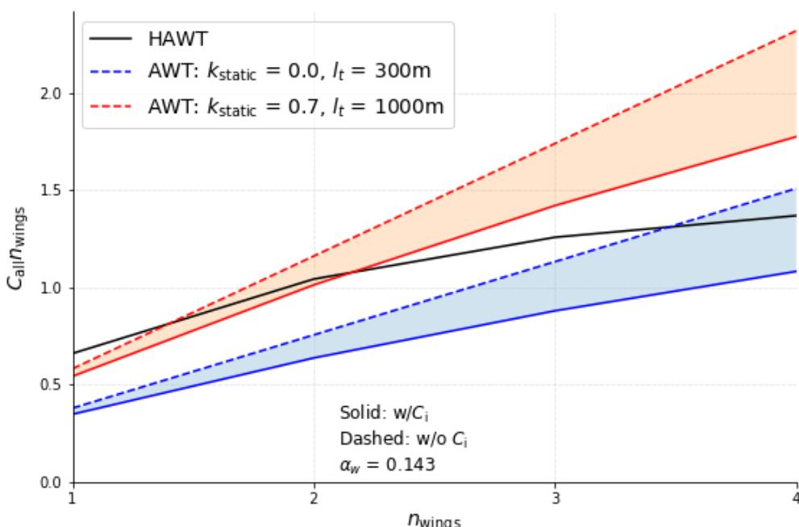

#### **Figure 44 : AWT and HAWT normalized performance relative to P 0 versus number of wings/kites/blades under wind shear of 1/7. Multi-kite Y configurations are represented with a k static of 0.7, while multi-kite clockface configurations are represented with a k static of 0. 39 40**

These points all perhaps miss the greater, non-quantifiable challenges of multi-kites. "Y" configuration multi-kites greatly increase the launch and land operational difficulties, add substantial complexity to crosswind control, and introduce a whole new set of single points of failure that could bring down the entire system. The main benefit is only unlocked with very long

39 Described shortly below.

40 Included in the plot is the nonsensical 1 kite solution with a non-zero static tether length, simply for completeness.

tethers, which raises regulatory issues. Even if these can be addressed, they will increase development and testing time dramatically, something the fledgling AWE industry has already struggled with.

There are some alternate configurations that can address some of these problems. A "clockface" design, where each kite is effectively separate, only sharing a ground station, foregoes the static tether benefits to ease launch and land (kites only need to synchronize crosswind and transition into and out of crosswind) and make it easier control, as kites don't directly tug on each other as in a Y design. The clockface design isn't particularly appealing purely from a power perspective, but when one considers the BoS scaling pressures discussed in [s ection 3](#page-110-0) , it becomes much more compelling.

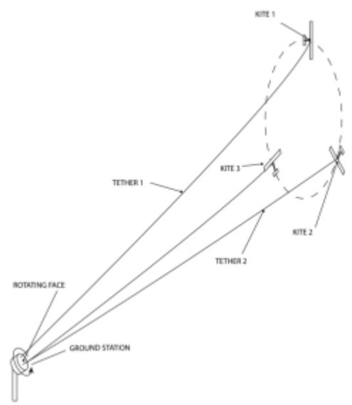

**Figure 45 : Conceptual sketch of a "clockface" configuration for multi-kites.**

There are also hybrid solutions—a traveling crawler can enable the easier launch and land of a clockface configuration with the benefits of a Y configuration, but adds additional complexity.

These alternatives do little to change the bigger picture: multi-kites, while initially appealing, appear to offer less performance benefits than anticipated due to the introduction of substantial induced flow losses and the costs of carrying a tether that is a large portion of total airborne mass, especially in light of the opportunity cost of devoting that mass to the tether rather than the wing. The development challenges further push this idea, in this author's opinion, firmly into the realm of the distant future. If AWE can create a successful, reliable product and gain years of real world experience with a single kite, then perhaps later designs can chase the potential gains of multi-kites, beginning with simpler clockface configurations to get the BoS advantages. An AWT design dependent on multi-kites as an initial product faces a daunting development challenge.

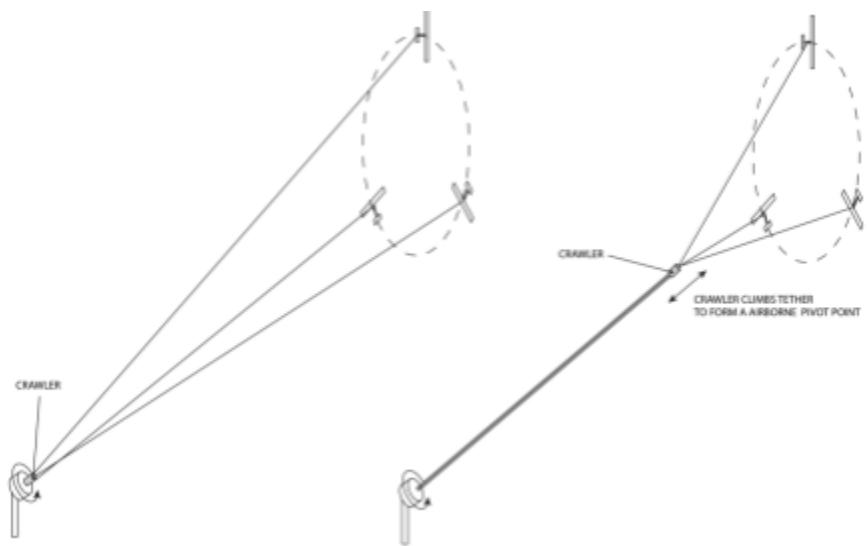

**Figure 46 : Conceptual sketch of a traveling crawler design for multi-kites.**

# 9 M600 Power Performance

In " [M600 Energy Kite Description](#page-231-0) " [ [11](#page-231-0) ], we present the predicted and tested performance of the M600, Makani's prototype energy kite, in comparison with the original design intent.

Here, let's apply the simple analytical model we've developed here to take a more fundamental look at the reasons for the performance gap shown there.

Taking values for the M600 Intent and the M600 As-Built from table 1 , we evaluate them in our analytical model. Before doing so, we need to make one additional change. The M600 As-Built has a hard speed constraint of 70 m/s based on a predicted whirl flutter mode of the props. _vamax_ We can add this to our term in the same manner as our constraint. We also need to _Cvk vamin_ select an , choosing the minimum values of 75 m and 145 m for each system, respectively, _rloop_ and choose a of 0.7 for the M600 intent and 0.5 for the M600 As-Built, broadly _kgrav_ representative of how the kites were typically flown. We also repeat our MX2 example from figure 28.

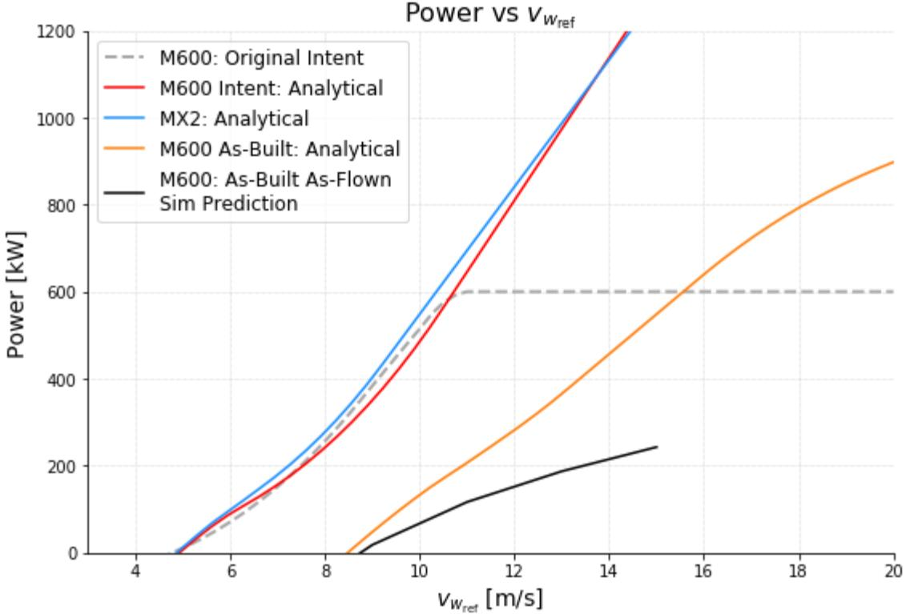

**Figure 47 : M600 design intent power curve from more detailed models and our analytical model, along with analytical model results for the MX2 and the M600 As-Built. Also shown is the M600 As-Built and As-Flown simulation prediction, all under zero wind shear conditions.**

Our simple analytical model matches the M600 Original Intent power curve, which was created from an optimal control problem (OCP) optimizer at the time. The analytical model also captures the poor cut-in performance of the M600 As-Built, agreeing well with the simulation there.

As we noted in " [M600 Energy Kite Description "](#page-231-0) [ [11](#page-231-0) ], the large minimum path radius and worse aerodynamic qualities are responsible for most of the reduced performance, and we've 41 captured those effects well in our analytical model. What our analytical model doesn't explain is the growing gap between the simulation prediction and the analytical model as winds continue to increase.

To understand this, we need to look at what "as-flown" signifies. For wind speeds greater than 10 m/s, we were forced to deliberately degrade the kite's performance, for reasons we'll examine shortly. Let's take a look at some commanded flight parameters for the presented simulation prediction in figure 48 .

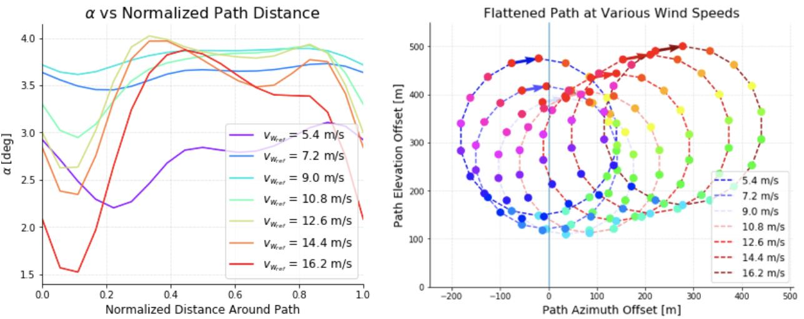

#### **Figure 48 : Alpha and path commands for the M600 As-Built and As-Flown simulation prediction. The kite is only operating optimally at ~9 m/s of wind. Paths are shown flattened into the downwind viewing plane, with offsets shown relative to downwind.**

Optimum operation of this kite at a maximum alpha of 4 deg at the minimum path radius of ~145 m is only commanded at approximately of 9 m/s. This is where the analytical model, also _vwref_ operating optimally, agrees well. As wind speed increases, the commanded alphas begin to drop, path sizes grow larger, azimuth offset shifts sharply to the right, and the as-flown performance relative to the optimum continues to drop.

41 We won't get into _why_ we had worse aero performance and large minimum path sizes for the M600 As-Built here. See the referenced article, [" M600 Energy Kite Description](#page-231-0) ["](#page-231-0) [ [11 \]](#page-231-0), for a more complete description of predicted and flight test performance, as well as the discussion of how we got there.

This begs the question: why are we commanding the kite in such a way to drastically reduce performance? The answer lies in some unique challenges for AWTs in high speed, turbulent winds, and those challenges are greatly exacerbated by large path sizes. The M600 was forced to degrade performance to avoid some of those challenges, and ultimately, high wind speeds remained an unsolved problem for the M600, with simulation indicating a maximum safe wind speed of ~15 m/s.

# 10 High Winds Are Hard

### 10.1 Overview

Much of the focus in AWT literature and HAWT design has been on making as much power as possible, and indeed, this should be the focus to have a competitive power curve, with a comparatively early cut in and first rated power point.

However, the challenges of what happens _beyond_ that point, as wind speed continues to increase with a saturated power system that is unable to accept any additional power, cannot be overlooked. High wind operation and power saturation remained an unsolved problem at Makani. Even in the history of HAWT development, it took some time to learn how to safely saturate power, with most HAWTs now using variable blade pitch to lower the angle of attack as the main power limiting mechanism.

This tool is available to AWTs as well, but with much stricter limits, and as a result this method is unable to fully address the problem. We'll begin by investigating the fundamentals behind the high wind problem, then look at the various strategies available to AWTs to handle power saturation, as well as the limitations of each strategy.

### 10.2 The Challenge

In order for a wind energy system to be competitive, it's desirable to saturate power at approximately 10 m/s, depending on the specifics of the site, power system, and local energy market. All wind energy systems also have a cut-out point, where the cost of building the 42 system to produce power at high winds and high loads isn't justified due to the rarity of high winds and their reduced value since all other wind based power is also at maximum production. Cut-out also depends on the specifics of the site and power system, but is typically around 20-25 m/s for lower wind sites and 25-30 m/s for high wind sites, especially offshore. A system designed for a particular cut-out needs to be able to survive gusts of several additional m/s, so for the examples to follow we'll use a wind speed of 24 m/s to represent the maximum wind speed for a 20 m/s design cut-out system, making our challenge as easy as possible.

42 Again, it's _not_ necessarily desirable to reach rated power as soon as possible—while attractive from a capacity factor and grid perspective, an excessively early rated power point implies throwing away a lot of available energy in the wind simply due to an undersizing of the power system relative to the rest of the system's power capabilities. Those capabilities have costs, achieved by things like larger and higher performance wings/blades, so this mismatch results in a higher total cost of energy as the costs of higher performance aren't accompanied with additional energy. On the opposite end, reaching rated power is too late maximizes use of the system's performance, but at the cost of an oversized power system that sees little use except at rare high winds, when other wind based power systems also make a lot of power and the grid has little need for more of it. As with all things, there's a compromise to be made.

From the basic power equation, the core issue is readily apparent—power increases with _P_0 _vw_ , and the maximum wind speed we desire to operate at is 2 to 2.5 times the desired first 3 saturation point, meaning the system needs a way to reject somewhere around an order of magnitude more wind power than the power system is capable of. Excess unmanaged power shows up as overspeeding. With maximum wind power rated power, high winds will approach ≫ the no power generation case, where the kite speed will equal . A kite with an L/D of _C C_ )_v_ ( _L_/ _D w_ 10 and mean elevation angle of 0.45 rad will reach approximately 180 m/s in 20 m/s winds, a speed that will cause numerous loads challenges. AWTs probably shouldn't have their speeds best measured in mach number.

Just as clearly, the wind energy industry has already solved this problem—the only question is if the solutions found there can be applied to AWTs. Before we dive into specific solutions, there is one additional challenge that AWTs must face.

We touched on it above when we described the potential energy pumping issue and the _kgrav_ factor. The path described by an energy kite exchanges a large amount of potential energy from the top to the bottom, and encapsulates the largest decision to be made here—you can _kgrav_ either pump that energy into and out of the grid, or store it as kite speed. Pumping energy into the grid creates large fluctuations in power that bring power saturation issues on the downstroke well before the mean power gets close to saturating.

In the analytical model above, we found that fractions for optimal power operation have a _kgrav_ weak sensitivity at high winds, trending slowly towards 0 at higher winds, but more complex models show the true optimum in the absence of power system constraints is typically in _kgrav_ the range of 0.6-0.8. For now, we'll assume a value of 0.7 in our examples below, but we'll expand upon this further in a moment.

From here, we can make an overly simple model for power generated around the loop, accounting for the "gravity power" that our selection of adds to the kite's power system. If _kgrav_ we naively distill our prior work into a constant fixed power coefficient (and ignore the efficiency definition changing through the power sign flip, as it's not relevant here), we can find the electrical power around the loop to approximately be:

$$P\_{\psi} = \frac{P\_{AWT}}{P\_0} P\_0 + P\_{grav, \psi} \eta\_{t2g} \tag{91}$$

Assuming a of 0.25 (approximately the best for wind speeds near the desired rated _PAW T_ /_P_0 power point, from figure 26 ) with a of 0.7, we have figure 49 . _kgrav_

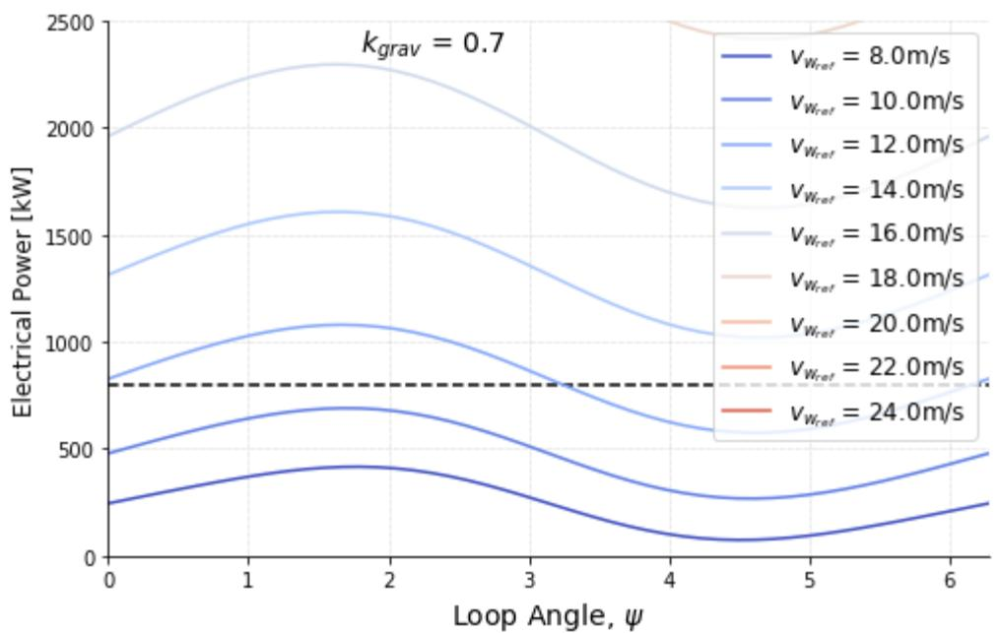

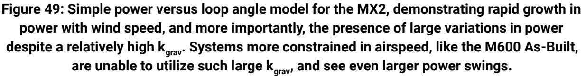

Higher wind speeds are intentionally cut off here, as they blow up the scale. Despite the small loop sizes and a strategy that stores most of the potential energy in kite speed, there is still approximately +/- 250 kW of power pumping in and out of the kite's power system.

The dashed line indicates the approximate electrical power limit of the MX2 system (as measured at the collection system), showing that the kite will need to start deploying power saturation strategies on the downstroke at ~10 m/s of wind, and will need to heavily reduce power to make it to 24 m/s, which is well off the scale in the above plot.

We've now set the stage for the problem: AWTs, just like HAWTs, need to develop a strategy to manage the rapidly rising power from the relationship to survive to the target cut out wind _vw_ 3 speed, with the added challenge of a fluctuation of nearly a third the rated power caused by the potential energy exchange. This fluctuation creates a transitional zone that spans several m/s of wind speed, where the kite needs to make as much power as possible everywhere in the path except on the downstroke.

## 10.3 Strategies

### 10.3.1 Reducing lift

The most obvious strategy is to implement the now common HAWT solution—reduce the power by reducing the lift generated by the blades/wing. There are two limiting factors for this on AWEs:

-   1. A kite optimized for will generally have high lift multi-element airfoils that perform ζ poorly with a risk of separation at low alphas.
-   2. Lift is used to make the turn. Reducing lift also reduces the ability of the kite to follow the desired path.

Let's begin by briefly examining the first item. In order to leave enough margin for control errors and gusts, the MX2 kite is limited to -10 deg to prevent separation. Below, in figure 50 we plot ζ as a function of aerodynamic angle for the MX2 kite: _L_ α

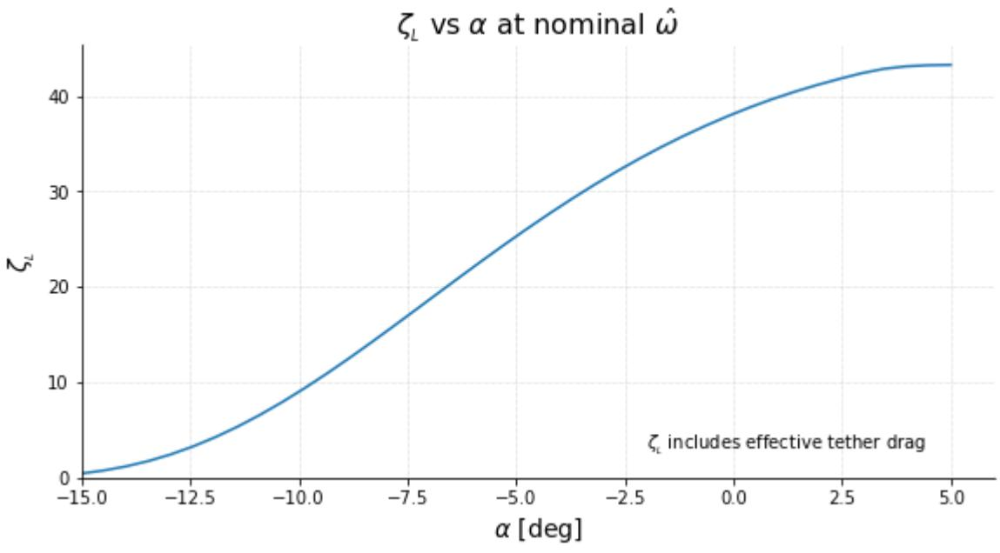

**Figure 50 : ζ L performance metric for the MX2 kite at different alphas, at the nominal normalized angular rates.**

A minimum of -10 deg makes for a minimum of ~10, in the absence of any other α ζ*L* restrictions.

The second issue, of making the required turn, is more troublesome. A quick inspection of the minimum turning plot in figure 32 makes this clear—the worst case minimum turning radius

limits us to -7 deg for a path radius of 80 m, which is a of 20, double the minimum α ≥ ζ*L* possible from flow separation constraints. Lower than optimal, but is it low enough? It is possible to increase the target path radius to buy some additional margin between the commanded path radius and the minimum path radius, but at the expense of increasing the 43 potential energy exchange, which either expands the (at some additional cost of _vk_ Δ increasingly off-optimal airspeeds), or requires reducing the , which throws more energy _kgrav_ swings into the power system, which is exactly what we're trying to avoid.

The issue is compounded by how sharp this turning limit is. Close to the turning limit, it takes large changes in tether roll angle to tighten the turn. Revisiting the minimum turning radius plot, but this time holding wind speed constant (and at a higher, more relevant wind speed here of 14 m/s) and plotting the minimum turning radius as a function of maximum tether roll angle , we γ find:

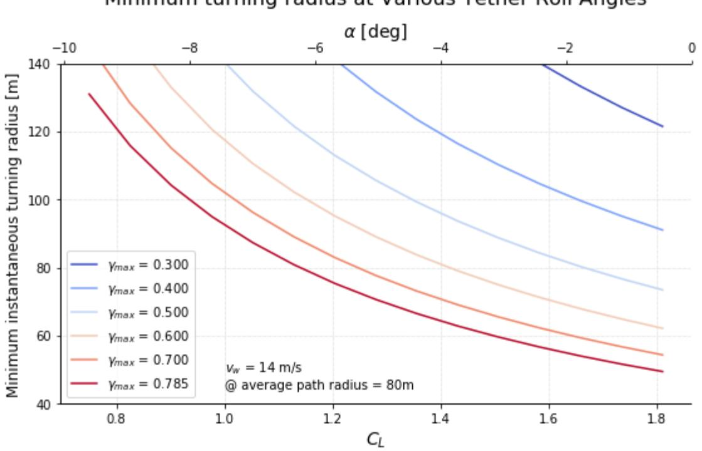

**Figure 51 : Minimum instantaneous turning radius for the MX2 versus lift coefficient and alpha at various tether roll angles.**

In figure 51 , we see that near the limit, each additional amount of roll gains less turning effort. Implementing a strategy of reducing lift only during the downstroke for the transitional wind speeds then implies a high roll rate in order to reach the maximum power reduction via reduced lift.

43 Increasing the path radius only weakly affects the instantaneous minimum radius.

Based on the minimum turning limits shown, and the difficulty in increasing them, we'll choose a lower limit on alpha of -7 deg, which reduces by a factor of about 2, and repeat the plot, in ζ*L* figure 52 , with the simple power model created above:

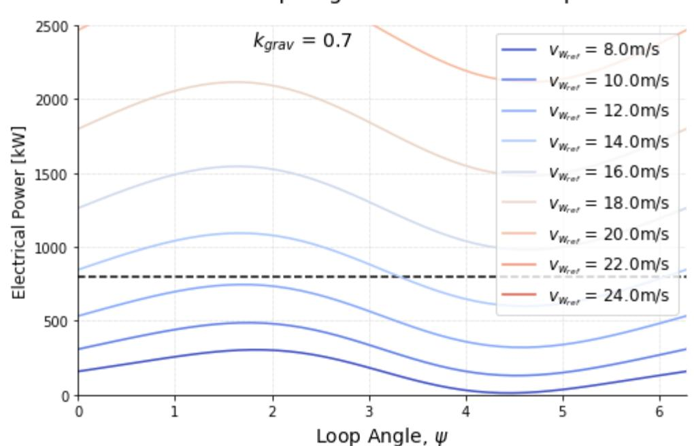

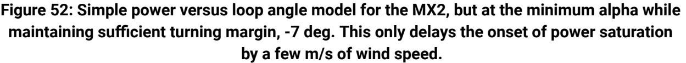

Reducing by a factor of 2 only staves off the first power saturation point to ~12 m/s! Other ζ strategies will need to be used to shave the downstroke peak beyond this point, as well as shift the entire power production down to reach 24 m/s of wind.

This model is intentionally simplistic—path changes can alleviate some of this turning constraint, which, if we recall from above, is at its worst at the bottom of the downstroke. In addition, the factor represents a simple speed strategy—we can vary this factor around the _kgrav_ loop to more selectively control power. Regardless of modeling simplifications, the conclusion remains: AWTs can only partially utilize lower lift as a means of power reduction, because they also use lift to stay in the air and have a tether roll angle constraint!

#### 10.3.2 Non-optimal speed

Thus far, we've been assuming the kite is operating with a speed strategy centered around its optimal speed, . What if our speed strategy is centered around a non-optimal kite speed? _vkL_

Let's explore this by revisiting the plot of vs kite speed for the MX2 system, this time also ζ*v* plotting solutions at the lower and expanding the wind speeds shown. Again, we have chosen α θ*e* = 0.45 rad and zero shear:

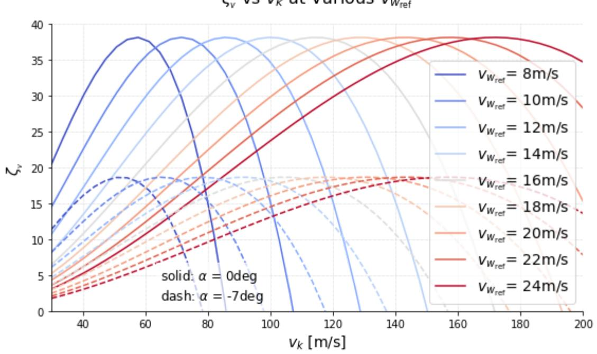

**Figure 53 : Performance metric ζ v for the MX2 system versus kite speed for a variety of wind speeds and shears.**

The location of the peaks in figure 53 occur at , and this kite sees little movement in its _vkL_ optimum speeds as a function of , since the ratio of L/D remains similar throughout the α operating range. It appears there is some room to trim a significant amount of power while maintaining a reasonable kite speed range, especially at higher wind speeds.

Let's explore this further. To maximize this benefit, we need the kite to fly as slow as possible. Getting on the other side of this peak at high winds appears to simply require excessively high airspeeds and the very high tensions, structural loads, and rotor design challenges that go along with them.

So we'll target the low end, attempting to manage power by going slower than optimum. Let's assume our kite has a minimum controllable airspeed, , of 30 m/s, and that . We can _vamin va_ ≈ _vk_ then define the speed range in terms of . We plot the same data as above, but this time _kgrav_ show power rather than , where we simplify power to ζ (again assuming _v_ (ζ*v*/ζ )( _L AW T P P_/ 0 0 ) _P P P_ is a constant 0.25, and taking care to note that is at the reduced of -7 deg, while _AW T_ / 0 ζ*v* α ζ is at the best achievable of zero), and we focus on higher wind speeds and lower , since _L_ α α we're interested in kite speed mostly as a power limiting strategy here.

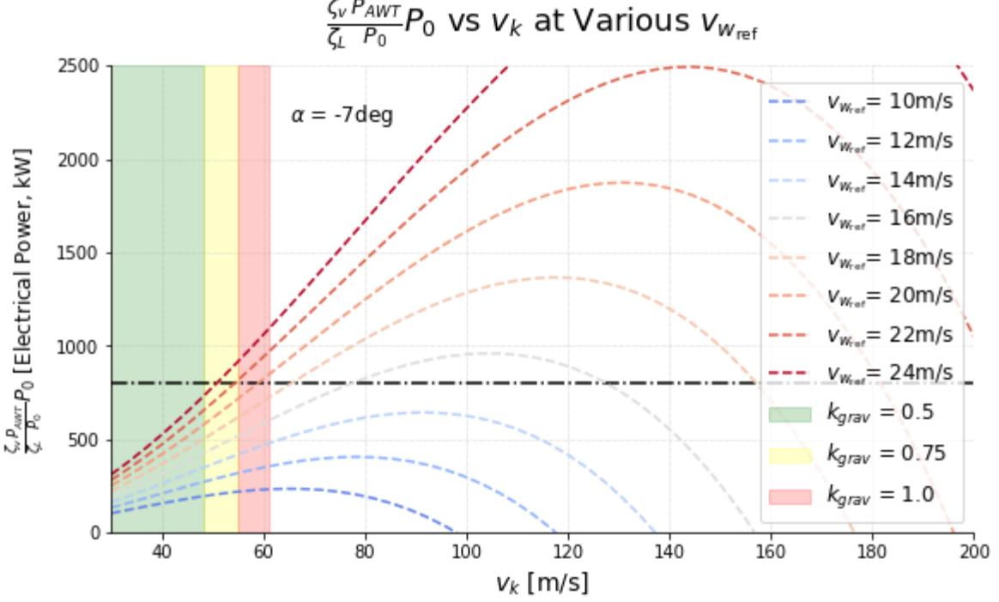

#### **Figure 54 : Power versus kite speed for the MX2 system, with regions denoting various kite speed ranges for a given k grav fraction, assuming minimum possible speeds and at our minimum viable alpha.**

Colored bands in figure 54 indicate the speed range dictated by a given strategy that _kgrav_ touches the minimum airspeed—ie, as slow as possible. The higher bands are inclusive of the lower ones, and our approximate power limit is denoted with the black line.

The big conclusion is immediately obvious. Even in combination with the lowest possible lift needed to make the turn, the slowest possible speed strategy isn't able to keep power below the limit at high factors. _kgrav_

Attempting to manage excess power with a slow kite also leaves the strategy open to runaway, with a positive feedback loop as excess power shows up as additional kite speed, which then creates additional excess power, which then speeds up the kite, and on and on.

Lower factors from those shown can keep the power from wind within limits, but at the _kgrav_ cost of the several hundred kW power swings from the energy extracted from the Hamiltonian required to meet that strategy, which then promptly puts the kite over the limit again. Larger path sizes will grow the speed range required for a given strategy, while smaller path sizes, if _kgrav_ possible, will further limit the effectiveness of decreased lift as a strategy.

In short, there's plenty of merit in this strategy, but even combining it with the minimum lift strategy appears insufficient to fully manage excess power.

#### 10.3.3 Path

What about the path location? In [section 6.1.2 ,](#page-132-0) we discussed the losses with increasing cos3 path elevation angle. Can it be effectively utilized to manage excess power at high wind speeds? Path location was previously investigated only in the context of elevation offset, but what about azimuth offset? Can both be utilized to shift power peaks around and address the transition zone?

Let's begin with the transition zone. Here, we desire a kite path that flattens the power peaks caused by the strategy and the potential energy exchange—ie, we want to remove power _kgrav_ from the downstroke and add it to the upstroke. For a kite moving clockwise around a path viewed looking downwind, one could imagine an azimuth shift to the right would move the upstroke more downwind, and the downstroke increasingly offwind, as shown in figure 55 :

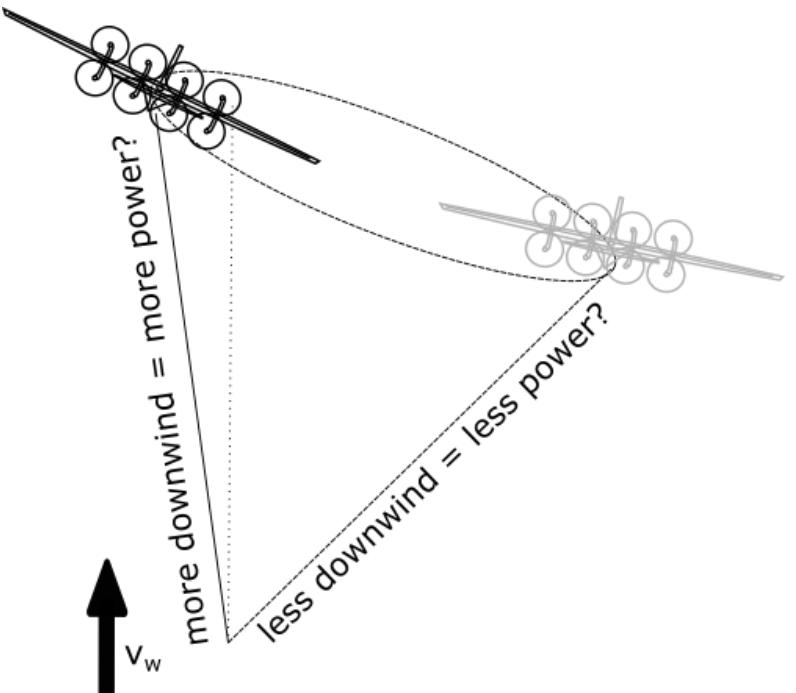

**Figure 55 : Desired effect of azimuth offsets is to shift power from where it's unneeded to where it's needed.**

However, recall from above that power is really attenuated by , ie, roughly by how θcos 3 _offwind_ much the _lift_ is rolled offwind, not by the instantaneous path azimuth or elevation offset. For any path where the mean turning radius is close to the ideal size to minimize turning losses derived above, that model implies that this angle approximately follows that of the path center θ*offwind*

offset, and power attenuation is similar on both sides—if this is indeed the case, it is not a good way to accomplish our goal.

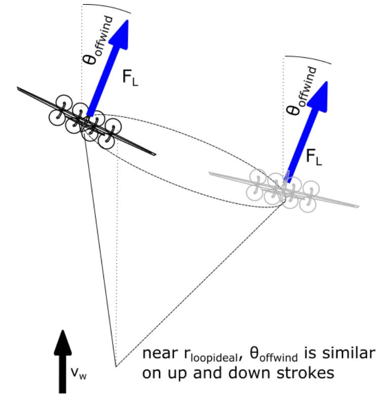

#### **Figure 56 : Typical effect of azimuth offsets, assuming operation close to r loop,ideal . In this condition, azimuth alone is ineffective at moving power around as power scales with cos 3θ offwind , which is similar on both sides of the path.**

However, this effect is compounded by the fact that path offset from the wind introduces path components that are into and out of the wind. Non-circular paths create those components as well, but for optimal paths it's typically not significant, while the components from azimuth and elevation can be quite large. Until now, we've been ignoring the effect this movement into and out of the wind has on power. Does this expected relationship hold true with this effect?

It's possible to piece together an analytical model that captures the key trade-offs here, but this model would be lengthy to derive and cumbersome to use, so we'll instead jump straight to our numerical model.

For this numerical model, we utilize a simplified version of our MX2 kite, with all constraints removed or raised such that they will not be hit, and create a constant 80% efficient rotor and a constant 80% efficient power system from the shaft to the padmount. This is to better isolate the effect of azimuth offsets.

Aerodynamic angles, wind speed, path elevation, and path shape are held fixed as azimuth is swept. To test the hypothesis that power attenuation is a function of and that for paths θ*offwind* close to the ideal this matches the path center offset, we use [equation 37](#page-139-0) from above to calculate an . This gives an ideal path radius of 98 m when operating with a of 1.81. _rloop_, _ideal CL_ In the example below, we use this value for path radius for a circular path and keep our path elevation of 0.45 rad from prior examples. 44

We begin a constant speed strategy at the Loyd optimum , to attempt to isolate the effect _vkL_ azimuth has on power, which leaves no free variables to optimize over. To reiterate, the goal in the transition region is to shift power from the peak to the valley.

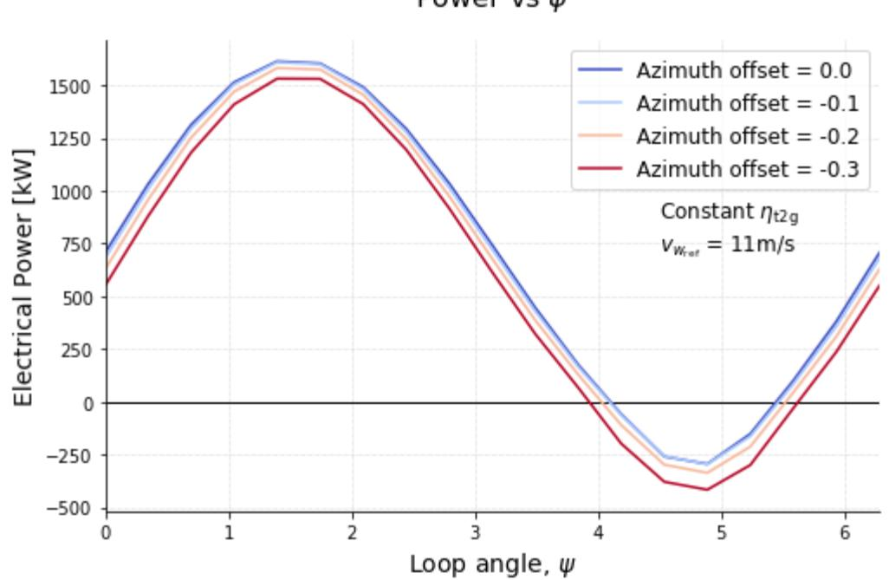

#### **Figure 57 : Power versus loop angle at various azimuth offsets, providing numerical confirmation that turning near r loop,ideal negates the ability of azimuth offsets to shift power.**

Clearly, the hypothesis is correct in this context—azimuth slews are wholly unable to shift power from the peak for a path at the ideal turning radius. The power looks very nearly sinusoidal with loop angle at all azimuths, demonstrating that the potential energy exchange is indeed the dominant effect for the power fluctuations. The phase shift in airspeed versus kite inertial speed that occurs with increasing azimuth offset doesn't appear to shift the power around much at all. There is an overall drop in power with increasing azimuth that is in line with losses. While cos3 those losses can be useful for very high winds, they are not useful for shifting power around in the transition zone.

44 Yes, this will slightly violate the minimum height constraint, which isn't relevant to this exercise.

We need to be careful that we're drawing the correct conclusions though, as the constant inertial speed strategy used here is naive. Strategies with a high will see substantial _kgrav_ changes in kite inertial speed, which will in turn affect the airspeed, and the required roll angles and losses. The kite will also move off the peak of the power versus kite speed θ*offwind* relationship. Let's investigate a more complex case, with an optimized kite speed strategy.

For this iteration, we go back to our 80 m path radius, slightly tighter than the pure turning losses optimum, and open up kite speed strategy to an optimizer. Everything else is kept the same. We're trying to show just the effect of path location on power, so the optimizer is set up to seek best power in the absence of a power limit—there may be additional speed strategies that can better shift power around in the presence of a power limit. Before we dig into the effect on power, let's see some ways that a numerically optimized speed strategy differs from our _kgrav_ approximations above.

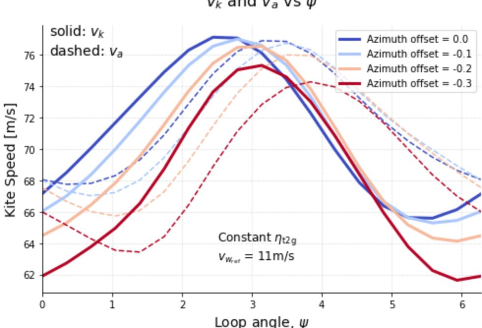

**Figure 58 : Kite inertial and airspeed strategies versus loop angle at various azimuth offsets.**

Speed strategies are indeed fairly sinusoidal in shape, and generally centered such that the maximum inertial speed is at the bottom of the loop. What does this look like in terms of _kgrav_ factor? The strategies in figure 58 do not exactly correspond to a simple , so we define an _kgrav_ instantaneous . We define as the component of the kite's acceleration vector tangent _kgrav kgrav_,_i_ to the path (ie, acceleration that changes the kite's kinetic energy, rather than turns the kite) measured in Gs. With this definition, there's a sign change for the upstroke. A strategy of _kgrav_ 0.5 would result in a versus loop angle that looks like a sine wave for a circular path, _kgrav_,_i_ ψ

reaching a peak value of 0.5 for the downstroke and a minimum value of -0.5 for the upstroke. Let's see what this new parameter looks like.

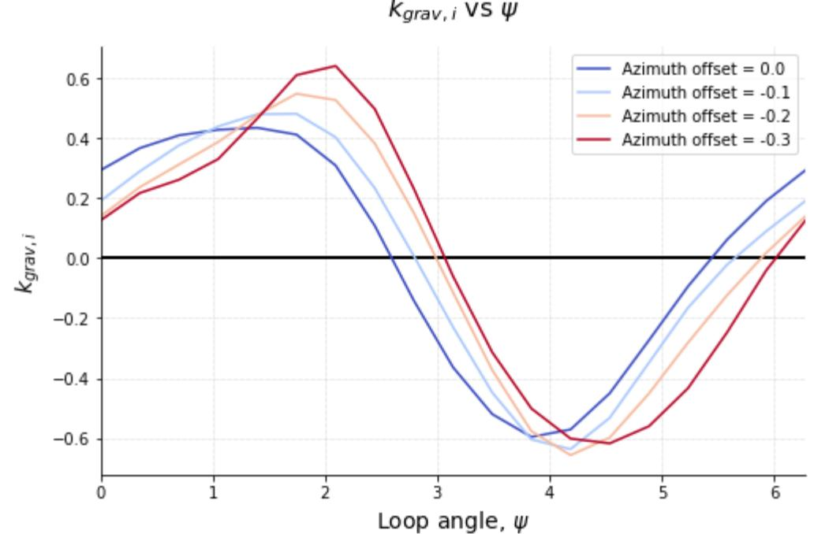

#### **Figure 59 : Instantaneous k grav,i factors versus loop angle. Real strategies can be more nuanced than a simple k grav strategy, and can be utilized to shift some power around.**

Although potential energy still forms the main reason we vary speed around the loop, we should simply think of as the rate we're storing energy in the form of kite speed, as it does not _kgrav_,_i_ necessarily align with moving through the gravity field. This is demonstrated by the phase shift in figure 59 . The _peak_ value of can usually be used as a decent proxy for a that _kgrav_,_i kgrav_ represents the effect of the in our simpler analytical model, but strictly speaking, the terms _vk_ Δ represent different things. Effects of a real speed strategy can only be well represented with a _kgrav_ if the strategy is very nearly sinusoidal, which is usually the case.

The first thing to note is that the peak values of appears to be lower than our example _kgrav_,_i_ above. Potential energy is not the only reason we vary kite speed, and in more detailed models we typically see higher at higher wind speeds as an attempt to minimize power swings _kgrav_,_i_ from pumping potential energy. Without a constraint applied in figure 59 , there is less motivation to maximize this effect. Applying a maximum power constraint will drive the optimized solutions to higher to minimum power fluctuations. _kgrav_

Now, we can show the effect on power.

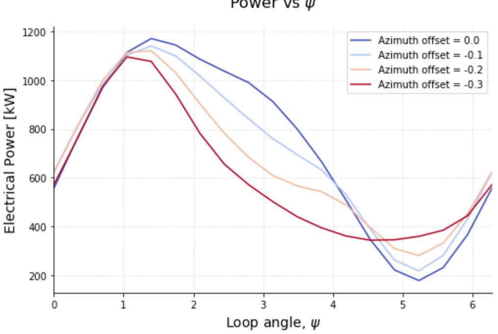

**Figure 60 : Power versus loop angle at various azimuth offsets, demonstrating the complex relationship with power once combined with various speed strategies.**

In figure 60 , there's now some movement of power near the peak to the valley in an optimal power strategy, but the key takeaway seems to be that speed strategies alone at constant aerodynamic angles can make a complex relationship with power around the loop. It becomes difficult to apply simple analytical trades here, even outside the context of power saturation constraints, as all the various strategies strongly interact with each other.

We can still draw some conclusions though. Overall, path shifts are generally ineffective at shifting power around the loop to offset potential energy induced power fluctuations, but they are effective at overall power reductions. The path elevation and azimuth offset from directly downwind needs to be an integral part of any high wind strategy.

High path offsets create substantial path components into and out of the wind that have second order effects with any speed strategy that can cause some shifts, but we should note that in the context of a turbulent wind field, it can be difficult to reliably make use of any of those effects.

Variable winds create another issue—path changes are slow, acting on time scales of tens of seconds, leaving the kite unable to utilize path change strategies solely for brief increases in wind speed. If the kite is chasing best performance at wind speeds below power saturation, it is unable to leverage path changes to respond to momentary increases in wind speed that require mitigation. A kite on a path that enables it to handle higher winds is then sacrificing performance in order to be prepared to survive the higher winds. The result is that any strategy

has to compromise between these opposing goals, resulting in a soft "knee" in the power curve near rated power.

Another beneficial aspect of large path offsets, aside from lowering the overall power level, is that the lower can continue to shift the versus curves to the left, with the peak _vweff_ ζ*v vk* occurring at lower kite speeds. At very high offsets, it may even be possible to get kite speeds on the other side of the peak and reach a stable scenario where increasing kite speed results in less power production.

Combining all the power saturation strategies described thus far is typically enough for optimization codes with assumptions of perfect control and smooth wind fields to find fully saturated power solutions for most kites to the cut-out wind speeds of 20-25 m/s, with some roll-off in performance as we blend in power saturation strategies. However, these fail in more realistic scenarios, so let's investigate a few more power management tricks before looking into some overall strategies those codes suggest.

### 10.3.4 Excess Drag

Our final strategy is to deliberately degrade the kite's performance. The simplest implementation is to utilize existing aerodynamic surfaces at deflections large enough to cause separation.

Makani did some experimentation with this by deflecting the inboard most ailerons to their maximum "up" position, similar to an airbrake on a glider, causing airflow separation and a dramatic increase in drag for that section. However, this strategy is flawed—while presented primarily as a drag device, deflections like this have a similar relative impact on lift. As we noted above, lift is also used to make the turn, so sharp reductions in lift carry with them sharp changes in tether roll angle in order to follow the target path, and the lift reduction directly takes away from how far lift can be reduced by alpha. The spoiler solution is draggier than a similar drop in lift achieved by alpha, but the control challenges associated with the nonlinear behavior of an aileron spoiler made this solution less appealing.

One can of course envision a more pure drag device. Separating power management from the turning forces would greatly simplify the controller effort. The problem is one of complexity. Let's sketch out what such a device would need to do. Assume there's a strategy for the path, kite speeds, and alpha such that the kite is able to fully saturate the power system at a wind speed of 10 m/s. The ideal drag device would be able to completely manage the excess power of a wind increase until such time that a new strategy can be implemented, where the limiting factor is the path location operating on the timescale of tens of seconds.

If power saturation occurs at a thrust power of ~1200 kW, and we desire the drag device to handle a change in wind speed of 2 m/s, then the power the drag device needs to dissipate is given simply by 1200 _kW_ ((12 _m s_) (10 _m s_)) 1200 _kW_ , which is approximately 875 kW. / / / 3 Assuming our drag device has a of 1, is operating at sea level, and the kite average speed _CD_

is 70 m/s, the required area of our drag device is ~3 m 2_v_ . This is fairly large, but not entirely ˉ*k* impractical. It's difficult to consider devoting mass, cost, and complexity to a system that reduces performance everywhere to only be helpful in such a narrow context, but the real threat to the idea is that an onboard generation kite already has a much larger set of variable drag devices—the rotors!

The fact that we're dealing with a power saturation issue clearly indicates the rotors should already be working hard, so for this use case, what we desire is for the rotor efficiency to dramatically drop. Let's begin by taking a look at a map of our MX2 rotor efficiency, truncating the color scale to positive efficiency only for clarity:

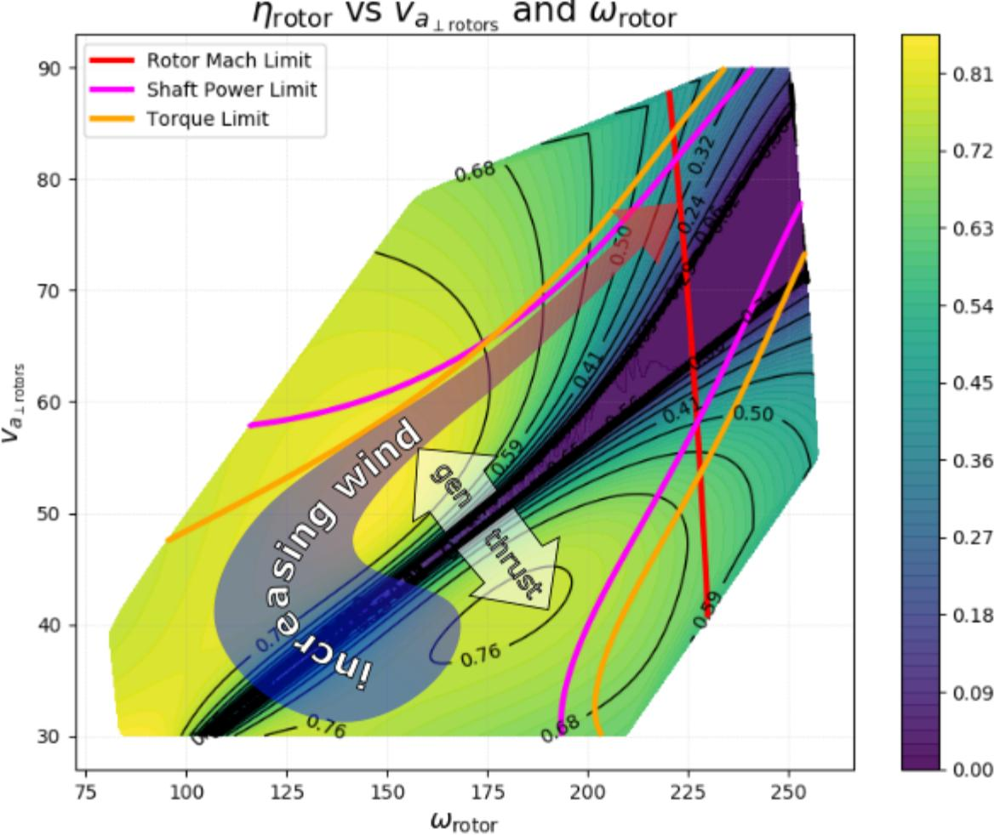

**Figure 61 : Rotor efficiency as a function of rotor speed and airspeed for the 4th generation Makani rotors. The lower right represents forward thrust, consuming power, while the upper left represents rotor drag, generating power.**

Various fixed pitch rotor maps will look different, but the general form will be approximately the same. The blue arrow follows the approximate path a strategy takes through the map with

increasing wind speeds. We begin at the bottom on the lower side of the efficiency valley, where we're consuming power, then quickly moving to pass through the generation efficiency peak at moderate winds. As we reach the upper shaft power saturation line marked in magenta, we see that efficiency takes a nosedive as we follow this limit into higher airspeeds. At the uppermost corner, where the rotor is hitting its mach limit (in this case, a tip speed limit of ~ mach 0.8), efficiency is at just 40%. Given that first saturated power is reached at ~75% efficiency, and this occurs at a thrust power of ~1.2 MW, the _excess_ thrust power this consumes is a massive 1.4 MW, making this drop in rotor efficiency several times more more effective than a large deployed drag device, and even better, we don't need to spend any additional mass, cost, or (hopefully) maintenance on it.

What are the potential downsides of this? First is noise—rotor noise is strongly coupled with rotor tip mach speed, and utilizing this strategy requires intentionally reaching these high tip speeds, likely limiting heavy use of such a strategy to offshore or other remote locations. The second is rotor life, as high speed rotors, especially those operating close to mach 1, result in increased wear.

### 10.3.5 Piecing Together a Strategy

We've identified many pieces of a power saturation strategy—can they be assembled into a robust solution?

Here, we'll lean entirely on our numerical model to balance these trades, adding in the numerous constraints we've been ignoring until now—constraints like limits on power, torque, rotor stall, tension, airspeed, and others. The solution is not general—perturbations of starting conditions, changes in the kite model, changes in the optimization parameters and penalties, and more can result in different strategies, but they all share some common traits. With that in mind, let's investigate a particular result.

Before we do so, it should be reiterated that several different codes, models, and optimization tools have been able to identify strategies that work under the simple conditions in each model, but Makani was unable to find successful strategies in simulation with imperfect control, imperfect sensors, and more importantly, realistic turbulent wind fields. As a result, these high wind strategies were never tested in flight—the risk was deemed too high, and we restricted ourselves to lower wind speeds during test flights. We'll talk more about the modeling work and the simulation needed to highlight these issues in a moment.

We're not going to dig into all the modeling details and settings here, as the code and model these results are based on is provided, but the high level view is that this model assumes perfect control and no wind turbulence. Taking the MX2 model and optimizing it for power across all wind speeds with a circular path shape and no wind shear for simplicity results in the power curve shown below, with the maximum and minimum power around the path also shown in figure 62 .

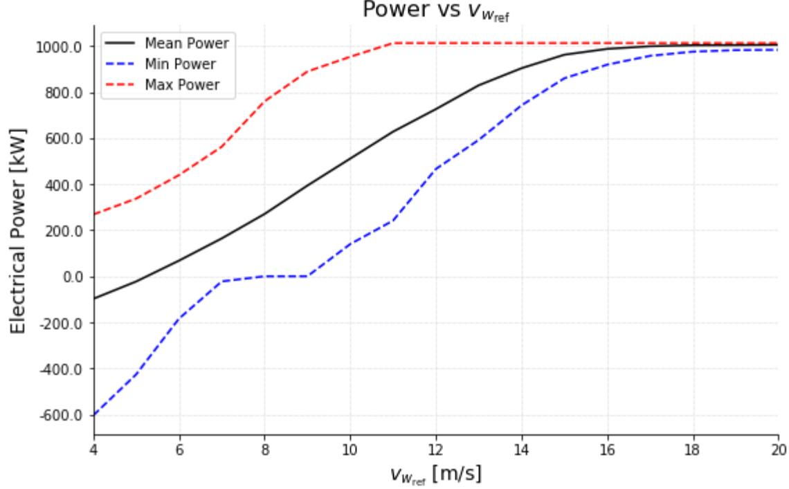

#### **Figure 62 : Minimum, mean, and maximum power around a loop for different wind speeds. Note the kink in minimum power around zero, as the optimizer strives to minimize pumping losses by eliminating power consumption as soon as possible.**

This kite begins saturating power at ~11m/s of wind, and is mostly saturated at 15 m/s. We'll look for strategy changes across what we'll call the "transition zone" from 10-15 m/s, and in what we'll call the "survival zone" from 15-20 m/s.

#### 10.3.5.1 Path Strategy

In figure 62 , we view the paths looking downwind, located by their centroids, rotated to be flattened into the viewing plane for clarity, and colored by position to denote model evaluation points—we'll reuse these colors to mark these positions in some later plots. The flattening undercuts how much azimuth slew is going on here—with a tether length of just 300 m and path radii around 100 m, an offset of ~280 m is entirely perpendicular to the viewing plane we've squashed the paths onto. The arrows indicate the direction of travel—clockwise in this case. In later plots, we'll present data versus normalized path distance. In all those examples, we begin our path at the top, and proceed clockwise.

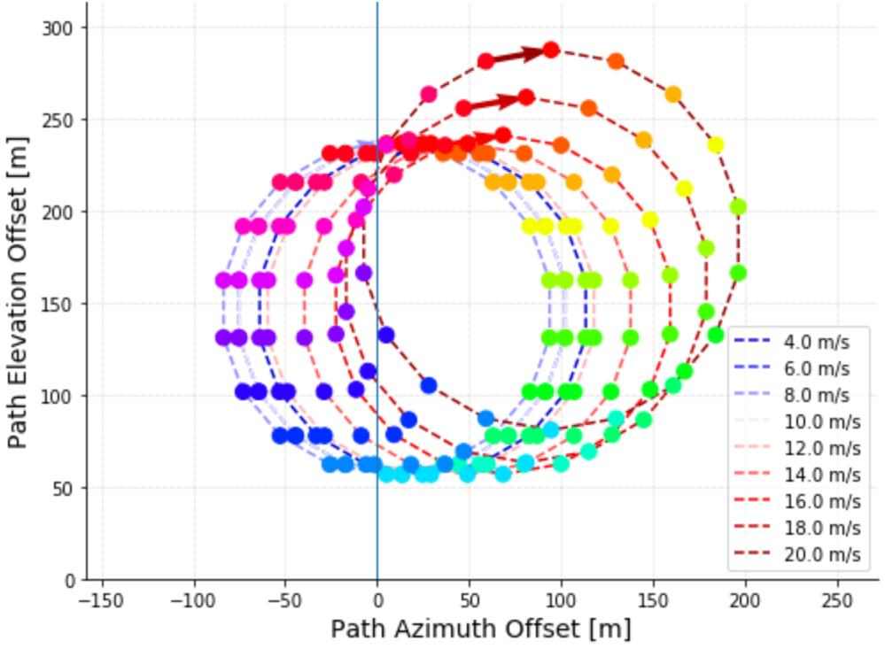

**Figure 63 : Visualization of the path strategy at different wind speeds. Paths are flattened to the viewing direction, which is directly downwind.**

The path strategy in figure 63 has some small azimuth shifts that move the downstroke further off-wind in the transition wind speeds, but there isn't much of a strategy change until winds approach the survival zone at > 15 m/s. At this point we begin to see substantial azimuth and elevation offsets, with slightly larger path radius as well.

#### 10.3.5.2 Lift and Speed Strategy

Before picking apart the lift strategy, it should be noted that this kite is an actively tension-limited kite. Tension limiting was discussed in [section 6.1.8](#page-151-1) , and here the start of tension limiting intentionally coincides with the start of power limiting, also about 10 m/s of wind. The highest tension portions of the loop also roughly correspond to the highest power portions of the loop, and there's substantial overlap in the response to each—lower alpha and airspeed.

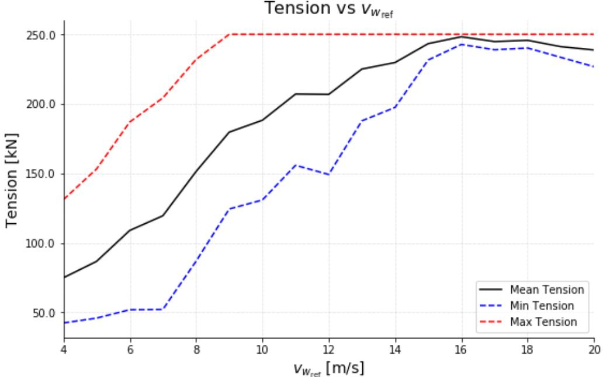

**Figure 64 : Minimum, mean, and maximum tension versus wind speed. Tension limiting begins at around 9 m/s of wind, and the entire loop is nearly operating at the tension limit for wind speeds >15 m/s. Jaggedness is from optimizer solution variations.**

Airspeed strategies look fairly sinusoidal, and increase nearly linearly with wind speed until we reach the survival regime, at which point speeds no longer increase, utilizing the lower airspeed as a power and tension management strategy.

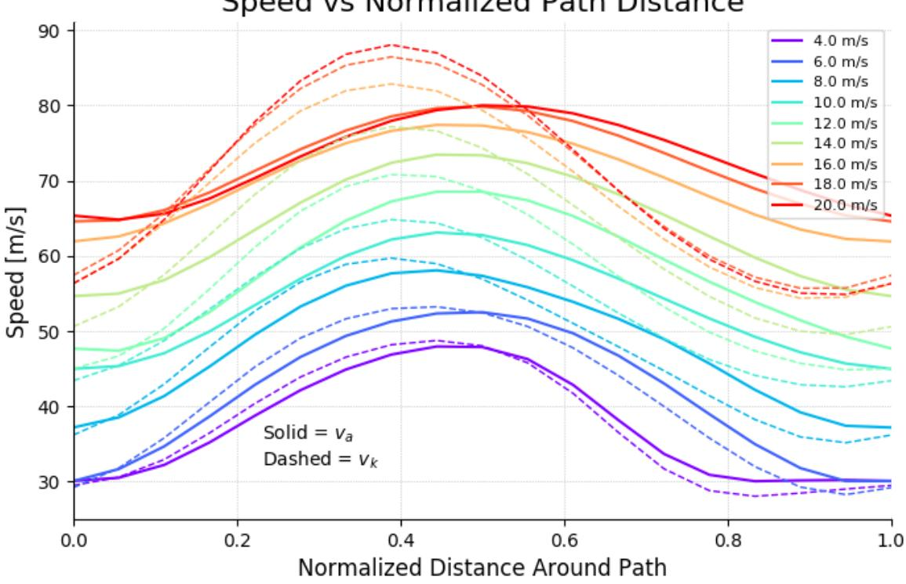

#### **Figure 65 : Inertial speed and airspeed versus distance around the path at various wind speeds. The difference between them grows at higher wind speeds due to the increasingly offset azimuth and elevation strategies.**

How much is this model able to reduce alpha? In figure 51 , we showed an analytical model that indicated a limit of ~ -7 deg of alpha for this kite to continue being able to make the turn. Here, we see the limit here is slightly below the estimated limit. This alpha reduction begins primarily as tension management, looking like the inverse of the airspeeds in the transition zone from 10-15 m/s of wind with dips in alpha at the bottom of the path, but broadens that lower alpha region to be more on the downstroke as we move into the survival wind speeds > 15 m/s, where it's now also working to manage power.

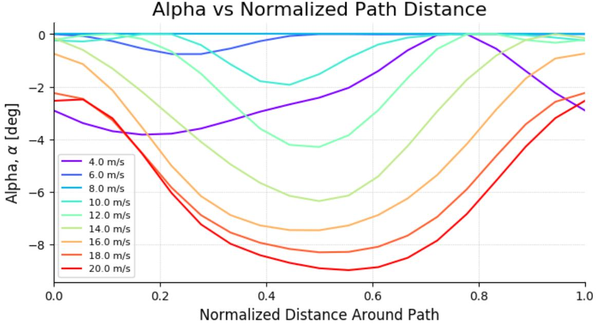

**Figure 66 : Alpha versus distance around the path at various wind speeds. Low winds see alpha drops to minimize losses, medium winds see nearly constant operation at the optimum, while high winds see substantial reductions in alpha to manage excess power.**

We haven't discussed strategies at the lowest wind speeds, but there's also a drop in alpha for 4-6 m/s of wind. At these wind speeds, the downstroke, where the kite is moving downwind, sees very low effective wind speeds. With little power to be had from low winds, the kite instead shifts to reducing losses and lowers alpha in pursuit of a higher to reduce drag. The _CL_/_CD_ minimum sink criteria, , shares its peak with , but is only relevant if the aircraft can _CL C_ 1.5/ _D_ ζ*L* fly as slow as possible. Here, our speed strategy approaches the minimum airspeed, but the _kgrav_ strategy dictates some higher airspeeds, making more representative of losses. _CL_/_CD_

Speaking of strategy, let's take a look at it. _kgrav_

A over one means we're accelerating the kite faster than 1 G, basically storing some of _kgrav_,_i_ the wind energy in kite speed in addition to potential energy. We see this happening in a fairly concentrated region on the downstroke and upstroke, and these values only appear when the kite enters the transition zone as a strategy to shift power from the peak.

At moderate wind speeds of 8-10 m/s, the optimizer is just finding the balance between off-optimal speed losses and grid pumping losses, as we did in our analytical model before, with similar average absolute values of around 0.4-0.5 at these wind speeds.

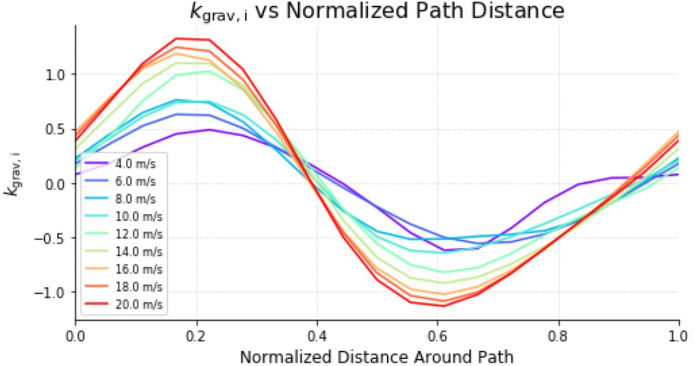

**Figure 67 : Instantaneous k grav,i fractions versus distance around the path at various wind speeds. At high wind speeds, the system stores a lot of wind energy in kite speed on the downstroke, as shown by the k grav,i factors reaching well over 1.**

Interestingly, at the very low wind speeds ≤6 m/s, the trend is reversed from our analytical model, which was trending towards a of 1. The analytical model simply falls apart here. _kgrav_ Minimum kite speeds combined with typical elevation angles result in the kite moving upwind or downwind faster than the effective wind speed on the upstrokes and downstrokes! This largely invalidates our model for at these very low wind speeds. The power penalty of going fast is ζ*v* higher and the balance shifts towards a slower, more constant speed strategy with lower _kgrav_ values. Despite these inaccuracies, the analytical model still works well for predicting cut-in, and captures the sensitivities at medium and high winds well.

#### 10.3.5.3 Rotor Strategy

Barring the nosedives to negative efficiencies as the rotor flops through a no power zone between generation and power consumption at the lowest wind speeds, the bulk of the "make as much power as possible" regime from 6-10 m/s of wind is at a fairly constant rotor efficiency, around 80%.

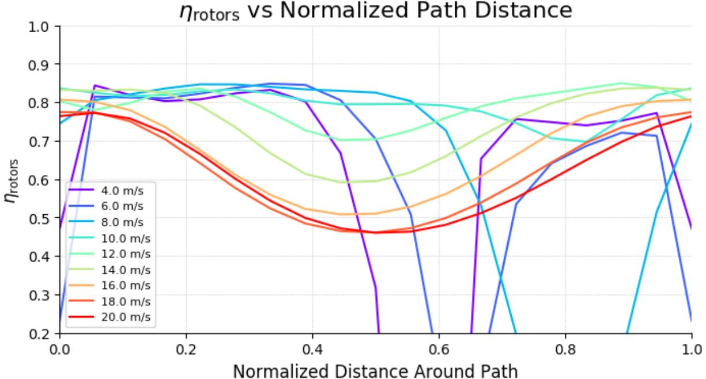

#### **Figure 68 : Rotor efficiency from thrust/drag power to shaft power versus distance around the path at various wind speeds. Transitions between thrusting and generation at low winds aside, the system typically operates at a nearly constant efficiency until high winds and high kite speeds are reached.**

Throughout the transition zone the kite utilizes increasingly inefficient rotors, and is heavily reliant on draggy rotors to manage excess power at the highest wind speeds, shedding almost ~1.5 MW of excess wind power from the drop in efficiency. Perhaps equally important is that the rotors are still fairly efficient at the top of the path in order to saturate power. In fact, if we look at what else the kite is doing at this point, nearly everything is working to maximize power. Alpha is only lowered by ~2 deg, and kite speeds are near the ideal for the effective wind speed. Saturating power requires the kite to work fairly hard to make power for part of the loop, and then work equally hard to dump excess power for the rest, even at the highest wind speeds.

Alternatively, we can plot these solutions onto our rotor map. Using the same coloring for the paths and different positions for each wind speed as above, we find what is shown in figure 69 .

In figure 69 , we can easily visualize how well the rotor is matched to the airframe. At low winds, the strategy traverses the highest efficiency regions of the generation and consumption contours. The low efficiency valley in the middle corresponds with essentially no power or thrust, and has little effect. Power saturation is entered while still near the efficiency peak, and following the power limit sends us quickly off this peak, which is what we're looking for.

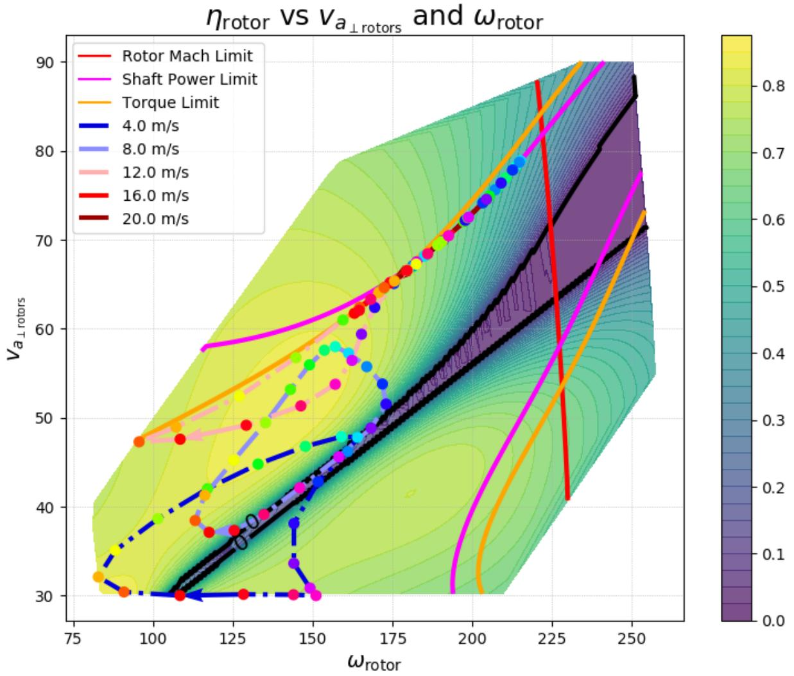

**Figure 69 : Rotor map for the MX2 overlaid with loop solutions at various wind speeds. Path locations are colored the same way as in** figure 63 **. High wind speeds (≥ 16 m/s) loops are obscured, as solutions follow the power limit line.**

Now that we've identified a possible representative strategy, let's pick it apart.

### 10.3.6 Poking holes in our strategy

As mentioned in the section introduction, power saturation remained an unsolved problem at Makani. Several optimization efforts in a variety of tools have been able to find solutions similar to that shown above, so perhaps the easiest way to highlight issues with these strategies is to pull out the key differences between the models where strategies like this work, and the model where it doesn't.

Makani had 3 main efforts where we were able to find viable strategies to survive to a cut-out wind speed of ~20 m/s. Those efforts included an older Optimal Control Problem (OCP) code

for the M600, the numerical model provided and used for the solution above, and a black box optimization on the outer loop control strategy implemented in the simulator.

The context where the strategies developed by these tools don't work is the full simulator, the source code of which has been released, with realistic turbulence provided by [NREL's](#page-231-0) [statistically derived TurbSim models \[9\]](#page-231-0) , and imperfect knowledge of the system and sensors. At high winds, all these strategies fail in similar ways. Excess power leads to overspeeding, resulting in excessive loads and poor kite control.

All optimization models provide very similar results for wind speeds below the transition zone—tight low loops with a sinusoidal speed strategy at best alphas—and broadly similar ζ*L* strategies at the transition zone and beyond—larger path sizes at higher elevation and azimuth offsets, with reduced alphas.

Perhaps the most interesting of these models is the optimization using the simulator. It's the most complete model with the closest representation of reality. Why didn't this approach work? The simulation strategy optimization was only completed for the M600 simply due to a lack of time. A single simulation requires minutes of compute time, and optimization using this model requires hundreds of thousands of simulations. As a result, optimizing under a single set of conditions requires a large amount of compute resources, and the MX2 model wasn't yet mature enough in the simulator to devote those resources.

In the interest of not introducing yet another model only to arrive at a similar set of incomplete results, I'll only briefly summarize this attempt. The simulation optimization effort utilized a gentler turbulence model and a fixed nominal configuration with perfect sensors. Both 45 changes were attempting to address the lengthy compute—the ideal optimization process would use a wide range of wind fields and a monte-carlo variance of the physical system to ensure robustness, but computational requirements grow quickly. The brief summary of results is as follows:

-   Moderate wind speed strategies are not particularly constrained or sensitive—the introduction of even a small amount of noise from control errors and turbulence during optimization results in widely varying strategies with relatively small power differences. Simpler tools combined with hand tuning can find similarly effective strategies that are smoother and much easier to design and implement.
-   The introduction of turbulence and control errors smear out the transition zone we see in the simpler models—power mitigation efforts must begin earlier so that the kite is prepared to handle a wind increase or control error, with a detrimental effect on the power curve.
-   Safe strategies could be found to survive to a cut-out wind speed of 20 m/s.

45 The Dryden turbulence model, commonly used for aircraft flying at higher altitudes and faster speeds, but not particularly appropriate for ground level turbulence for wind turbines.

● No strategies could be found to saturate power for the M600. Any optimizations that were able to find survivable solutions up to 20 m/s of wind did so at a much lower average power level by flying large paths with significant azimuth and elevation offset, reducing power around the entire path.

Getting back to the presented solution, let's discuss the effects included in simulation that cause it to fall apart.

#### 10.3.6.1 Turbulence

The fact that simply removing or reducing turbulence from simulation is enough to find survivable (but not power saturated) solutions for the M600 is a strong indicator that turbulence drives the failure to translate solutions from simpler models.

Let's dig into this using our simpler numerical model. Using the solution above and perturbing the wind, we can get thrust power sensitivity to wind gusts around the path for different wind speeds.

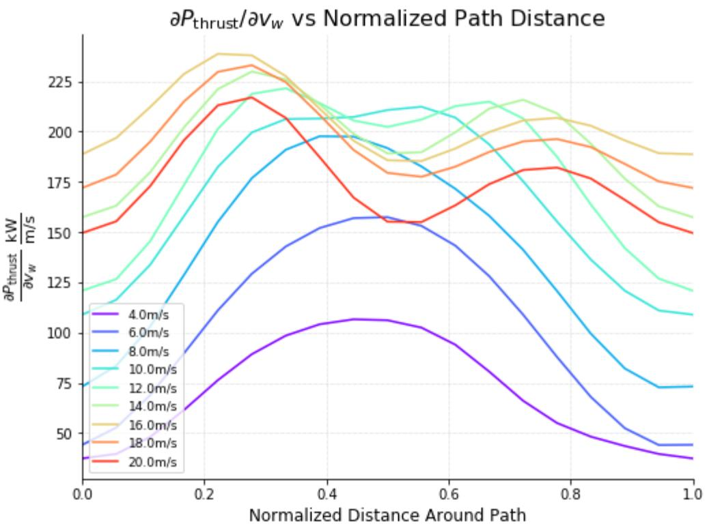

**Figure 70 : Change in thrust power for a change in wind speed versus distance around the path at various wind speeds. High winds bring increased power sensitivity to gusts—unsurprising given the v w 3relationship with power.**

The sensitivity in thrust power to wind gusts is huge. A small gust of just 3 m/s at moderate to high winds can create an additional 600 kW of excess thrust power! Here, the low mass of an AWT (compared to HAWT rotor inertia) works against itself, leaving little time to manage this excess power before accelerating into excessive speeds. For our MX2 kite, 600 kW of excess thrust power at an inertial speed of 75 m/s accelerates the kite at about 4 m/s 2, or nearly half a G—this is much too fast for path changes to have a meaningful effect, leaving immediate management of this to other strategies.

The shape of these curves is also interesting, and is mostly driven by path location as a result of the sensitivity to wind combined with movement in and out of the wind on the upstroke cos3 and downstroke. Unfortunately, moving these curves around by changing the path shape and offsets also affects the mean power production—a path that is less sensitive to wind gusts is also a path that generates less power. There's still room for improvement here though. Penalizing high sensitivity to wind results in higher azimuth and elevation offsets from the wind direction, and there's a small region where this can be done with small impact on power. In other words, there's a tradeoff between reducing the average saturated power level and robustness of the saturated power solution to wind gusts.

#### 10.3.6.2 Control Variability

Imperfect control is another significant contributor to the issue. We see a similarly large sensitivity in power to most control parameters. Errors in alpha are an obvious example—we expect changes in lift to have a strong relationship with power. Repeating the exercise from above but for alpha results in figure 71 .

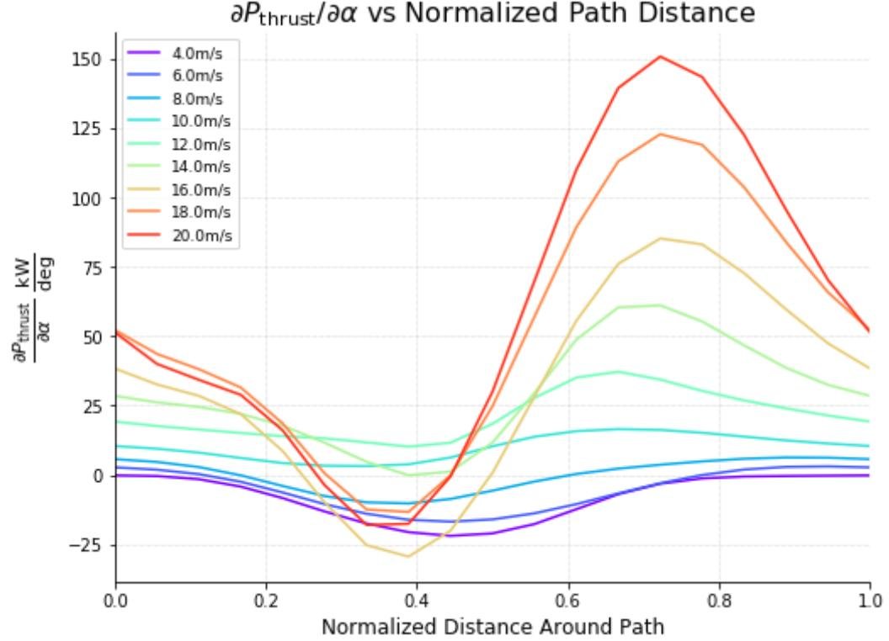

#### **Figure 71 : Change in thrust power for a change in alpha versus distance around the path at various wind speeds. This sensitivity is highly dependent on path strategy and loop angle.**

In figure 71 , the sensitivity is concentrated on the upstroke at high winds, where the kite is flying into the wind, but we find that a degree or two of error can result in a hundreds of kW change in thrust power. Again, with a relatively lightweight kite, these errors can build to become an overspeed problem quickly.

#### 10.3.6.3 Tether Dynamics

Thus far, we've neglected to discuss any tether dynamics, and our models have all assumed a rigid, straight-line tether. There are two areas where a more realistic tether model makes things more difficult.

The first challenge is the energy stored in the tether. Energy stored in the spring of the tether can be given by the equation below, where is the net elastic modulus and cross-sectional area _Et t A_ of the tether, is the energy stored in it, and is the spring constant of the tether. Here _Etether ktether_ we'll ignore the effect of catenary on the spring constant, as the total energy stored in the catenary is typically rather small:

$$E\_{\text{teither}} = \frac{1}{2} k\_{\text{teither}} \left( \frac{F\_T l\_t}{E\_t A\_t} \right)^2 = \frac{1}{2} \frac{F\_T \,^2 l\_t}{E\_t A\_t} \tag{92}$$

The MX2 and M600 share similar tether properties, with an of 18 MN, resulting in a _Et t A ktether_ for a 300 m tether on the MX2 of ~60 kN/m. The energy stored and released in the tether (again, neglecting the effect of catenary) as a result of a large normal tension variation from a low of 120 kN to the peak of 250 kN is ~400 kJ. Compared to the potential energy exchange of ~2.7 MJ, or the ~tens of MJ of thrust energy generated per loop, this is small, and it's fairly appropriate to have ignored it thus far. 46

At high winds, ideal operation sees little change in tension around the path, so this should be even less impactful. However, gusts and control errors can create sudden swings in tension. Sudden reductions in lift come with sudden dumps of this stored energy into the system, making the control problem more difficult.

The second challenge is the tether plunge mode. Neglecting the mass of the tether and again ignoring catenary effects, we can find the natural frequency of this plunge mode below:

$$f\_{plunge} = \frac{1}{2\pi} \sqrt{\frac{k\_{\text{teher}}}{m\_{\text{ite}}}} \tag{93}$$

With this simple model, the natural frequency of the plunge mode for the MX2 kite is approximately 0.9 Hz, and about 0.8 Hz for the M600. The tether plunge mode is omnipresent—the M600 sees this mode (closer to 0.75 Hz for the real system, as catenary and tether mass slightly slows this down) present in much of our flight test data. Bouncing the kite on the end of the tether creates additional controls challenges—shedding and gaining lift from gusts or control actions can excite this mode and begin to jerk the kite around. Actively controlling tension or power is challenging as the controller is bandwidth constrained.

#### 10.3.6.4 All the Rotors

In order to saturate power at high winds, the kite by definition needs to follow the power limit line on our rotor map. While effective at dissipating large amounts of excess power, this is highly constraining and difficult to achieve in practice. The model used here has a single representative rotor—the real system with 8 rotors has differing local airspeeds as a result of circulation created by the wing lift combined with body rates. The result is a fairly wide spread in operating conditions for each rotor. Future plans for the MX2 design were to incorporate location-specific rotor designs, changing pitch to match typical crosswind conditions at each station.

In addition, the rotors need to balance meeting thrust commands with moment commands. Optimums shift throughout the range of wind speeds. At low wind speeds and slow kite speeds, control surfaces lack effectiveness and undesirable rotor moments can overwhelm them, so

46 It can become significant for offshore floating systems, or much longer tether lengths.

rotor moments should be kept low or used to actively steer the kite. Moderate wind speeds and kite speeds should have the rotors prioritizing best power as the control surfaces are more easily able to reject undesired moments.

It's unlikely that all rotors will be able to be simultaneously saturated for the breadth of conditions for the entire saturated power regime shown, like this simpler model with a single representative rotor is able to. Some derating of the system will be required to account for this effect, likely reducing the rated power by an anticipated 10-20% from that shown in the power curve plots above. This derating due to imbalanced rotor limits is at least partially responsible for the blackbox simulation optimization for the M600 resulting in less than fully saturated power. The net effect for the MX2 system remains unquantified—because this is inextricably tied to the overall power saturation strategy, it too remained unsolved for Makani.

#### 10.3.6.5 Kite Acrobatics

An AWT under normal operation needs to be a fairly acrobatic aircraft. Optimal operation will have the kite turning tight paths at low elevation under consistently high alphas. This isn't unexpected, but the power saturated regime poses additional challenges here as well.

Reducing lift to manage power raises body rates that are already high, as the kite must quickly change its roll angle to compensate for the loss of lift and continue to make the turn. High performance AWTs, with wings more akin to gliders than stunt planes, can struggle here. In figure 72 , we look at the body rates for our solution.

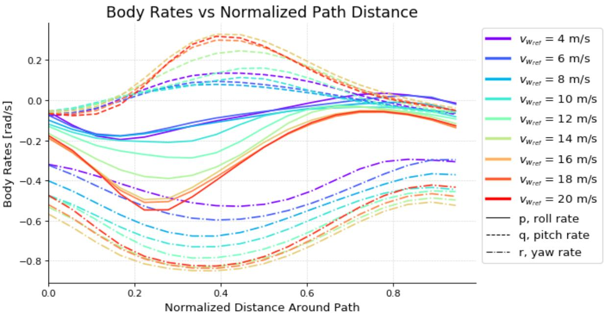

#### **Figure 72 : Angular body rates about each axis versus normalized path distance at various wind speeds. High wind speeds bring with them higher body rates. Of particular importance are the large roll and yaw rates.**

The body rates shown here are assuming nominal operation, with perfect control and no gusts. Real rates can fluctuate by 10 deg (0.17 rad) per second or more. These high body rates bring with them large aerodynamic moments that then require large control surfaces to counteract. These considerations drove much of the MX2 tail design, and gave us additional motivation to avoid increases in span, despite the induced drag benefits of doing so.

### 10.4 Power Saturation Summary

In the end, it all comes down to addressing turbulence and shifts in wind speed. If a solution is to exist here, it would be helpful to contain a few key elements.

-   1. The kite should operate at the peak shaft power as a function of kite speed in the saturated power regime, such that the _combination_ of changes in rotor efficiency and thrust power as the kite overspeeds leaves the system within the power system capabilities.
-   2. The path must be tight, at least in the vertical dimension, in order to reduce power and speed fluctuations from the potential energy exchange.
-   3. The kite design needs to be able to support large tether roll angles and high steady state body rates, and quickly stabilize under excursions.
-   4. It's desirable to fly a path such that the kite is operating at the peak propulsive power as a function of kite speed, such that overspeeds are passively stable.

The first criteria is met by our solution, which we can see in figure 73 .

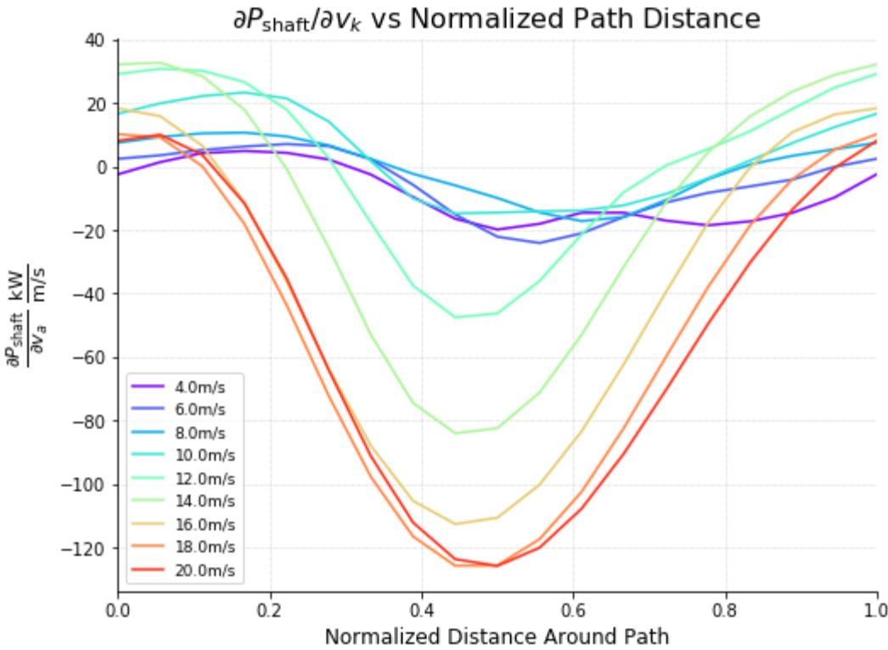

#### **Figure 73 : Change in shaft power for a change in kite speed versus normalized distance around the path at various wind speeds. Thanks to plummeting rotor efficiency, increasing kite speeds at high winds can reduce shaft power, creating some room to generate additional drag.**

As kite speed increases, high winds generally see a decrease in shaft power, meaning that we come off the power limit line on our rotor maps and gain some drag thrust margin on our rotors, thanks to the plummeting efficiency of our rotors. The system is then able to add drag to correct an overspeed where the value in the above plot is negative (at lower wind speeds this isn't necessary, as we're not at maximum power). This derivative does not meaningfully change for changes in airspeed of 5-10 m/s.

The fourth criteria is not met here though. In figure 74 , we plot the change in thrust power for a change in kite speed.

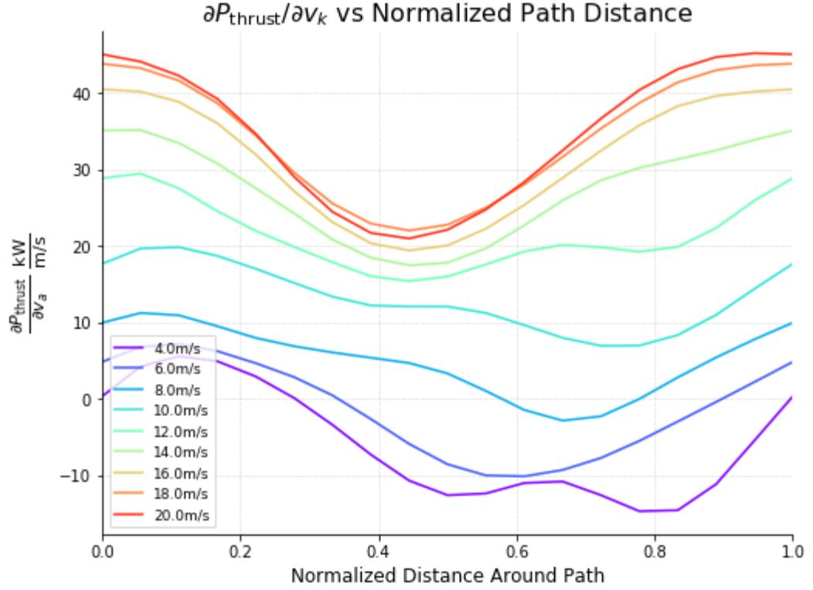

#### **Figure 74 : Change in thrust power for a change in kite speed versus normalized path distance at various wind speeds. Comparing this with figure 73 shows the effect of dropping rotor efficiency—shaft power is decreasing even as thrust power is increasing.**

The kite continues to produce more thrust power as it overspeeds. In the absence of active control or in the presence of a power system failure, the kite will overspeed by tens of m/s. Larger path offsets can address this, lowering at the cost of lowering the average ∂*P* ∂*v thrust*/ _k_ power. Maximum continuous power will be limited not by the actual hardware, but by the system's lack of ability to safely maximize use of its hardware.

The net sensitivity to wind is perhaps best highlighted by comparing the relative sensitivities of the change in _shaft_ power with kite speed ( figure 73 ) to the change in _thrust_ power with wind speed ( figure 71 )—we can use a shaft power margin created by a wind-induced overspeed to combat that overspeed. The peak drop in shaft power at high winds occurs at the bottom half of the path, where the kite is moving fast and rotor efficiency is ~50%, which means we have ~2x the shaft power drop available in the form of additional rotor drag power.

Making this comparison, at high wind speeds we see shaft power sensitivity to kite speed in the range of negative 0-120 kW/(m/s), and thrust power sensitivity to wind speed in the range of 150-225 kW/(m/s). Accounting for the factor of 2 increase in rotor drag power relative to shaft power, the peaks are a similar magnitude: ie, a wind increase of 1 m/s will cause an overspeed of about 1-2 m/s, at which point the rotor drag power limit raises enough that we can resist further overspeeding by re-saturating shaft power.

This is promising, but it doesn't take much wind before we need more overspeeding runway than we have to enable us to reel things back in. In this example, the runway is essentially already used up— figure 68 already has the rotors just about hitting their mach limit at high winds, and unable to tolerate any additional airspeed. There are still more tools to expand that runway that we haven't discussed here—variable pitch rotors, for example, or intentional de-rating of the system by making nominal operation further from our power limits so there's always margin to slow down, but each comes with substantial costs: literal costs in the case of the former, and reduced performance for the latter.

In the meantime, all models that lack turbulence and control errors should have their power saturated regime solutions called into question, including any results we've provided. It's very likely the real MX2 system would require path strategies that result in a rated power haircut of ~100-200 kW. The M600 was so restricted in minimum path radius, creating so many challenges that this author is unsure it would ever be able to safely fly at high winds regardless of power level and controller improvements.

Ultimately, the challenge is driven by shifts in wind and turbulence, and as such is stochastic in nature. It becomes a question of how large of a gust or wind shift can the system survive, and for how long. Only extensive simulation and flight testing can tell.

# 11 References

-   1. _Makani Code Release_ , Makani Technologies LLC, 2020. [Online]. Available: <https://github.com/google/makani/>
-   2. IEA, "Global Energy Review 2020," Paris, France, 2020. [Online]. Available: <https://www.iea.org/reports/global-energy-review-2020>
-   3. W. Short, D. J. Packey, and T. Holt, "Manual for the Economic Evaluation of Energy Efficiency and Renewable Energy Technologies," NREL, Golden, CO, USA, 1995. [Online]. Available: <https://www.nrel.gov/docs/legosti/old/5173.pdf> 47
-   4. R. Wiser, Z. Yang, M. Hand, O. Hohmeyer, D. Infield, P. H. Jensen, V. Nikolaev, M. O'Malley, G. Sinden, and A. Zervos, "Wind Energy," in _IPCC Special Report on Renewable Energy Sources and Climate Change Mitigatio_ n, O. Edenhofer, R. Pichs-Madruga, Y. Sokona, K. Seyboth, P. Matschoss, S. Kadner, T. Zwickel, P. Eickemeier, G. Hansen, S. Schlömer, C. von Stechow, Eds., Cambridge, United Kingdom and New York, NY, USA: Cambridge University Press, 2011. [Online]. Available:

[https://www.ipcc-wg3.de/report/IPCC\\\_SRREN\\\_Ch07.pdf](https://www.ipcc-wg3.de/report/IPCC_SRREN_Ch07.pdf)

-   5. T. Stehly and P. Beiter, "2018 Cost of Wind Energy Review," [fig ES3], NREL, Golden, CO, USA, 2020. [Online]. Available: <https://www.nrel.gov/docs/fy20osti/74598.pdf>
-   6. _System Advisor Model_ . (2020), National Renewable Energy Laboratory. Accessed: July 7, 2020. [Online]. Available:<https://sam.nrel.gov/>
-   7. M. L. Loyd, "Crosswind Kite Power," _J. of Energy_ , vol. 4, no. 3, May-Jun 1980, Art. no. 80-4075, doi:<https://doi.org/10.2514/3.48021>
-   8. D. Vander Lind, "Analysis and Flight Test Validation of High Performance AirborneWind Turbines," in _Airborne Wind Energy_ , (Green Energy and Technology) U. Ahrens, M. Diehl, R. Schmehl, Eds., Berlin and Heidelberg, Germany: Springer, 2013, pp. 473-490, doi: [https://doi.org/10.1007/978-3-642-39965-7\\\_28](https://doi.org/10.1007/978-3-642-39965-7_28)
-   9. B.J. Jonkman, "TurbSim User's Guide," NREL, Golden, CO, USA, Version 1.50, Aug. 26, 2009. [Online]. Available:<https://www.nrel.gov/docs/fy09osti/46198.pdf>
-   10. T. Van Alsenoy, "Sensitivity Analysis of Airborne Wind Turbine Design Variables: Using trajectory optimization," M.S. thesis, Dept. Wind Energy, Aero. Eng., TU Delft, Delft, Netherlands, 2014.
-   11. P. Echeverri, T. Fricke, G. Homsy, and N. Tucker, "M600 Energy Kite Description," in _The Energy Kite: Selected Results From the Design, Development and Testing of Makani's Airborne Wind Turbines_ , Part I, Makani Technologies, Alameda, CA, USA, 2020, [Online]. Available: https://x.company/projects/makani
-   12. G. Homsy, "Oktoberkite and the MX2," in _The Energy Kite: Selected Results From the Design, Development and Testing of Makani's Airborne Wind Turbines_ , Part I, Makani Technologies, Alameda, CA, USA, 2020, [Online]. Available: https://x.company/projects/makani

47 A much-condensed version is provided in NREL's excellent System Advisor Model (SAM) help documentation [6].

# 12 Appendix

### 12.1 Numerical Model Description

#### 12.1.1 Overview

This model began as a small component of an overall system design model that estimated all costs and energy production for an entire plant of systems over the plant's life, with this sub-model responsible for evaluating the power performance of a given design. In its initial form, speed and simplicity were of paramount importance, so it leaned heavily on several of the analytical approaches we'll outline below.

The overall system model led us to identify much of the desired characteristics of a future onboard power generation system. However, flight tests and simulation efforts began to highlight the edges of the problem. AWTs operate in a highly dynamic manner, turning tight paths close to the ground in a turbulent environment, requiring a high amount of performance and precision. It should be no surprise that AWTs, when operated to chase best power performance, are highly constrained, maxing out power components, riding along tension limits, reaching airspeed and rotor speed limits, and saturating control surfaces.

As a result, we desired a model that captured more of these limits and the physics behind them, but still ran quickly enough to evaluate the numerous design tradeoffs ahead of us in a reasonable amount of time. The simple performance model was broken out of the larger system model and expanded in complexity and scope. The result, while somewhat clunky in its implementation as it has grown organically over time, has been very useful as a design tool. With run times on the order of minutes to evaluate performance across the full range of desired wind speeds, it's now too slow to tie into an overall system model, but fast enough for a single high performance desktop machine to perturb all the system inputs and complete a full sensitivity analysis in a matter of hours.

So how does this model work? At its most basic level, a kite state (called a pose within the model) is created from inputs consisting of the wind vector, the kite's position (assuming a rigid tether, with some methods from [Van Alsenoy \[10\]](#page-231-0) to capture catenary effects on tension direction), the kite's velocity vector, and the kite's attitude, but parameterized in terms of aerodynamic angles between the kite's body frame and the apparent wind resulting from the wind speed and the kite's motion. One will find that an additional term is needed to fully define the orientation of the kite, as the rotation about the apparent wind is undefined—we call this additional term the lift-roll-angle, as it signifies how much the lift is rolled about the apparent wind, with a zero such that the wings of the kite are tangent to the flight sphere when the aero angles are zero. Finally, the kite's translational and rotational accelerations are also an

input—we're solving for force and moment residuals as a result of the state and its derivative. Most inputs do not result in a valid state, as the resulting forces and moments do not result in the desired accelerations. This is addressed with an optimizer at the next level.

Importantly, we make several simplifying assumptions to reduce the number of inputs. The rotors are modeled with a single representative rotor, and rotor drag (or thrust) is simply the inverse sum of other forces along the rotor axis. The control surfaces are assumed to provide 48 pure moments, and control saturations are managed via constraints, allowing us to avoid specifying all the control surface deflections. If control surfaces are largely separable (ie, they generate moments about predominantly one axis), we can approximate the control surface deflections surprisingly well.

Moving one level up in the model, we create closed paths that we call loops, and discretize it into poses. Orientation angles (two aero, one lift-roll-angle) and speed strategies are parameterized over the path, and from here we can compute the required accelerations for each pose. An optimizer functions at this level, adjusting path, speed, and orientation (via aero angles and lift-roll-angle) to both balance the forces, keep all constraints within limits, and optimize for power. This process gives rise to the name you'll see elsewhere, the Force Balance Looped (FBL) model. We have the ability to add in penalties, typically penalizing the required control effort (via penalizing the residual moment in terms of required control deflection). When power becomes increasingly saturated at high wind speeds and the signal to the optimizer goes away, we blend in a tension penalty.

Finally, there's a top level that varies the wind speed to create a power curve. It does so by creating and optimizing loops for each wind speed, feeding the optimized result of a lower wind speed as the seed of the next higher wind speed. This is an important step, as high wind speed operation is highly constrained, and finding a good solution is dependent on a good initial seed.

#### 12.1.2 Sub-Models

The following sub-models are optional, and can easily be replaced with a user provided function. In several examples in this text we have done so, for example, to replace the rotor model with a rotor of constant efficiency.

#### 12.1.2.1 Rotor Model

Rotor maps are typically dimensionalized in terms of rotor rotational speed and the freestream velocity as the lookup for thrust and torque. For our model, we instead have required thrust and freestream velocity. We could search the table to find the required thrust —an earlier version tried this approach and found it slow, and without additional steps to smooth the output, full of kinks that gave the optimizer difficulties. In addition, we'd like to non-dimensionalize the model to enable us to evaluate a similar rotor design, but at a different scale.

48 Working in a non-inertial reference frame, including the pseudo-forces from the acceleration.

In order to do so, we non-dimensionalize the rotor table output in terms of a coefficient of power, _Cp_ , and coefficient of thrust, . The relationship between and defines the _Ct Ct Cp_ 49 performance of the rotor by describing how much thrust (or in the case of generation, negative thrust, ie, drag) translates into power. We find a polynomial fit for this relationship across different freestream velocities and for different rotor pitches. There is a similar relationship for _C_ to rotor angular speeds at different freestreams, and we fit that as well, in order to apply _t_ torque and mach limit constraints. A stall constraint can be applied by enforcing a minimum . _Ct_ The resulting model runs quickly, and returns the desired necessary for the model, *thrust*2*shaft* η along with relevant constraints. We assume energy stored in the rotors is negligible.

#### 12.1.2.2 Aero Model

Within the model, we simply need a function that accepts aerodynamic angles (alpha and beta) and non-dimensionalized body rates (omega hat, , and outputs aerodynamic force and )ωˆ moment coefficients. Force coefficients can either be in reference to the kite body frame axes (represented with , , ), or the aerodynamic frame (represented with , , ), _Cx Cy Cz CD CY CL_ while moment coefficients must be in the body frame (represented with , , ). Since we _Cl Cm Cn_ don't specify flap deflections and instead just model the effect of flaps as optional constraints and penalties, an aero model can be as simple as a one line polynomial function, enabling easy evaluation of conceptual designs early in the process.

Eventually, we desired additional fidelity and to accept the input that is used in the simulator, which is a lookup table generated from some other model, with rate terms linearized about some nominal operating point. To ensure smoothness, we create a piecewise polynomial curve fit of the lookup tables, and this fitted model forms our required function.

#### 12.1.3 Known Shortcomings

-   Optimistic results.
    -   In addition to any performance benefits resulting from simplified models, the results assume perfect control and no turbulence.
    -   Due to perfect control and lack of variability, if it's beneficial to ride a limit, the optimizer will do so. In practice, this isn't possible, and sufficient margin needs to be built into the kite's operational targets.
    -   As such, the results should be considered as an approximate upper bound on overall performance.
-   No kite wake.
    -   The influence of the kite's shed vortices on the incoming wind is ignored.

49 As an aside, the aerospace and wind turbine industry have different ways of defining these coefficients. As long as things are consistent, the math works out the same. As the operating point of interest for our rotors is generation, we've chosen to use wind turbine notation for our coefficients in the code.

-   For large, high performance kites turning tight paths, this effect can be significant.
-   Rigid tether assumption.
    -   For onshore systems, the energy storage in the tether is small, and can be justifiably ignored.
    -   For floating offshore systems, the kite can store a large amount of energy in the floating platform and mooring lines, and simulation has shown that this can have a big effect on the results.
-   Specific to onboard generation kites.
    -   In its current form, it assumes a fixed tether length and onboard generation.
    -   Creating path parameterizations in terms of curvature and payout speed, while possible with this method, is not implemented.
-   Suggested future work:
    -   A similarly simplified optimal control problem (OCP) setup would likely retain usefulness as a design tool, but has the added benefit of possibly aiding and supporting creation of a model predictive control (MPC) implementation, where the kite's controls are optimized in situ, in the controller itself, making the kite much more tolerant of control errors and gusts while subject to a litany of constraints.
        -   To maximize usefulness as a design tool, it needs to be as fast and as simple as possible, with runtimes of minutes rather than hours.
        -   To build an MPC implementation, it needs to be simplified to run in milliseconds.
    -   Additional states to support offshore by representing the platform movement.
